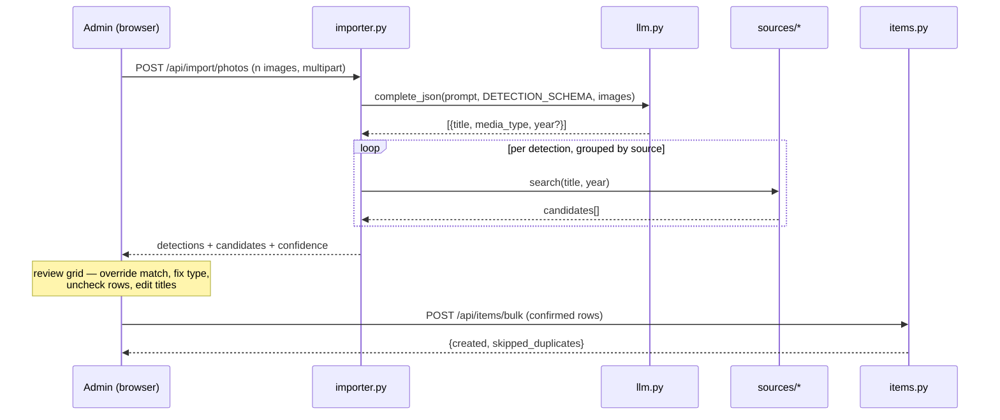

# Media Tracker — Barebones Vertical Slice

Design spec for taking the media collection tracker from admin-gated CRUD on a
bare `items` table to a populated, enriched, publicly viewable collection.

Supersedes nothing in `docs/media-tracker-requirements.md`; it implements E2–E5
of that document as one milestone and adds a photo-backfill feature the
requirements doc does not cover. Where the two disagree, the deviations are
listed explicitly in **Deviations from the requirements doc** below.

- **Date:** 2026-09-01
- **Status:** approved design, pending implementation plan
- **Scope:** requirements-doc epics E2, E3, E4, E5 + photo backfill
- **Out of scope:** E6 (recommendations)

---

## Problem

The tracker has a schema and a CRUD form and nothing else. Two things block it
from being either useful or presentable:

1. **It is empty, and filling it by hand is the reason it will stay empty.**
   The collection being tracked is physical — discs, boxes, and comics on
   shelves. There is no export to import. Typing a few hundred titles into a
   web form is the kind of task that gets abandoned at item forty.
2. **Nothing about it is visible.** Every row is admin-gated. The `is_public`
   column exists and nothing reads it. As a portfolio feature it currently
   demonstrates that a CRUD form was written.

The fix for (1) is bulk ingest from photographs of the shelves: a vision model
reads titles off spines and boxes, the backend resolves each against the
matching metadata API, and one review screen commits the batch. The fix for (2)
is a public read-only showcase reading `is_public`.

Enrichment sits between the two. Both a useful collection and a presentable one
need year, creator, cover art, and genre — which means the metadata source
layer is the shared foundation, and is built first.

## Scope

### In

- One Alembic migration adding every column in requirements §1.
- `backend/sources/` — a common interface with four adapters: TMDB (films),
  IGDB (games), ComicVine (comic volumes), BGG (board games).
- Type-ahead metadata picker on the admin add/edit form; manual entry preserved.
- `POST /api/items/{id}/refresh-metadata`.
- `backend/llm.py` — provider-agnostic JSON completion with image input,
  Gemini and Anthropic implementations.
- `backend/importer.py` — multi-photo upload, vision extraction, per-source
  resolution, returned as reviewable detections.
- Admin bulk-import confirm grid with per-row override.
- `POST /api/items/bulk` — commit confirmed detections, dedupe on conflict.
- `backend/public.py` — unauthenticated `GET /api/public/items` and
  `GET /api/public/stats`.
- Public `/collection` page: poster grid, filters, stats block, recently
  finished strip, cold-start loading state, source attribution.
- Footer "Sign in" link; footer "Admin · Sign out" when a session exists.

### Out

- Recommendations, the `recommendations` table, the Discover tab (E6).
- Any write path for unauthenticated visitors.
- Local image caching or object storage. Covers are hotlinked.
- Storing uploaded photos. Bytes reach the provider and are discarded.
- A diary/plays table, lists, social features, multi-user accounts.
- A `books` type.
- Importing from Steam, Letterboxd, or any third-party account.
- Issue-level comic tracking. Volumes only.

## Proposed solution

### Module layout

```
backend/
  models.py         + requirements §1 columns, OwnedFormat enum
  config.py         + optional per-source fields (NOT added to _REQUIRED)
  items.py          + GET  /api/items/search-metadata      picker proxy
                    + POST /api/items/{id}/refresh-metadata
                    + POST /api/items/bulk                 import commit
  public.py   (new)   GET  /api/public/items
                      GET  /api/public/stats
  importer.py (new)   POST /api/import/photos
  llm.py      (new)   complete_json(prompt, schema, images=[]) -> dict
                      GeminiProvider | AnthropicProvider
  sources/    (new)   base.py      SourceResult / SourceDetail / SourceAdapter
                      registry.py  ItemType -> adapter
                      tmdb.py  igdb.py  comicvine.py  bgg.py
frontend/src/
  pages/AdminCollection.jsx   + metadata picker, + import entry point
  pages/AdminImport.jsx (new)   upload + confirm grid
  pages/Collection.jsx  (new)   public showcase
  layouts/RootLayout.jsx      + footer sign-in / admin state
```

New routers are registered in `main.py` alongside `auth` and `items`, per the
one-router-per-project convention in CLAUDE.md.

### Photo import flow



No import state is persisted server-side. The browser holds detections between
upload and commit. Closing the tab loses the batch; re-uploading the photos
reproduces it.

### Single-item picker flow

Admin picks a type, types a title, the form calls
`GET /api/items/search-metadata?type=&query=`, the backend dispatches to the
registry adapter, and the picker lists title/year/thumbnail. Selecting a result
fills `external_source`, `external_id`, `year`, `creator`, `cover_url`, and the
`source_metadata` snapshot; `title` becomes an editable prefill. Submitting with
no selection creates a manual row with every external field null.

### Public showcase

`GET /api/public/items` returns `is_public = true` rows through an explicit
response model — never the ORM object — carrying only: `id`, `type`, `title`,
`year`, `creator`, `cover_url`, `status`, `rating`, `favorite`, `finished_at`,
and `genres` + `community_score` lifted out of `source_metadata`.

`GET /api/public/stats` computes counts by type and status, a rating histogram,
and finishes per month, server-side, over public rows only.

The `/collection` page is the only public page that calls the API. The free-tier
backend sleeps after ~15 minutes, so the first request can take ~30 seconds: the
page shows an explicit "waking the backend" message rather than a spinner that
reads as broken.

## Key decisions

### 1. `owned_format` is nullable, and the importer defaults it to `physical`

The requirements doc calls `physical` the wrong default for most rows and leaves
the choice open. For a backfill whose entire premise is photographing physical
shelves, `physical` is right *for imported rows* and wrong as a column default.

Resolution: the column is nullable with no server default; the create form
requires it; the importer sets `physical` on every row it commits. A want-list
row (`none`) is then a deliberate choice, never an artifact of a default.

**Tradeoff:** existing rows are backfilled to NULL rather than guessed, so the
"Want" tab filter (`owned_format = 'none'`) and any ownership UI must treat NULL
as "unspecified", not as a value.

### 2. The vision model returns titles, not matches

The extraction schema is `[{title, media_type, year?}]` and nothing more, where
`media_type` is constrained by JSON-schema enum to the four `ItemType` values
(`game`, `movie`, `comic`, `boardgame`) so it maps to the column with no
translation layer and no room for an invented fifth type. The
model gets no tool access, no candidate list, no API results. Resolution happens
in `importer.py` against `sources/`.

**Why:** it makes the expensive, nondeterministic step a pure function of the
image, and the entire resolution path unit-testable with zero model calls. An
agent loop here would buy nothing — there is no branching decision to make — and
would cost testability, latency, and a class of failure that is hard to
reproduce.

**Tradeoff:** the model cannot disambiguate using the candidate list (a spine
reading "Dune" cannot be resolved to 1984 vs 2021 from the API results). That
disambiguation moves to the review grid, where a human does it faster anyway.

### 3. Confidence is computed, never self-reported

Per detection, `difflib.SequenceMatcher` ratio on the case-folded,
punctuation-stripped title against each candidate, plus the margin between the
best and second-best candidate. Three buckets:

| Bucket | Condition |
|---|---|
| `exact` | best ratio ≥ 0.95 and margin ≥ 0.15 |
| `probable` | best ratio ≥ 0.75 |
| `uncertain` | anything else, or zero candidates |

Year is applied before ranking, not after: when the model returned a year,
candidates whose year differs by more than 1 are dropped from the candidate
list entirely, and the ratio and margin are then computed over what remains.
This keeps the margin meaningful — otherwise two same-titled releases sit at
an identical ratio and the margin collapses to zero, forcing `uncertain` on a
detection the year already disambiguated.

**Why:** models are unreliable at grading their own certainty and will report
high confidence on a confidently-wrong reading. String distance against real API
results is a measurement, not an opinion. Thresholds are constants in one place
and expected to be tuned once against a real shelf.

**Tradeoff:** string distance cannot catch a *correct* match that reads
differently (a spine showing a localized or abbreviated title). Those land in
`uncertain` and are fixed in the grid — a false negative, which is the safe
direction.

### 4. Throttling is per-source, not global

Each adapter owns its own limiter. TMDB (~40 req/s) and IGDB resolve
concurrently; ComicVine and BGG resolve serially at ~1 req/s with backoff on 429
and on BGG's 202-queued response. BGG `thing` lookups batch up to 20 ids per
request.

**Why:** a global limiter set to BGG's pace would make a shelf of films resolve
at board-game speed. A mixed batch should only be as slow as its slowest rows,
and only those rows.

**Tradeoff:** four limiter configurations to keep correct instead of one, and
the importer needs per-source task groups rather than one flat gather.

### 5. Per-source config is checked lazily, never at boot

`config.py` keeps its fail-fast `_REQUIRED` contract for the values the service
cannot run without. Source and LLM keys are optional fields on `Config`; each
adapter raises `SourceNotConfigured` on first use when its key is absent.

**Why:** `config.py`'s existing docstring reasoning — refuse to boot rather than
run insecurely — applies to a missing `SESSION_SECRET`, where running without it
is unsafe. It does not apply to a missing ComicVine key, where the correct
behavior is that comic lookups are unavailable and everything else works. Adding
source keys to `_REQUIRED` would mean a deploy of the film feature cannot boot
without a board-game registration.

**Tradeoff:** a typo'd key surfaces at first use rather than at boot. Mitigated
by a startup log line naming which sources are configured.

### 6. The public router uses an explicit response model

Not the ORM object, not `model_config = ConfigDict(from_attributes=True)` over
the whole row. A hand-written schema listing exactly the public fields, with a
test asserting `notes` and `owned_format` are absent from the response body.

**Why:** the failure mode of serializing the ORM object is silent — adding a
private column later leaks it with no code change and no test failure. An
explicit allowlist inverts that: a new column is invisible until someone adds
it deliberately.

### 7. Dedupe on a partial unique index, treated as skip

`CREATE UNIQUE INDEX ... ON items (external_source, external_id) WHERE
external_source IS NOT NULL AND external_id IS NOT NULL`. Bulk insert uses
`ON CONFLICT DO NOTHING` and reports the skipped count.

**Why:** photographing the same shelf twice is the expected user behavior, not
an error. The partial predicate keeps manual rows — which have NULL on both —
out of the constraint entirely; without it, two manual rows would collide.

### 8. Uploaded photos are never written to disk

Bytes go from the multipart request to the provider payload and are discarded.
No filesystem writes, no object storage, no `cover_url` pointing at anything
we host.

**Why:** Render's free-tier disk is ephemeral, so anything written is lost on
restart while still being a data-retention surface. The photos have no value
after extraction — the resolved covers are hotlinked from the sources.

### 9. Status enum keeps its four values

The requirements doc offers `shelved` as an optional add. Skipped.

**Why:** adding a Postgres enum value is a migration concern with transaction
caveats, and no UI in this milestone distinguishes paused from abandoned.
Adding it later is the same one-line migration it is today, with an actual
consumer.

## Deviations from the requirements doc

| Requirements doc | This spec | Reason |
|---|---|---|
| `owned_format` default `digital` or nullable, agent's choice | Nullable, importer sets `physical` | Physical-media backfill is the driving use case (§Key decisions 1) |
| Photo backfill not mentioned | Core feature of the milestone | Joey has no exports; the collection is physical |
| E6 owns `llm.py` | `llm.py` lands here, for vision | The importer needs the provider seam before recommendations do |
| E2 = films only, E3/E4 later | All four sources in this milestone | Shelves are mixed; a films-only importer cannot read a shelf |
| BGG throttle "≥5 s between requests" | ~1 req/s + 202/429 backoff | Not supported by any primary source read (§Prior art) |
| ComicVine "200/resource/hour + burst detection" | Treated as unverified; ~1 req/s defensively | Not present in ComicVine's own documentation (§Prior art) |
| `shelved` status "if cheap" | Skipped | No consumer in this milestone (§Key decisions 9) |

## Prior art & docs consulted

Research gate, 2026-09-01. Verdict column is align/deviate against this spec.

| Source | Checked | Finding | Verdict |
|---|---|---|---|
| developer.themoviedb.org/docs/rate-limiting | ✅ fetched | Legacy 40-per-10s disabled Dec 2019; current ceiling "somewhere in the 40 requests per second range", "could change at any time", honor 429 | Align — requirements doc correct |
| developer.themoviedb.org/docs/authentication-application | ✅ fetched | v3 `api_key` param and v4 Bearer token give identical access; Bearer's stated advantage is one credential across v3 and v4 | Align — use Bearer, but "preferred" is our choice, not TMDB's |
| comicvine.gamespot.com/api/documentation | ✅ fetched | `/search` requires `api_key`, `query`, `format`; `resources=volume` filters; **`limit` on `/search` cannot exceed 10**. `/volumes` limit defaults to 100. **No rate limits stated anywhere in the docs** | Deviate — doc's 200/hr figure is community lore, not documented |
| ai.google.dev/gemini-api/docs/image-understanding | ✅ fetched | Inline base64 capped at 20 MB total request; max 3,600 images per request; PNG/JPEG/WEBP/HEIC/HEIF; JSON schema demonstrated *with* image input; docs example model id `gemini-3.7-flash` | Align — pin the model id in config |
| ai.google.dev/gemini-api/docs/rate-limits | ✅ fetched | Free-tier RPM/RPD/TPM **not published**; docs defer to the AI Studio dashboard | Deviate — doc's "~250 req/day" is unverifiable; design for 429 instead |
| claude-api skill, python/claude-api | ✅ read | Image blocks: `{"type":"image","source":{"type":"base64","media_type":…,"data":…}}`. Structured output: `output_config={"format":{"type":"json_schema","schema":{…}}}` with `additionalProperties: false` + `required`. `output_format` is deprecated | Align — the two providers have the same request shape, so the seam is thin |
| boardgamegeek.com/wiki/page/BGG_XML_API2 | ❌ **HTTP 403** | Primary source unreadable. Secondary (client libraries, BGG forum threads): ~2 req/s is the common client convention; 202 = queued, retry; `thing` capped at 20 ids per query; cloud migration introduced 429s | Deviate — ≥5 s is unsupported; ~1 req/s is conservative against community practice. **Confirm against live calls during implementation** |
| api-docs.igdb.com | ❌ **HTTP 403** | Primary source unreadable. Twitch client-credentials OAuth, ~60-day app token, 4 req/s, Apicalypse POST bodies are carried forward from the requirements doc **unverified** | **Assumption, not fact.** First task in the IGDB zone is a live call confirming auth shape and limit before the adapter is written |

Repo conventions consulted: `CLAUDE.md` (router-per-project, CSS tokens, no raw
hex, self-hosted fonts), `backend/config.py` (fail-fast contract and its stated
reasoning), `backend/models.py` (enum `values_callable` pattern,
`CheckConstraint` naming), `backend/schema_check.py` (manual-migration boot
guard).

## Data model

One migration. New enum type `owned_format`; `external_source` stays a
`varchar(20)` validated in application code rather than a second enum, so
adding a fifth source later is not a migration.

| Column | Type | Null | Default |
|---|---|---|---|
| `year` | smallint | ✅ | — |
| `creator` | varchar(300) | ✅ | — |
| `cover_url` | text | ✅ | — |
| `external_source` | varchar(20) | ✅ | — |
| `external_id` | varchar(50) | ✅ | — |
| `favorite` | boolean | ❌ | `false` |
| `started_at` | date | ✅ | — |
| `finished_at` | date | ✅ | — |
| `times_completed` | smallint | ❌ | `0` |
| `owned_format` | enum `owned_format` | ✅ | — |
| `source_metadata` | JSONB | ✅ | — |

Enum values: `physical`, `digital`, `subscription`, `borrowed`, `none`.

Indexes: partial unique on `(external_source, external_id)` where both are
non-null; `ix_items_finished_at` for the timeline and finishes-per-month stat.

`source_metadata` is named to avoid SQLAlchemy's reserved `metadata` attribute.
It holds the fetched snapshot: genres, description, community score(s),
runtime/playtime, and per-type extras (platform, seasons, issue counts, player
counts, weight).

## Error handling

Typed exceptions, per `modules/standards.md` — no bare string errors, nothing
swallowed:

| Exception | Raised when | Surfaced as |
|---|---|---|
| `SourceNotConfigured` | An adapter's key is absent | 503 on the picker; detections for that type marked `unresolved` in an import |
| `SourceRateLimited` | 429, or BGG 202 exhausting retries | Retried with backoff, then `unresolved` |
| `SourceError` | Any other adapter failure | Logged with the source name; `unresolved` |
| `LLMError` | Provider failure, timeout, or schema-invalid output | 502 with "extraction failed, try again" |

A partial failure never fails the batch: a dead source marks only its own
detections `unresolved` and the rest of the grid still renders. External calls
and responses are logged per standards.md, with a per-batch summary line rather
than one log per detection — a 200-item import must not flood the sink.

## Testing

**pytest**

- Adapter tests against recorded response fixtures. No live API calls in CI.
- Confidence scoring: exact / probable / uncertain boundaries, the year
  tiebreaker, the zero-candidate case.
- Public router field leak: assert `notes` and `owned_format` are absent from
  the serialized response, and that a non-public row is not returned.
- Bulk insert: conflict on `(external_source, external_id)` skips and reports;
  two manual rows with NULL externals both insert.
- `schema_check` recognises the new head revision.
- Lazy config: an adapter with no key raises `SourceNotConfigured` and the app
  still boots.

**vitest**

- Confirm grid: override a match, change a row's type, uncheck a row, verify
  the committed payload.
- Public poster grid renders; cover `onerror` falls back to the placeholder.
- Cold-start state renders the waking message, not a bare spinner.

**Environment / smoke**

`scripts/smoke.sh` already exists and is the pattern to extend. New checks:
`GET /api/public/items` returns 200 and an array without `notes`;
`GET /api/public/stats` returns 200 with the expected keys; `/collection`
returns 200 from the static site. Passing means every check green and no new
errors in the Render logs for either service.

Manual verification that cannot be automated, run once before the finish gate:
one real shelf photo through the importer end to end, confirming detections
resolve and commit.

## Zones

```
Zone 1 (auto): migration + models + schema_check         [DB migration]
CHECKPOINT — batch review
Zone 2 (auto): sources/base + registry + tmdb + search proxy + refresh + picker UI
CHECKPOINT — batch review
Zone 3 (auto): llm.py + importer + bulk insert + confirm grid
CHECKPOINT — batch review
Zone 4 (auto): igdb + comicvine + bgg                    [parallel-safe]
CHECKPOINT — batch review
Zone 5 (auto): public router + /collection + stats + footer sign-in + attribution
CHECKPOINT — batch review + finish gate
```

Zone 1 is carved out on its own because it is a database migration. Zone 4's
three adapters share no state and implement an interface Zone 2 already proved,
so they are parallel-safe.

## Attribution

Required by source terms, rendered on the tracker pages once that source's data
is public:

- **TMDB** — "This product uses the TMDB API but is not endorsed or certified
  by TMDB", plus the TMDB logo linking to themoviedb.org.
- **ComicVine** — a link back to Comic Vine. Non-commercial use only; a
  personal portfolio qualifies.
- **BGG** — "Powered by BGG" logo linking to boardgamegeek.com.
- **IGDB** — no mandatory attribution; credited anyway.

## Issues

Filed during execution, as parallel-safe tasks at the start of the plan — not
during brainstorming, so acceptance criteria match the finalized task
breakdown. One issue per zone.

**Milestone:** `Tracker: barebones vertical slice` — does not exist yet; created
alongside the issues. **Label:** `enhancement` on all five (the repo's existing
label set has no better fit; no new labels are introduced).

### 1. Tracker: schema migration for enrichment columns

Adds every column in requirements §1 so the source, importer, and showcase work
has something to write to.

- [ ] One Alembic migration adds `year`, `creator`, `cover_url`,
      `external_source`, `external_id`, `favorite`, `started_at`,
      `finished_at`, `times_completed`, `owned_format`, `source_metadata`
- [ ] `owned_format` enum type created with `physical` | `digital` |
      `subscription` | `borrowed` | `none`; column nullable, no server default
- [ ] Partial unique index on `(external_source, external_id)` where both
      non-null; two manual rows with NULL externals both insert
- [ ] Index on `finished_at`
- [ ] `source_metadata` is JSONB and is not named `metadata`
- [ ] `schema_check` recognises the new head; app refuses to boot behind it
- [ ] Migration is reversible — downgrade drops the columns and the enum type

### 2. Tracker: source adapter interface and TMDB films

Proves the interface that the other three adapters implement.

- [ ] `sources/base.py` defines `SourceResult`, `SourceDetail`, and the adapter
      protocol (`search(query, year=None)`, `fetch(external_id)`)
- [ ] `sources/registry.py` maps `ItemType` to an adapter
- [ ] `sources/tmdb.py` uses v4 Bearer auth, searches films, fetches detail with
      `append_to_response=credits`, derives `creator` from the directing credit
- [ ] Typed errors: `SourceNotConfigured`, `SourceRateLimited`, `SourceError`
- [ ] Source keys are optional in `config.py`, checked lazily — absent key never
      blocks boot; a startup log line names which sources are configured
- [ ] `GET /api/items/search-metadata?type=&query=` proxies to the registry,
      admin-gated, keys never reach the browser
- [ ] `POST /api/items/{id}/refresh-metadata` re-fetches from the linked source
- [ ] Picker UI on the admin form: title/year/thumbnail, selection fills the
      external fields and prefills an editable title
- [ ] Manual entry with no selection still creates a row, all external fields null
- [ ] Adapter tested against recorded fixtures; no live calls in CI

### 3. Tracker: photo import with vision extraction

The backfill path. Turns shelf photographs into reviewable, resolvable rows.

- [ ] `llm.py` exposes `complete_json(prompt, schema, images=[]) -> dict` with
      `GeminiProvider` and `AnthropicProvider`, selected by `LLM_PROVIDER`
- [ ] Both providers use enforced schema output; Gemini `responseSchema`,
      Anthropic `output_config.format.json_schema`
- [ ] Timeout plus one retry; provider failure raises `LLMError`, surfaced as
      "extraction failed, try again"
- [ ] `POST /api/import/photos` accepts multiple images, returns
      `[{title, media_type, year?}]` detections with candidates and confidence
- [ ] `media_type` constrained by schema enum to the four `ItemType` values
- [ ] Uploaded bytes are never written to disk
- [ ] Confidence computed server-side: year filters candidates first, then
      ratio and margin bucket into exact / probable / uncertain
- [ ] Per-source throttling — TMDB concurrent, BGG and ComicVine serial ~1/s
- [ ] One dead source marks only its own detections `unresolved`; the batch
      still returns
- [ ] Confirm grid: override a match, change a row's type, uncheck a row, edit
      a title; works on mobile camera capture and desktop drag-and-drop
- [ ] `POST /api/items/bulk` commits confirmed rows with `owned_format`
      `physical`, dedupes on conflict, reports `{created, skipped_duplicates}`
- [ ] Import state is client-side only; no staging tables

### 4. Tracker: IGDB, ComicVine, and BGG adapters

Completes shelf coverage. Three adapters against the interface issue 2 proved.

- [ ] **Before writing the IGDB adapter**, a live call confirms the Twitch
      client-credentials flow and the real rate limit — the primary docs were
      unreachable and the documented behavior is currently an assumption
- [ ] `sources/igdb.py`: app token cached in memory and refreshed on 401, never
      fetched per request; stores `similar_games` ids in `source_metadata`
- [ ] `sources/comicvine.py`: volume-level only, custom `User-Agent`,
      `resources=volume`, respects the documented `limit` ceiling of 10 on
      `/search`, throttled ~1/s
- [ ] `sources/bgg.py`: XML parsed server-side, `thing` batches ≤20 ids,
      throttled ~1/s, retries on 202-queued and 429 with backoff
- [ ] Each adapter tested against recorded fixtures; no live calls in CI
- [ ] Each registers in the registry and works through the existing picker and
      importer with no changes to either

### 5. Tracker: public showcase and footer sign-in

Makes the collection visible and replaces know-the-URL admin access.

- [ ] `public.py` — `GET /api/public/items` returns only `is_public` rows
      through an explicit response model, never the ORM object
- [ ] Test asserts `notes` and `owned_format` are absent from the response and
      that a non-public row is not returned
- [ ] `GET /api/public/stats` computes counts by type and status, rating
      histogram, and finishes per month, server-side, over public rows only
- [ ] `/collection` page: poster grid with type and status filters, stats
      block, recently-finished strip
- [ ] Cover `onerror` falls back to a placeholder; per-type tile aspect ratio
      decided and applied (ComicVine and BGG images are not poster-shaped)
- [ ] Cold-start state shows an explicit waking-the-backend message, not a
      bare spinner
- [ ] Attribution rendered once a source's data is public: TMDB text + logo,
      ComicVine link, "Powered by BGG" logo
- [ ] Footer "Sign in" link enters the existing Google OAuth flow; when a
      session exists the footer shows "Admin · Sign out"
- [ ] `/collection` linked from Projects as a project card
- [ ] `scripts/smoke.sh` extended with the public endpoints
- [ ] Styled with existing CSS variables only — no raw hex, correct in both
      themes

## Open questions

1. **BGG app registration.** BGG asks that applications be registered via the
   form linked from `boardgamegeek.com/using_the_xml_api` before public-facing
   use. Joey action. Gates only Zone 5's public display of BGG data — Zone 4's
   adapter and admin-side use are unaffected.
2. **IGDB auth shape is an assumption.** The primary docs returned 403. Zone 4
   opens with a live call to confirm the Twitch client-credentials flow and the
   real rate limit before the adapter is written.
3. **Confidence thresholds are a first guess.** Expected to be tuned once
   against a real shelf photo, in Zone 3, before the grid UI is finalized.
4. **Cover art for comics and board games at grid scale.** ComicVine and BGG
   images are not poster-shaped. The public grid needs a defined aspect-ratio
   behavior — crop, letterbox, or per-type tile shape. Decide in Zone 5.
