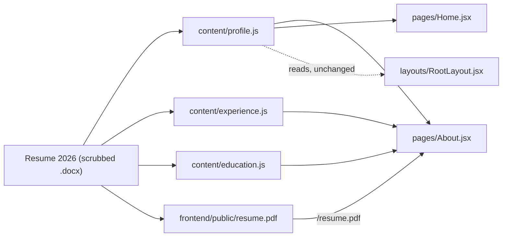

# Resume refresh — site copy and About page

Date: 2026-09-01
Repo: joey-haas.dev
Source of truth: `~/Documents/resume/Joseph Haas Resume 2026 copy scrubbed.docx`

## Problem

The site's copy predates the 2026 resume. Concretely:

| Surface | Site today | Resume 2026 |
| --- | --- | --- |
| About bio | "backend engineer at Guild Education" | Senior Software Engineer / Technical Product Manager; five years engineering at Guild |
| Employer name | Guild Education | GUILD (formerly Guild Education) |
| Guild dates | 2021 – present (engineering only) | 2020 – present including the PM year |
| iBAHN title | Product Associate | Associate Product Manager, IPTV Platform |
| Education | absent | Turing 2021; University of Denver 2012; CSPO and Pragmatic Marketing |
| Toolbox chips | seven generic entries | SQL, PostgreSQL, Snowflake, GraphQL (AppSync), AWS, GitHub Actions, event-driven integration |
| Downloadable resume | none in the repo | Home already promises "plus the resume" |

A visitor who reads the site and then opens the resume sees two different people.

## Scope

In scope:

- Rewrite `content/profile.js` (bio, tagline, toolbox).
- Rewrite `content/experience.js` (employer name, dates, titles, summaries).
- Add `content/education.js` (degrees and certifications).
- Add an Education section to the About page.
- Add a downloadable PDF resume at `/resume.pdf` and link it from About.
- Refresh the Home page intro copy.
- Add `About.test.jsx`.
- Add a `/resume.pdf` check to `scripts/smoke.sh`.
- Update README and CLAUDE.md to document the new content module and the public asset.

Explicitly out of scope:

- A `/resume` route rendering the resume as a web page. CLAUDE.md keeps this site a
  website rather than a rendered resume document.
- A contact form or contact section. Joey has flagged this as possible future work;
  it is not part of this change.
- Per-role bullet lists on the timeline. One summary sentence per entry stands.
- Any backend, API, or infrastructure change.

## Proposed solution

Approach: refresh the content modules and reuse the markup that already exists.

The About page's `.timeline` and `.chip-list` styles are generic enough to carry the
Education section without new CSS, so the change is data plus two small page edits.

### Copy

About bio, two paragraphs (dual engineer/PM framing, matching the resume header):

> I'm a senior software engineer at Guild, where I've spent five years building and
> owning the backend payments and benefits systems that fund, track, and reconcile
> every learner benefit dollar — spend-writing APIs, funding context, tax
> classification, and the eligibility migration underneath it all.
>
> Before the code, eight years as a product manager across enterprise SaaS, payments,
> and video. I still work like one: architecture doc, then squad alignment, then the
> endpoint — and the data forensics when something goes wrong. Most useful on systems
> where correctness and money are the same problem.

Header tagline: `Senior software engineer · Denver, Colorado`.

Home intro keeps its shape — one sentence of position, one of backstory, `why` in the
display serif — updated to the new title and the shortened employer name.

Experience entries, newest first:

1. `Software Engineer I → Sr. Software Engineer`, Guild (formerly Guild Education),
   `2021 – present · Denver, CO`, current. Summary covers spend-writing APIs, funding
   context, tax classification, and the BA 2.0 eligibility migration, owned from API
   contract through rollout and incident forensics.
2. `Product Manager, Payment Products`, Guild (formerly Guild Education),
   `2020 – 2021 · Denver, CO`. Balance tracking and external benefits administration
   for Fortune 1000 employer partners.
3. `Software Product Manager, Core Services`, MJ Freeway, `2018 – 2019 · Denver, CO`.
4. `Manager, Video Products`, Charter Communications, `2014 – 2018 · Denver, CO`.
5. `Associate Product Manager, IPTV Platform`, iBAHN, `2012 – 2014 · Denver, CO`.

Toolbox chips (12): Node.js, TypeScript, Python · FastAPI, React, SQL · PostgreSQL,
Snowflake, GraphQL (AppSync), AWS (Lambda, RDS), REST API design,
Event-driven integration, GitHub Actions CI, Distributed systems.

Education entries: Back-End Engineering Program, Turing School of Software and Design,
`2021 · Remote`; B.S. International Business, minor in Marketing, University of Denver,
`2012 · Denver, CO`. Certifications chips: Certified Scrum Product Owner,
Pragmatic Marketing Certified.

### Resume asset

`frontend/public/resume.pdf`, served at `https://joey-haas.dev/resume.pdf`, linked from
About as `<a href="/resume.pdf" download="Joey Haas Resume.pdf">`. The `download`
attribute is same-origin, so the browser saves it under a readable name while the URL
stays short enough to paste into an email.

## Key decisions

**Public directory over a hashed import.** Vite recommends importing assets so they get
content hashes, and deliberately deviating from that costs cache-busting: a republished
resume keeps the same URL, so a CDN or browser may serve the old file for a while. The
stable URL is worth more here — a resume link pasted into an email or a job application
has to keep working after the next deploy.

**Guild timeline stays collapsed.** Four Guild rows out of seven would read as a
promotion ladder rather than a career. The single arrow-joined entry plus the separate PM
entry preserves the pivot, which is the story the site is actually telling.

**Education reuses the timeline markup.** The dots imply chronology, which is accurate
for 2021 and 2012, and it avoids inventing a second visual language for four lines of
text.

**Employer rendered as "Guild (formerly Guild Education)".** Current name for accuracy,
old name for recognition. Prose says "Guild".

**No contact details beyond what the footer already carries.** The scrubbed resume drops
the phone number; the site does not add it back.

## Prior art and docs consulted

| Source | Finding | Verdict |
| --- | --- | --- |
| [Vite — Static Asset Handling](https://vite.dev/guide/assets) | `publicDir` defaults to `<root>/public`; files copy to `dist/` root unhashed and must be referenced root-absolute. Vite prefers importing assets unless an exact filename is required. | Deviate deliberately: an emailable resume URL is exactly the stated exception. |
| [Render — Redirects and Rewrites](https://render.com/docs/redirects-rewrites) | Render skips redirect and rewrite rules when a real resource exists at the path. | The `/*` → `/index.html` rule in `render.yaml` will not intercept `/resume.pdf`. |
| Repo: `dist/feed.xml` from `scripts/generate-rss.mjs` | A root-level static file already coexists with the SPA rewrite in production. | Confirms the Render behavior on this deployment. |
| Repo: `README.md` line 61, `content/*.js` | Content modules are the documented single source of truth for copy. | Align: all new copy lands in `content/`. |
| Repo: `index.css` `.timeline`, `.chip-list` | Both are generic, not About-specific. | Align: reuse, add no CSS. |

## Resolved decisions

1. **PDF source.** Joey exported a web-safe PDF himself:
   `~/Downloads/Joseph Haas Resume (web).pdf`, two pages, 61 KB. Verified by text
   extraction to carry no phone number and no street address — email, city, site,
   LinkedIn, and GitHub only. It ships verbatim as `frontend/public/resume.pdf`; no
   conversion step is needed, and nothing about the file is generated at build time.
2. **Smoke coverage.** `scripts/smoke.sh` gains a `/resume.pdf` check asserting a 200
   response and a PDF content type.

## Smoke test strategy

A smoke utility already exists: `./scripts/smoke.sh <frontend-url> <api-url>`, run after
deploy. This change adds one assertion to it — `GET /resume.pdf` returns 200 with
`content-type: application/pdf`.

Locally, before any deploy:

- `cd frontend && npm test` — all suites green, including the new `About.test.jsx`.
- `cd frontend && npm run build` — succeeds, and `dist/resume.pdf` exists afterward.
- Dev server check of `/about` in both themes: education section renders, resume link
  downloads, no console errors.

Passing looks like: green suite, a build containing the PDF, a clean console, and a
full-pass smoke run after deploy with no failed checks.

## Issues

Not filing GitHub issues for this change; it is a single-session content refresh.
