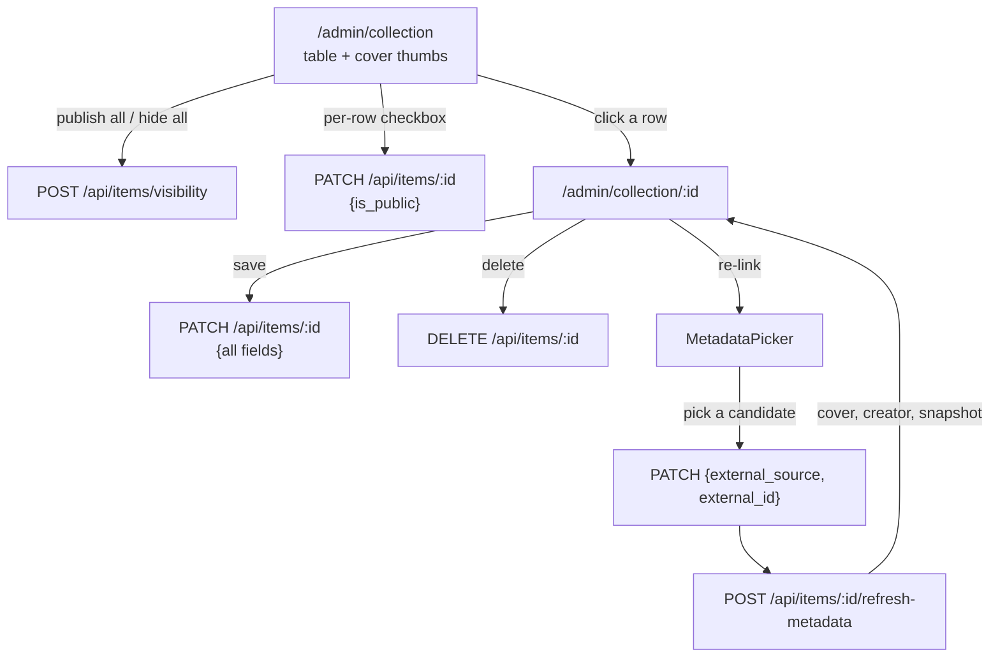

# Admin Collection Tools — Publish, Edit, Cover Art

Design spec for making the imported collection actually manageable: publishing
items to the public showcase, correcting bad matches, and seeing cover art
while doing it.

- **Date:** 2026-09-18
- **Status:** awaiting approval
- **Branch:** `admin-collection-tools`

---

## Problem

A photo import of roughly 75 items landed successfully, and then three things
turned out to be missing.

**Nothing can be published.** `is_public` appears nowhere in the frontend — not
in the add form, not in the collection table, and the importer does not set it.
`ItemIn.is_public` defaults to `False`, so every imported row is private. The
public API, the `/collection` page, the `is_public` filter and a test asserting
non-public rows stay hidden all shipped; the control that sets the flag did
not. The showcase is currently unreachable from the application, which is why
`/collection` reports an empty collection while the database holds 75 rows.

**Nothing can be corrected.** The admin table offers a status dropdown and a
delete button. A row with a wrong title, a wrong year, or — the case that
actually occurred — a wrong external match cannot be fixed. `Star Fox` matching
the 1993 release rather than the 2026 one is only repairable today by deleting
the row and re-adding it through the picker.

**Nothing is visible.** There is no cover art in the admin tool, so a wrong
match looks identical to a right one. The 1993 Star Fox box art would have made
that mismatch obvious at a glance; instead it took a live test and a debugging
session to notice.

## Scope

### In

- `is_public` toggle per row, and bulk publish/hide for the whole collection.
- `POST /api/items/visibility` — bulk visibility change.
- Cover thumbnail column in the admin collection table.
- Item detail view at `/admin/collection/:id` with every field editable.
- Re-linking an item to a different external record from the detail view,
  re-fetching cover, creator and snapshot through the existing refresh route.
- Delete from the detail view.

### Out

- Bulk editing of anything other than visibility. One field across everything
  is a different feature from editing one item properly.
- Changing the public page. It already renders whatever is flagged public.
- Fixing the 7-minute import. Real, unexplained, and tracked separately — the
  fix depends on evidence not yet gathered (see Open questions).
- Any schema change. Every field involved already exists.
- Bulk re-linking or re-matching.

## Proposed solution

Almost all of this already exists. `PATCH /api/items/{id}` accepts every field
including `is_public`; `refresh-metadata` already re-fetches from a linked
source; `MetadataPicker` and `CoverImage` are built and tested. Only the bulk
visibility route is genuinely new.

## Key decisions

### 1. The row toggle reuses PATCH; only bulk gets a new route

`ItemPatch` already carries `is_public`, and `updateStatus` in
`AdminCollection.jsx` is the exact shape a toggle needs. Adding a dedicated
single-item visibility endpoint would duplicate a working one.

Bulk is different: 75 sequential PATCH requests to publish a collection is a
slow, partially-failing operation with no meaningful error story. One statement
server-side is both faster and atomic.

**Tradeoff:** two code paths do overlapping things. Accepted because their
failure modes genuinely differ — a single toggle can report "that one didn't
save", a bulk operation cannot usefully report 40 of 75.

### 2. Detail view rather than inline editing

The table already carries four columns and gains two more here (cover,
publish). Adding title, year, rating, format, dates and notes inline would make
it unusable on a phone — which is where the import workflow actually happens.

A detail view also gives the re-link flow somewhere to live. `MetadataPicker`
needs a search field, a candidate list with thumbnails, and room to confirm the
result; none of that fits in a table row.

**Tradeoff:** a round trip to fix one field. Acceptable because the expected
correction is "this match is wrong", which needs the picker anyway, not "this
rating should be 8".

### 3. Re-linking goes through the existing refresh route

Selecting a new candidate PATCHes `external_source` and `external_id`, then
POSTs to `refresh-metadata`, which re-fetches cover, creator and the snapshot
server-side. The browser never assembles metadata it cannot verify — the same
rule the import path follows.

**Tradeoff:** two requests. Worth it to keep one server-side path responsible
for what a source record means.

### 4. Cover art is a table column, not a grid

A thumbnail per row makes a wrong match obvious while keeping the dense,
scannable table. Reuses `CoverImage`, so per-type aspect ratios and the
`onerror` placeholder come for free.

Rejected: replacing the table with a poster grid. More visual, but it discards
a working list and the status/rating columns that make the table useful.

### 5. Bulk visibility takes an explicit id list or an explicit "all"

`{is_public: bool, ids: [...] | null}` where `null` means every item. Not a
filter expression. A visibility change is the one operation here that can
affect everything at once, so the request says plainly what it intends rather
than describing a query whose result the caller has to predict.

## Prior art & docs consulted

Deliberately none, and the reason matters: this is internal UI over endpoints
written in this repository, with no new dependency, service, auth pattern or
data-flow change. The research gate exists to check external prior art before
introducing something unfamiliar; there is nothing external here. Running it
would have produced citations that justified nothing.

Repo conventions consulted instead:

| Source | Bearing on this work |
|---|---|
| `AdminCollection.jsx:140` `updateStatus` | The PATCH-then-reload shape the row toggle copies |
| `AdminImport.jsx` | Grid, confirm and commit patterns; `CoverImage` usage |
| `components/MetadataPicker.jsx` | Re-link UI, already tested |
| `items.py` route ordering | `/{item_id}` is typed `uuid.UUID` and has swallowed two routes already; `/visibility` must be declared before it |
| `CLAUDE.md` | CSS variables only, no raw hex; react-router declarative mode |

## Open questions

1. **The 7-minute import is unexplained.** Out of scope here, but unresolved.
   The fix differs depending on whether Gemini retried slowly against a
   per-attempt 120s timeout with no overall budget, or the ~75 IGDB lookups
   were the tail. Needs the Render log lines before anything is changed.
2. **Publishing the existing 75 rows** happens through the new bulk button once
   this ships, or through SQL before then. Not a code question.

## Smoke test strategy

`scripts/smoke.sh` exists and already covers the public endpoints. It runs
unauthenticated, so it cannot exercise these routes directly — every one of
them is admin-gated.

What it can assert, and what will be added:

- `POST /api/items/visibility` unauthenticated returns 401, not 404 — proving
  the route exists and is gated rather than silently absent.
- `/admin/collection/00000000-...` returns 200 from the static host, proving
  the SPA rewrite serves the new nested route on deep link.

Everything else is covered by pytest and vitest. Passing means: full backend
suite green, full frontend suite green, `npm run build` clean, and the two new
smoke checks green after deploy.

## Manual verification

One pass that automation cannot cover, run before the finish gate: open the
collection, confirm thumbnails render, publish all, confirm `/collection` now
shows the items, then open a wrongly-matched row, re-link it through the
picker, and confirm the cover and creator change to the correct release.
