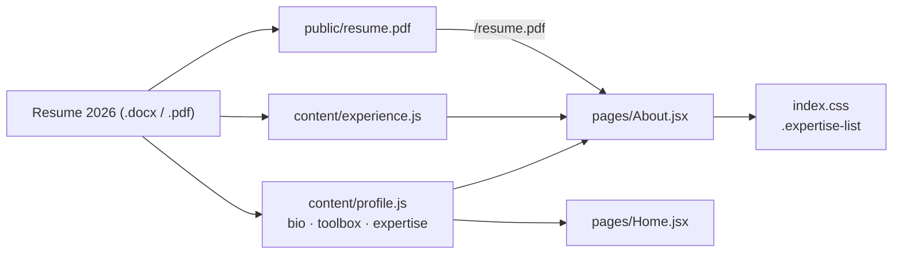

# Resume copy sync — About, Home, and the published PDF

Date: 2026-09-18
Repo: joey-haas.dev
Source of truth: `~/Documents/resume/Joseph Haas Resume 2026.docx` (and its PDF export)

## Problem

The site's copy was synced from the 2026 resume on 2026-09-01. That resume has since
been rewritten. The rewrite is not cosmetic: it removes every internal codename and
client name, renames the team, tightens each bullet to an outcome, and reframes the
summary around ledger platforms.

| Surface | Site today | Resume 2026 (current) |
| --- | --- | --- |
| `profile.bio` | "since 2021 I've built and owned the backend payments and benefits systems" | five years engineering, on the payments team, payments *and ledger* platforms |
| `experience.js` company | Guild (formerly Guild Education) | GUILD |
| Guild engineering row | `Software Engineer I → Sr. Software Engineer` | three levels: SE I (2021–22), SE II (2022–24), Senior (2024–present) |
| Current-role summary | "eligibility migration underneath them" | de-identified: eligibility platform, alerting, incident forensics |
| Toolbox chips | twelve; no test tooling, no security scanning, no integration platforms | adds Mocha/Chai/Sinon, integration testing, BDD, Snyk, Salesforce and NetSuite |
| Areas of expertise | absent | fifteen listed under the header |
| Home intro | "the payments systems behind employer-funded education" | payments *and ledger* systems |
| `/resume.pdf` | the 2026-09-01 export | two newer exports, neither published |

A reader who scans the About page and then downloads the resume currently sees two
different framings of the same five years.

## Scope

In scope:

- Rewrite `content/profile.js`: bio paragraph one, toolbox chips, a new `expertise` export.
- Update `content/experience.js`: employer label, the Guild engineering role label, and
  the current-role summary.
- Add an "Areas of expertise" section to the About page, with the CSS it needs.
- One-word update to the Home page intro.
- Replace `frontend/public/resume.pdf` with the current designed export.
- Extend `About.test.jsx` to cover the new section.
- Update `README.md` so the content-module list mentions expertise.

Explicitly out of scope:

- Splitting the Guild timeline into three engineering rows. See Key decisions.
- Per-role bullet lists on the timeline. One summary sentence per entry stands, as
  decided on 2026-09-01.
- Adopting the resume's dual `Senior Software Engineer | Technical Product Manager`
  title in the header tagline. See Key decisions.
- Adding the Charter Champion Award, TiVo product names, or the 20%-of-enterprise-video
  figure to the timeline. The older entries keep their one-sentence summaries.
- Any backend, API, infrastructure, or blog change.

## Proposed solution

Refresh the content modules in place and add one section to a page that already has the
markup patterns for it. No new module, no new abstraction.

Two alternatives were considered and rejected:

- **A single `resume.js` module** collapsing profile, experience, education, and
  expertise into one export shaped like the resume. Fewer files, but it rewrites three
  working modules and their tests without adding a capability.
- **Build-time extraction from the `.docx`**, which would end drift permanently. It also
  ends the site's voice: the site is deliberately warmer and more first-person than the
  resume, and generation would flatten that difference.

### Copy

Bio paragraph one:

> I'm a senior software engineer at Guild, where five years on the payments team have
> gone into the backend systems that fund, track, and reconcile every learner benefit
> dollar — spend-writing APIs, funding context, tax classification, and the eligibility
> migration underneath them.

Paragraph two is unchanged.

Current-role summary in `experience.js`:

> Spend-writing APIs, funding context, tax classification, and the eligibility-platform
> migration underneath them — owned from API contract through rollout, alerting, and
> incident forensics.

Role label: `Software Engineer I → II → Senior`. Company, on both Guild entries: `Guild`.

Home intro: "building the payments systems behind employer-funded education" becomes
"building the payments and ledger systems behind employer-funded education". The rest of
that page is still accurate.

Areas of expertise, eight entries, in this order: Backend & API design; Payments &
ledger systems; Distributed systems; Event-driven architecture; Data modeling & database
design; Data migrations & backfills; System architecture & ADRs; Observability, alerting
& incident forensics.

Toolbox chips, fourteen, in this order: Node.js; TypeScript; Python · FastAPI; React;
SQL · PostgreSQL; Snowflake; GraphQL (AppSync); AWS (Lambda, RDS); REST API design;
Mocha · Chai · Sinon; Integration testing · BDD; Snyk; Salesforce · NetSuite; GitHub
Actions CI.

Two chips leave the list rather than being deleted: *Event-driven integration* and
*Distributed systems* both move up into Areas of expertise, where they describe work
rather than a tool.

### Resume asset

`~/Documents/resume/Joseph Haas Resume 2026.pdf` ships verbatim as
`frontend/public/resume.pdf`. Verified before writing this spec: two pages, text extracts
cleanly, and it carries no phone number and no street address — email, Denver CO, the
site, LinkedIn, and GitHub only. The ATS export is not published; it is plainer by
design and the browser-facing copy should be the designed one.

The path does not change. Per CLAUDE.md the filename is load-bearing: it is the URL
already pasted into applications.

## Key decisions

**Grid, not CSS multi-column, for the expertise list.** Multicol would need
`break-inside: avoid` on every item to stop an entry splitting across the column
boundary, and it does not collapse to one column on a narrow screen without a media
query. `grid-template-columns: repeat(auto-fit, minmax(14rem, 1fr))` is two columns at
page width and one on a phone, with no fragmentation to guard against. This avoids the
footgun instead of patching it.

**Expertise renders as a list, not a third chip row.** The About page already has two
`.chip-list` rows (certifications, toolbox). A third would make chips the page's
dominant texture and blur "what I do" into "what I use". The list is visually distinct
for the cost of one small CSS block.

**Eight expertise entries, not the resume's fifteen.** The full list reads as a keyword
block. The eight kept are the engineering-weighted ones; the product-leaning entries
(product strategy and roadmaps, agile/BDD delivery, requirements) are dropped because
the timeline already spends eight years proving them.

**Expertise lives in `profile.js`, not its own module.** It is a flat string array with
the same shape as `toolbox`, unlike `education.js`, which exists because a credential
has a different shape from a role.

**The Guild timeline stays collapsed.** The resume now shows three engineering levels.
Rendering them as three rows would put four Guild entries in a seven-entry timeline and
read as a promotion ladder rather than a career. The arrow-joined label carries the same
information in one line.

**The header tagline keeps `Senior software engineer · Denver, Colorado`.** The resume's
dual title works on a document a recruiter scans for fit. In a site header, above a page
whose entire narrative is the PM-to-engineer pivot, it reads as hedging.

**`(formerly Guild Education)` is dropped.** The resume dropped it; five years on, the
old name buys less recognition than the extra clause costs.

**`Containerization` does not become a chip.** The resume lists it. Nothing on this site
or in its projects demonstrates it, and a one-word claim with nothing behind it is the
kind of line the rest of this page avoids.

## Prior art and docs consulted

| Source | Finding | Verdict |
| --- | --- | --- |
| [MDN — `break-inside`](https://developer.mozilla.org/en-US/docs/Web/CSS/break-inside) | `avoid` must be applied per item to stop multicol splitting an element across a column break; no list-marker guarantees are documented | Deviate: use grid, which needs no guard |
| [MDN — Handling overflow in multicol](https://developer.mozilla.org/en-US/docs/Web/CSS/CSS_multicol_layout/Handling_overflow_in_multicol_layout) | In continuous media, multicol overflows inline rather than reflowing; column count does not collapse responsively on its own | Confirms the grid choice |
| Repo: `docs/planning/2026-09-01-resume-refresh-design.md` | Established the collapsed Guild timeline, the unhashed `public/` asset, and one summary sentence per entry | Align on all three |
| Repo: `README.md` lines 58–76 | Content modules are the documented source of truth; the resume PDF is documented as a static asset replaced in place | Align; the module list needs the expertise line |
| Repo: `index.css` `.chip-list` (line 419), `pages/About.jsx` | `.chip-list` is generic and already used twice on this page | Align on reuse for toolbox; add one new rule for expertise |

## Open questions

None.

## Smoke test strategy

The smoke utility already exists: `./scripts/smoke.sh <frontend-url> <api-url>`, run
after deploy. It already asserts `GET /resume.pdf` returns 200 with
`content-type: application/pdf`, which re-verifies the replaced file. No change to the
script is needed.

Locally, before any deploy:

- `cd frontend && npm test` — all suites green, including the new expertise assertions.
- `cd frontend && npm run build` — succeeds, and `dist/resume.pdf` exists afterward and
  matches the new source file byte for byte.
- Dev server check of `/about` in both themes: the expertise section renders in two
  columns at page width and one column at phone width, the resume link downloads the new
  file, and the console is clean.

Passing looks like: green suite, a build containing the new PDF, a clean console, and a
full-pass smoke run after deploy.

## Issues

Not filing GitHub issues for this change; it is a single-session content sync.
