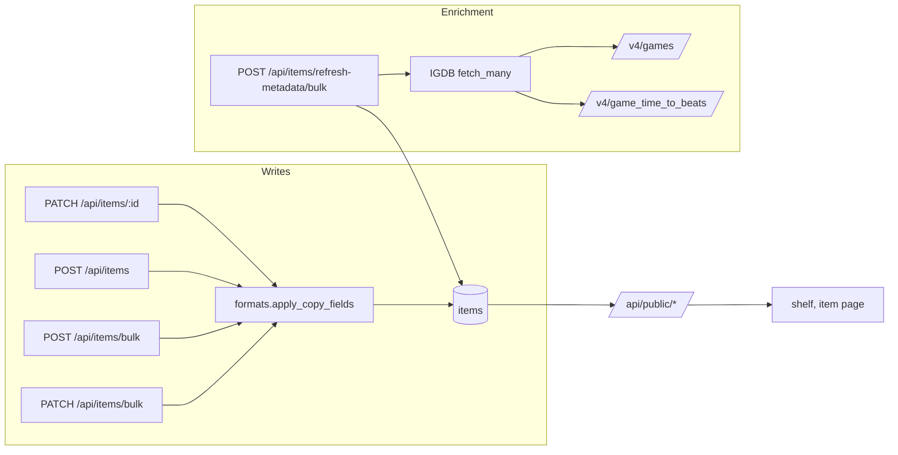

# Tracker E7b — Metadata Depth and the Copy Fields — Design

Date: 2026-09-23. Parent spec:
`docs/planning/2026-09-22-tracker-enhancement-design.md` (§5.1–§5.3, §5.8,
§9, §11). This document is the spec E7b is built from. Where it deviates from
the parent, the deviation is stated and its reason given; this document wins.

## Problem

The shelf (E7a) shows what a game *is* but not what the copy on the shelf
*is*. There is no platform per copy, no record of whether a Switch 2 box holds
a full cartridge or a Game-Key Card, no release date, and no time to beat. Play
Next (E8a) needs length and platform; Discover and Radar (E8b, E8c) need ids,
themes and release status; and the showcase should say "Game-Key Card" rather
than let a key card pass for a cartridge.

## Scope

**In**

- Migration `0003`: ten nullable `items` columns and three enums (§1).
- A deeper IGDB snapshot, recorded against live fixtures (§2).
- Batched bulk metadata refresh for games (§3).
- Server-side write rules for the copy fields, in one pure module (§4).
- Bulk set of platform, format, region and completeness from the admin list
  view (§5).
- The photo importer maps its detected platform to `platform_id` (§6).
- The E7b public fields and stats (§7).
- UI: format mark, Upcoming ribbon, platform chips, item-page chips and
  time-to-beat tile, the "On cartridge" line, the edit and create form fields,
  list-view selection and bulk set, and the refresh button (§8).
- Smoke checks and docs (§9).

**Out** (with where each goes)

- `pick_events` and `recommendations` tables: the migration of the phase that
  uses them (E8a, E8b). *Deviation from parent §5.2*, which put both in `0003`;
  shaping tables before their code exists invites a second migration anyway.
- Importer cart-ID and key-card-banner reading: when Switch 2 games are being
  imported again, verified against real box photos. *Deviation from parent
  §5.8.*
- The physical catalogue, registry sync, edition one-click fill and evidence
  notes: E7c.
- The pin endpoint and anything writing `pinned_at`: E8a. The column ships now
  because it is one of the ten `items` columns and costs nothing while NULL.
- An IGDB platform search on the forms: the form offers the platforms in
  `PLATFORM_NAMES`; adding one is a line there.
- A TMDB bulk refresh: the collection holds almost no films. TMDB rows gain
  `release_date` on their single-item refresh.
- The Apicalypse array-bracket question (parent §5.1): it governs §7–§8 queries,
  none of which E7b writes.

## Proposed solution

### 1. Migration `0003`

Ten nullable columns on `items`:

| Column | Type | Notes |
|---|---|---|
| `release_date` | date | From IGDB `first_release_date` or TMDB `release_date` on refresh, which overwrites it for linked rows; editable for manual rows. `year` stays the display field. |
| `pinned_at` | timestamptz | No writer until E8a. |
| `acquired_at` | date | Backfilled from `created_at::date` in the migration; editable. |
| `platform_id` | smallint | IGDB platform id of this copy. |
| `platform` | varchar(60) | Display name, resolved server-side from `platform_id`; never accepted from a request. |
| `physical_format` | enum `physical_format` (`game_card`, `game_key_card`, `code_in_box`, `disc`) | NULL is unknown or not physical. Never defaulted. |
| `format_source` | enum `format_source` (`cart_id`, `photo`, `registry`, `store_text`, `store_policy`, `platform_policy`, `manual`) | Derived server-side; E7b writes only `cart_id` and `manual`. The full set ships now so E7c does not alter the enum. |
| `cart_id` | varchar(20) | Switch 2 product code. |
| `region` | varchar(4) | NULL reads as `HOME_REGION = "USA"`. |
| `completeness` | enum `completeness` (`loose`, `boxed`, `cib`, `sealed`) | |

Downgrade drops the columns, then the enums. `models.py` gains the columns
and the three Python enums; `schema_check` needs no change beyond the new head.

### 2. IGDB snapshot and fixtures

**Fixture recording.** `backend/scripts/record_igdb_fixtures.py`, run once by
the owner, loads config the normal way (the credentials never leave the
process) and writes response bodies only — no headers, no tokens — to
`backend/tests/fixtures/`:

- `/v4/games` for three owned games: one Switch 2, one Switch, one N64 title;
- `/v4/game_time_to_beats` for those three plus one obscure game expected to
  have no submissions;
- `/v4/platforms` for the N64 and Switch 2 slugs.

It gets a README. Parser work waits on the recording; everything else in the
zone proceeds meanwhile.

**Snapshot.** `FIELDS` gains `themes.name`, `keywords.name`,
`game_modes.name`, `player_perspectives.name`, `genres.id`, `themes.id`,
`platforms.id`, `hypes`, `game_status.status`. The snapshot gains:

| Key | Value |
|---|---|
| `themes`, `game_modes`, `player_perspectives` | name lists |
| `keywords` | name list, first 10 (the query language cannot trim) |
| `genre_ids`, `theme_ids`, `platform_ids` | id lists |
| `hypes` | int or absent |
| `release_status` | the raw `game_status` value; absent means unknown, never released. The deprecated `status` field is not read. |
| `first_release_date` | ISO date from the epoch value |
| `time_to_beat` | `{hastily, normally, completely, count}`, hours to one decimal (source is seconds). The key is absent when the endpoint has no row; zeros are never stored. |

`PLATFORM_IDS` gains `"nintendo 64"`/`"n64"` → 4; `PLATFORM_NAMES` maps id →
display name. N64 = 4 and Switch 2 = 508 are confirmed against the `/platforms`
fixture before either is relied on. The single-id `fetch` also requests time to
beat (one extra call), so picker and re-link paths fill it.

### 3. Bulk refresh

`POST /api/items/refresh-metadata/bulk?type=game` (admin), declared before
`/{item_id}`. A new adapter method `fetch_many(ids)` requests games in batches
of 100 (`limit 100;` explicitly — the default is 10) and one
`game_time_to_beats` request per batch, spaced to stay under IGDB's 4 requests
per second. For each IGDB-linked game it updates the snapshot, `creator`,
`cover_url` and `release_date`, and sets `platform_id`/`platform` only where
both are NULL and the snapshot lists exactly one platform. It never writes
rating, status, favourite, notes, format, cart ID, region, completeness,
visibility, `acquired_at`, `started_at` or `finished_at`. `release_date` is the
exception by design: for an IGDB-linked game IGDB is its source of truth,
because announced dates move, so the refresh overwrites it. The editable field
exists for manual rows. A failed batch is counted and the rest
proceed. It runs synchronously and returns `{updated, skipped, failed}`.

### 4. Write rules — `backend/formats.py`

`apply_copy_fields(changes: dict, row: Item | None) -> dict` is pure and
raises `CopyFieldError`, mapped to 422 with its message. It runs on PATCH,
create, bulk create and bulk set. Request models accept `platform_id`,
`physical_format`, `cart_id`, `region`, `completeness`, `acquired_at`,
`release_date`; `platform`, `format_source` and `pinned_at` are absent from
them and so ignored, as unknown keys already are.

1. `platform_id` must be in `PLATFORM_NAMES`; it sets `platform`. NULL clears
   both.
2. `cart_id` is trimmed and upper-cased and must match
   `^L[PBNA]-[A-Z0-9]{5}-[A-Z0-9]{3}-[0-9A-Z]$`. `LP` → `game_key_card`; `LB`,
   `LN` → `game_card`; `LA` on a Switch 2 copy (508) → 422, "LA is a Switch 1
   cartridge, so the platform looks wrong". The third segment sets `region`
   unless the body sets it. `format_source` → `cart_id`.
3. A cart ID in the body or on the row, plus a *different* `physical_format`
   in the body, is a 422 explaining the conflict. *Deviation from parent §5.8*,
   which overrode the format silently and reported it: refusing is simpler and
   nothing is rewritten behind the owner's back.
4. `physical_format` set with no cart ID in body or row → `format_source =
   manual`.
5. `physical_format: null` clears `format_source` and `cart_id`. `cart_id:
   null` alone keeps the format and sets the source to `manual`.
6. `region` is 2–4 letters, upper-cased; NULL stays NULL.
7. `completeness` is accepted for any platform; the form shows it only for
   `CARTRIDGE_ERA_PLATFORMS = {4}`.

### 5. Bulk set

`PATCH /api/items/bulk` (admin) with `{ids: list[uuid] (1–500), changes:
{platform_id?, physical_format?, region?, completeness?}}`. No `cart_id`: it
belongs to one copy. Each row passes through `apply_copy_fields` in one
transaction; any conflict is a 422 naming the conflicting items, and nothing is
written. Returns `{updated}`. Declared before `/{item_id}`.

### 6. Importer

Rows the photo importer commits get `platform_id` from the existing
`platform_id()` over the detected platform text, then `platform` through
`apply_copy_fields`. Nothing else changes.

### 7. Public API

Allowlist pattern unchanged; the field-set pin tests change before the fields.

- List adds `release_date`, `platform`, `physical_format`, `completeness`,
  `time_to_beat_hours` (`normally`, rounded to a whole hour, or null).
- Detail adds `themes` and `time_to_beat` (the whole object, or null).
- Stats adds `by_platform` (`{name: count}` over public rows) and `by_format`
  keyed by platform id for `KEY_CARD_PLATFORMS = {508}`, each
  `{game_card, game_key_card, code_in_box, unknown, total}` over owned public
  games (`owned_format IS DISTINCT FROM 'none'`).
- Never public: `cart_id`, `format_source`, `region`, `acquired_at`,
  `pinned_at` — each named in the leak tests.

### 8. UI

- **`PosterCard`**: a format mark at the poster's bottom-right — a key glyph
  for `game_key_card`/`code_in_box`, "?" for a Switch 2 copy with a NULL
  format, nothing otherwise; `role="img"` with a spelled-out label, in
  `--text-muted`. An Upcoming ribbon along the bottom edge when
  `release_date` is after today: "Coming Mar 2027".
- **Filters**: a platform chip row built from the platforms present, rendered
  when there are two or more. `filterItems` gains `platform`.
- **Item page**: chips are the copy's platform, genres, themes (muted), other
  platforms (muted), then a format chip ("Full game on cartridge",
  "Game-Key Card", "Code in a box", "Disc", or "Format not recorded" for a
  Switch 2 NULL) and completeness when set. A Time to beat tile, "≈ 12 h ·
  18 h to complete", absent without data.
- **Stats**: an "On cartridge" line per key-card platform — "Switch 2 · 61 on
  cartridge · 3 Game-Key Cards · 4 not recorded, of 68" — once at least one
  game there has a recorded format.
- **Edit page**: platform select, format select, cart ID, region (placeholder
  "USA"), acquired date, completeness (N64 only); a 422 shown in words.
- **Create form**: platform and format.
- **List view**: a checkbox column with select-all, a Platform column, and a
  bar with "Set platform…" and "Set format…" over the selection, showing the
  count; a 422 names the conflicting items.
- **Refresh**: a "Refresh game metadata" button beside the bulk publish
  controls, showing `{updated, skipped, failed}`.

### 9. Smoke and docs

`scripts/smoke.sh`: public items carry `platform` and `physical_format`; stats
carry `by_format`; the leak grep adds `cart_id|format_source|region|
acquired_at|pinned_at`; `PATCH /api/items/bulk` and
`POST /api/items/refresh-metadata/bulk` answer 401 unauthenticated.
`CLAUDE.md` gains `formats.py` and the deploy order; `sources/README.md` gains
`fetch_many` and the fixture script.

## Key decisions

| Decision | Chosen | Tradeoff |
|---|---|---|
| One plan or several | One plan, two zones (owner's call) | One larger review and PR; one deploy and one migration run. |
| What `0003` holds | `items` columns only | Two more manual migrations later (E8a, E8b), against tables shaped by real code. |
| Where write rules live | Pure `formats.py` | One more module; one tested place instead of four copies or SQL triggers. |
| Cart ID vs body format | 422 | The owner resolves the conflict explicitly; the parent's silent override is dropped. |
| Backfilling platforms | Bulk set in list view | One endpoint and a selection UI; saves ~68 edit-page visits. |
| Importer | Platform only | Cart-ID and banner reading wait for real Switch 2 photos. |
| Platform choices | `PLATFORM_NAMES` only | No IGDB platform search; adding a platform is a one-line change. |
| Fixtures | Owner runs a script | One manual step; the credentials never reach the assistant. |

## Prior art and docs consulted

| Source | Finding | Verdict |
|---|---|---|
| IGDB API docs, api-docs.igdb.com (official) | `game_time_to_beats` is a separate endpoint; `hastily`/`normally`/`completely` in seconds plus `count`. | Align. |
| same | `status` on games is deprecated in favour of `game_status` → `/game_statuses`; enum values kept; released = 0, there is no 1. | Align: read `game_status`; never treat 0 as missing. |
| same | `themes`, `keywords`, `game_modes`, `player_perspectives` are reference arrays that expand by `.name`; no in-query array trimming. | Align; trim keywords in Python. |
| same | 4 requests/second (429 above), 8 concurrent; `limit` defaults to 10, max 500; `where id = (…)` is OR. | Align: explicit `limit`, spaced requests. |
| same | Switch = 130 documented. N64 = 4 only in a community gist; Switch 2 = 508 only in our code and igdb.com's platform page. | Deviate from trust: confirm both against the live `/platforms` fixture before use. |
| same | Absence of a `game_time_to_beats` row for a game with no submissions is not documented. | Confirm with the fixture's obscure-game case. |
| Repo: `matching.py`, `sources/` package, `public.py`, `test_migrations.py` | Pure helpers tested without a DB; adapters behind one interface; hand-written public allowlist; revision up/down tests. | Align. |

## Open questions

None blocking. The fixture run will confirm N64 = 4, Switch 2 = 508, the shape
of `game_status` on a live game, and that a game without submissions is absent
from `game_time_to_beats`; if any differs, the parser task adapts before it is
written and the difference is recorded in the plan's summary.

## Smoke test strategy

`scripts/smoke.sh` exists; E7b extends it (§9). Passing means: backend and
frontend suites green, `npm run build` clean, ruff and prettier/eslint clean,
no raw hex outside the token blocks, and after the owner applies `0003` to Neon
and merges, `./scripts/smoke.sh https://joey-haas.dev https://api.joey-haas.dev`
green with no new errors in the Render logs. The bulk refresh's
`{updated, skipped, failed}` from the owner's first press is the functional
check of the IGDB path in production.

## Deploy order (owner)

1. Apply `0003` to Neon: `alembic upgrade head` against `DATABASE_URL_DIRECT`,
   as for `0002`.
2. Merge; Render deploys; `schema_check` confirms the schema.
3. Press "Refresh game metadata" once.
4. Bulk-set platform and format in the list view.
5. Smoke and logs.

Deploying before step 1 makes the API refuse to boot; that is `schema_check`
working, and applying the migration fixes it.
