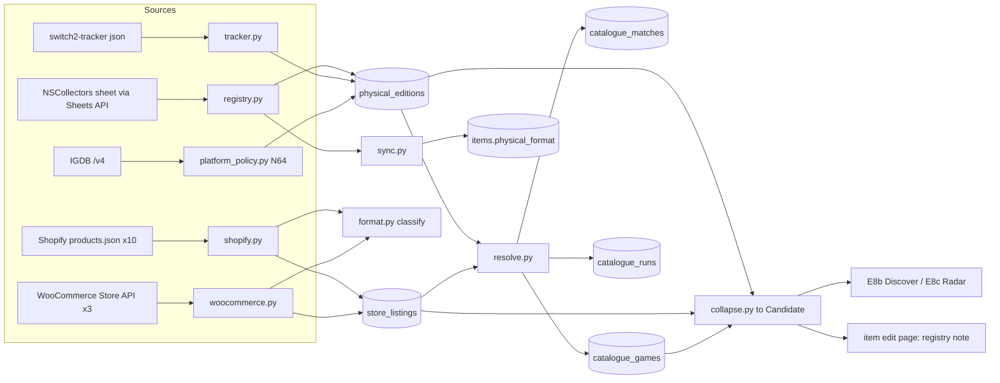

# Tracker E7c — Physical Catalogue — Design

Date: 2026-09-23. Parent spec:
`docs/planning/2026-09-22-tracker-enhancement-design.md` (§5.4–§5.8, §7, §8,
§10–§12). Handoff: `docs/planning/2026-09-23-tracker-roadmap-handoff.md`.
Research: `2026-09-22-physical-sources-research.md` and
`2026-09-22-tracker-design-research.md`, re-checked against the live sources
on 2026-09-23 (Prior art below). This document is the spec E7c is built from;
where it deviates from the parent the deviation is stated with its reason, and
this document wins. Revised 2026-09-24: the registry is read through the
Google Sheets API (Open question 1), Limited Run's closed-pre-order handles
are not walked (3), and the remaining E8b/E8c defaults are recorded.
Revised 2026-09-25 from the recorded fixtures (the plan's Execution summary
has the full drift): Atari is dropped (a Cloudflare bot challenge), so there
are twelve stores; the registry reads the Release Details and Upcoming
Releases tabs and neither summary tab; and a registry edition is keyed by
title, region, publisher and card type, because title and region alone are
not unique.

## Problem

Discover (E8b) and Radar (E8c) are physical-first: a game with no known
physical edition on a platform in the collection does not exist to them, and a
Game-Key Card must never pass for a cartridge. Nothing in the stack can answer
"does this game exist on a cartridge, and which kind" — IGDB has no concept of
it, Nintendo's pages do not mark it, and the `items` table only knows the
copies the owner already has.

The physical catalogue assembles that answer from three kinds of source: the
r/NSCollectors Switch 2 registry (with `switch2-tracker` as a cross-check), the
twelve boutique stores in the owner's bookmarks (nine Shopify, three
WooCommerce — the only physical signal for Switch 1, which is 58 of the 68
owned games), and platform policy (N64: every release is a cartridge; Switch 1:
no Game-Key Cards exist). It also has to be shaped for its readers: one
snapshot per game for scoring, a title match that survives a store re-listing
a product, and one tested rule for collapsing several editions of a game into
one honest format.

## Scope

**In**

- Migration `0005`: `catalogue_games`, `physical_editions`, `store_listings`,
  `catalogue_matches`, `catalogue_runs`, created empty. Additive; nothing on
  `items` changes (§1).
- `backend/physical_sources/`: the registry reader (the sheet's Release
  Details and Upcoming Releases tabs through the Google Sheets API; header
  located by content; schema check), the
  `switch2-tracker` cross-check, the Shopify and WooCommerce adapters, the
  `STORES` data table for all twelve stores, the Limited Run HTML step, the
  format classifier, the pure collapse rule, and the N64 platform-policy
  ingest (§2, §4).
- IGDB resolution of catalogue rows through `catalogue_matches`, with a
  per-game snapshot cache (§3).
- Refresh, resolve, status, needs-match, link, registry and disagreement
  endpoints — admin, synchronous, manual; robots.txt honoured per host; a
  descriptive User-Agent (§6).
- Registry sync onto owned items, the edit-page one-click registry fill, and
  the read-time disagreement note with "Use registry value" (§5).
- `/admin/catalogue`: status per source, refresh buttons that loop, the Needs
  match panel, the disagreements list; the registry line on the edit page (§7).
- One recorded fixture per store handle and per registry tab before any parser
  is written; smoke checks; `CLAUDE.md` and `sources/README.md` updates (§9).

**Out**

- Discover, Radar, the `recommendations` table: E8b/E8c (`0006`). E7c ships
  the `collapse()` they call.
- Importer cart-ID and banner reading: the next Switch 2 import session.
- PrestaShop stores (Red Art, Pix'n Love): E10. Forever Limited, Team17, PANAX:
  skipped, per D8.
- Any public API field; a test pins that nothing from the catalogue appears in
  `public.py`'s response models.
- Background jobs, price history, an N64 cover backfill from MobyGames.
- `items.edition_id`: not added; the item's edition is found at read time.

## Proposed solution

### 1. Migration `0005` — the catalogue tables

Five tables, created empty. Enums are created explicitly in `upgrade()` and
dropped in `downgrade()` (migrations README); `test_migrations.py` diffs the
models against the migration and cycles down/up.

**`catalogue_games`** — one row per IGDB game the catalogue knows; the only
place IGDB data lives. *Deviation from parent §5.5*, which copied an
`igdb_cache` onto every edition and listing row: Discover scores per game, so
the snapshot is stored per game, filled once per refresh.

| Column | Notes |
|---|---|
| `igdb_id` int, primary key | |
| `title`, `cover_url`, `release_date` date, `hypes` int | from the snapshot, denormalised for sorting |
| `snapshot` jsonb | the E7b §2 snapshot as `fetch_many` returns it: genres, themes, keywords, modes, perspectives, ids, `similar_games`, `time_to_beat`, `release_status`, `platform_ids` |
| `fetched_at` timestamptz | refreshed in batches of 100 during resolution, never per generate |

**`physical_editions`** — one row per (registry source, title, region), or per
platform-policy game. Stores never write it.

| Column | Notes |
|---|---|
| `id` uuid | |
| `source` varchar(20) | `nscollectors` \| `switch2tracker` \| `igdb_platform` \| `manual` |
| `source_ref` text; unique (`source`, `source_ref`) | `nscollectors`: `normalize_title(Game Title)` + `\|` + region + `\|` + `normalize_title(Publisher)` + `\|` + case-folded `Card Type` (*revised 2026-09-25*: title and region alone are not unique — WWE 2K25 EUR has a Game-Key Card and a Code in a Box row from one publisher; a card type changing from `TBC` retires the old row and adds the new one); `switch2tracker`: `normalize_title(title)` + `\|` + region (*deviation*: its `id` is a sort index that shifts, §2); `igdb_platform`: the IGDB id |
| `title`, `title_normalized` | as the source spells it; `matching.normalize_title` |
| `platform_id` smallint, `platform` | 508 for the registries, 4 for N64 policy |
| `region` varchar(4) | `USA`, `EUR`, `JPN`, `KOR`, `CHT`, `AUS`, `ASI` as the sheet spells them; `ALL` for policy rows and game-level tracker rows |
| `is_physical` bool, nullable | true for a card type; false for the sheet's `Digital` / `Digital only` and the tracker's `d`; NULL for an Upcoming Releases row whose `Card Type` is `TBC` or blank (announced, card type not yet listed). Every pool filters `is_physical IS DISTINCT FROM false`. |
| `physical_format` enum, `format_source` enum | the existing enums; `registry` or `platform_policy` here; NULL when unknown or digital |
| `cart_id` varchar(20), `publisher`, `editions` text, `ns1_compatible` bool | from the sheet when the columns are present |
| `release_date` date, `release_precision` enum `release_precision` (`day` \| `month` \| `quarter` \| `year`) | §2 |
| `igdb_id` int, FK → `catalogue_games`, nullable | copied from `catalogue_matches`; NULL while unmatched or ignored |
| `first_seen_at`, `last_seen_at`, `retired_at` timestamptz | absent from a successful, non-short run for its source → `retired_at` set; reappearing → cleared; never deleted |

**`store_listings`** — one row per platform variant of a product on a store
(Limited Run, Aksys and Nicalis sell one product with a `Platform` option).

| Column | Notes |
|---|---|
| `id` uuid; unique (`store`, `variant_id`) | single-variant products use the product id as `variant_id` |
| `store` varchar(40), `store_product_id` varchar(40), `variant_id` varchar(40), `handle`, `url` | never keyed on handle (Premium Edition reuses them) |
| `region` varchar(4) | per store config: `USA` for USD stores, `EUR` for EUR and GBP stores |
| `title`, `title_normalized`, `edition_label` | `title` as the store shows it; `title_normalized` after the store's `title_strip` and then `normalize_title`; `edition_label` from the shared `EDITION_LABEL` regex over title and option values |
| `platform_id` smallint, `platform` | per the store's platform strategy; NULL → Needs match |
| `is_game` bool | false for merch, vinyl, CDs, trading cards, club keys, `Shipping` products |
| `collections_seen` jsonb | the handles or category ids the variant was found in during the latest run |
| `price` numeric(8,2), `currency` char(3) | currency is the store constant |
| `availability` enum `listing_availability` (`preorder` \| `in_stock` \| `sold_out` \| `archived`) | |
| `preorder_closes_at` date, `release_date` date, `release_precision`, `release_text` | §2, parsing |
| `format_hint` enum `physical_format`, `format_tier` enum `format_source`, `format_evidence` text | from the classifier; NULL when nothing applied |
| `image_url` | store image, used only until a cover is linked |
| `igdb_id` int, FK → `catalogue_games`, nullable | via `catalogue_matches` |
| `raw` jsonb | product_type, tags, options, this variant's fields, a body excerpt, `html_checked_at` — enough to re-classify without refetching |
| `first_seen_at`, `last_seen_at`, `updated_at` | unseen in a successful, non-short run for its store → `archived`, never deleted |

**`catalogue_matches`** — the title → game decision, shared by every row with
the same key.

| Column | Notes |
|---|---|
| `title_normalized` text + `platform_id` smallint, primary key | `platform_id` 0 for rows with no platform, so the key is total |
| `igdb_id` int, nullable | NULL when `pending` or `ignored` |
| `match_confidence` enum `match_confidence` (`exact` \| `probable` \| `uncertain` \| `manual`) | |
| `decided_by` enum `match_decision` (`auto` \| `manual` \| `ignored` \| `pending`) | `pending` rows are the Needs match queue |
| `candidates` jsonb | the top three `SourceResult`s from the last search, so Needs match pre-selects without a new IGDB call |
| `decided_at` timestamptz | |

**`catalogue_runs`** — `id`, `source` varchar(40) (a store key, `nscollectors`,
`switch2tracker`, `igdb_platform`, `resolve`), `started_at`, `finished_at`,
`ok` bool, `rows_seen`, `rows_changed`, `rows_retired`, `items_synced`,
`unresolved_remaining`, `short_run` bool, `errors` jsonb — a list of
`{code, detail}` with codes such as `robots_disallowed`, `empty_collection`,
`schema_missing_columns`, `unknown_card_type`, `http_error`,
`igdb_not_configured`, `igdb_rate_limited`, `info`.

Indexes: `physical_editions (igdb_id, platform_id)` and
`(platform_id, region) WHERE retired_at IS NULL`; `store_listings
(igdb_id, platform_id)` and `(store, availability)`; `catalogue_runs
(source, started_at DESC)`.

**What this gives E8b and E8c.** A candidate is `(igdb_id, platform_id)`; its
metadata is one `catalogue_games` row; its format, note and store lines come
from `collapse()` (§4); `recommendations.listing_ids` references
`store_listings.id`; Radar's Watching join is `store_listings.igdb_id =
items.external_id::int AND store_listings.platform_id = items.platform_id`,
which the indexes above serve.

### 2. `backend/physical_sources/` — reading the sources

A package beside `sources/`, same conventions: pure `parse_*` functions,
recorded fixtures under `tests/fixtures/physical/`, lazy config, a `Throttle`
per host at 2 requests per second, `httpx2`. Interface: `list_products() ->
list[StoreProduct]` for stores, `list_editions() -> list[EditionRow]` for
registries — each already one row per platform variant or region. Every fetch
sends `User-Agent: joey-haas.dev tracker (+https://joey-haas.dev;
josephthaas@gmail.com)`.

**Courtesy — `courtesy.py`.** Before a host is read, its `/robots.txt` is
fetched once per run and checked with `urllib.robotparser` under
`User-agent: *` for every path the adapter will request. Disallowed → the
source is skipped with `robots_disallowed` in the run's errors. An unreachable
robots file (non-200) is treated as allowed and logged. Every store host
allowed its JSON paths on 2026-09-22, and every recorded path on 2026-09-25. `docs.google.com/robots.txt`
disallows every path for every agent (line 38, `Disallow: /`, no
`spreadsheets` rule — checked by the owner 2026-09-24), so the CSV export is
never fetched; the registry is read through the Sheets API instead, which
robots.txt does not govern.

**Registry — `registry.py`.** Reads two tabs of the NSCollectors sheet
(`1LEIJUOanvkKq9kv1fSOnD40GdE1Jt5LzSYsg8yAPmb8`) through the Google Sheets
API v4 with an optional, lazily checked `GOOGLE_SHEETS_API_KEY` (`config.py`,
never in `_REQUIRED`; a missing key records `sheets_not_configured` on the
registry run and leaves the tracker and the stores unaffected). Once per run
`GET /v4/spreadsheets/{id}?fields=sheets.properties` maps the known gids —
Release Details `764784245` and Upcoming Releases `238551450` — to their
current tab titles, then `GET /v4/spreadsheets/{id}/values/{title}`
returns each tab as JSON rows, which feed the same header-by-content parser
the CSV would have. A public ("anyone with the link") sheet needs only the
key; the fixture recorder's first run confirms that for this sheet, and a
403 there means the fallback door — an admin upload of hand-downloaded
CSVs through the same parser — is designed before the registry task starts.
*Deviation from parent §5.5*: no CSV export (robots). *Revised 2026-09-25*:
neither summary tab is read. Release Details dates all 749 rows by region
(`YYYY/MM/DD`), and Upcoming Releases has the Details layout without
`Master Title` and covers all 65 titles of the Upcoming Summary, with dates
and, for 120 of 185 rows, a card type. The key confirmed access on
2026-09-25, so the upload fallback is not built.

- `parse_details(rows)`, used for both tabs: the header row is located by content — the first
  row containing `Game Title`, `Region` and `Card Type` — never assumed to be
  row 0. A required column missing → `schema_missing_columns`; the run fails
  and nothing is written or retired. Optional columns (`Master Title`,
  `Cart ID`, `Publisher`, `Editions`, any header containing `NS1`,
  `Release Date`) missing → a warning in the run and NULL fields.
  `Card Type`, case-folded: `game card` → `game_card`; `game-key card` →
  `game_key_card`; `code in box` / `code-in-box` / `code in a box` /
  `retail code` → `code_in_box`; `digital` / `digital only` → `is_physical =
  false`, format NULL; blank → physical, format NULL; anything else →
  physical, format NULL, counted as `unknown_card_type` with the value so new
  vocabulary is noticed. `TBC` → `is_physical = NULL`, format NULL (seen
  only on Upcoming Releases). Cart IDs are kept only when they match
  `CART_ID_PATTERN` (`N/A` and blank → NULL); region is upper-cased.
- `Release Date`: `YYYY/MM/DD` or `YYYY-MM-DD` → day, `Mon YYYY` / `YYYY-MM`
  → month, `Q[1-4] YYYY` → quarter, `YYYY` → year, `TBA` / blank → NULL.
- `merge(details, upcoming)`: one `EditionRow` per row of either tab; where
  the same `source_ref` appears in both, Release Details wins (a title
  released in a region can linger on the upcoming tab).
- A run that sees fewer than half the rows of the source's last successful
  run is `short_run`: rows upsert, nothing retires.

**`switch2-tracker` — `tracker.py`.** `data/games.json` from
`raw.githubusercontent.com/codemaverick-hub/switch2-tracker/main/`,
best-effort: a failure is an error on its own run, never on the registry's.
On 2026-09-23 it held 910 games, updated that morning; `fmt` was known for
319 and 303 of those had no per-region `formats{}`. So a game-level `fmt`
(`c` / `k` / `b`) becomes one edition with region `ALL`; a per-region entry
becomes one edition each; `d` → `is_physical = false`; `?` → skipped. `date`
parses `Mon D, YYYY` → day, `YYYY` → year, `Qn YYYY` → quarter, `TBA` → NULL.
The repo has no licence file, so `tests/fixtures/physical/
switch2tracker_games.json` is a ~30-game excerpt. The collapse (§4) prefers an
`nscollectors` row over a `switch2tracker` row for the same game and region;
the tracker is never written where the sheet already speaks.

**Platform policy — `platform_policy.py`.** `POST
/api/physical/refresh-platform?platform_id=4` pages IGDB `where platforms =
(4) & total_rating_count >= 5; limit 500;` into `igdb_platform` editions
(`region = ALL`, `game_card` at `platform_policy`, `is_physical = true`) and
fills `catalogue_games` for them; the first run records the cover-coverage
count as an `info` entry. `CARTRIDGE_ONLY_PLATFORMS = {4, 130}` in
`formats.py`: Switch 1 joins because no Game-Key Cards exist on it, but it is
not ingested from IGDB — Switch 1 rows come only from stores, and the policy
only fills a store listing's format when its text says nothing.

**Shopify — `shopify.py`.** Walks
`/collections/<handle>/products.json?limit=250&page=N` per configured handle
until an empty page. An empty first page is `empty_collection` for that
handle; a store fails only when every handle is empty or errors. Products
seen in several handles merge their `collections_seen`. One `StoreProduct` per
platform variant. `inventory_quantity` is optional (absent on Limited Run
today). Never walks `all` or `archive` (6,512 and 4,112 products at Limited
Run), nor `in-production` / `all-in-production`: checked 2026-09-24, both
hold closed pre-orders tagged `Archive` and largely `Shipping Complete`,
nothing buyable and no Switch 2 items — Radar's job is pre-orders while they
are open, and those editions reach the registry when they ship.

**WooCommerce — `woocommerce.py`.** Walks
`/wp-json/wc/store/v1/products?per_page=100&page=N&category=<id>`;
`prices.price` ÷ 10^`currency_minor_unit`; `is_on_backorder` → `preorder`,
else `is_in_stock` → `in_stock` / `sold_out`. PixelHeart lists every product
twice (`/en/` and `/fr/` permalinks, distinct ids): a per-store `url_keep`
regex keeps `/en/`.

**`STORES` — `stores.py`.** One entry per store, transcribed from the research
doc and corrected by the 2026-09-23 endpoints. Each entry: `adapter`,
`domain`, `currency`, `region`, `collections`, `title_strip`, `platform`
strategy (ordered), `status` strategy (ordered), `game_filter`, `url_keep`,
`format_policy`, `html_step`.

| Store | Collections walked (counts on 2026-09-23) | Platform from | Status from | Notes |
|---|---|---|---|---|
| `limited_run` USD / USA | `coming-soon` 49 (5 on 2026-09-25), `latest-releases` 10, `distro` 27 (5), `the-lr-vault` 20 (63), `in-stock-switch` 44 (27) | option `Platform`; SKU `NS2-` / `NSW-`; title `(Switch 2, …)`; tags last | `coming-soon` / `latest-releases` → `preorder` even with `available: false` (Purple Dot waitlist); vault and in-stock → `variant.available` | `title_strip` `^(Switch\|PS5\|PS4\|Xbox) Limited Run #\d+: `; `format_policy`: `game_card` unless `distro` in `collections_seen`; `html_step` for Switch 2 pre-order variants; `in-production` and `all-in-production` deliberately not walked; the HTML step reads the ship date from the page's `selling_plan_groups` JSON (`Date` option, ISO), not theme text (2026-09-25) |
| `iam8bit` USD / USA, host `www.` | `games`, `nintendo`, `pre-order`, `new`, `restock` | tag `Nintendo Switch 2`; SKU `-N2-`; title `(Nintendo Switch 2)` | tag `pre-order`; tag `sold-out`; available | "complete on cartridge"; "Shipping Q4 2026" |
| `strictly_limited` EUR / EUR, host `www.` | `nintendo-switch-2`, `nintendo-switch`, `pre-order`, `coming-soon`, `in-stock` | product_type; tag `NSW2`; title `(Nintendo Switch 2)` | `variants[].available` first (a `Sold Out` tag sat on an available item) | "full game on cartridge" per item |
| `premium_edition` USD / USA | `pre-order`, `latest-preorders`, `coming-soon-2`, `in-stock`, `in-stock-partners` | product_type `Nintendo Switch Games`; tag `Nintendo Switch` | collection membership; title `(PRE-ORDER)`; available | key on id, never handle; "Physical Case and Game" |
| `nicalis` USD / USA | `nintendo-switch-2`, `nintendo-switch`, `new` | option `Platform` (`Nintendo Switch™ 2`); SKU `-NSW2-` | tag `Preorder`; available | body `Release Date: …`; says nothing about format |
| `aksys_us` USD / USA | `preorder-now`, `new-releases`, `switch` | SKU `SW-`; title `- Nintendo Switch™` | title `PRE-ORDER: `; available | says nothing about format |
| `aksys_eu` GBP / EUR | `nintendo-switch™-1` 61, `nintendo-switch-game` 40, `pre-order-now` 7, `buy-now` 55, `sold-out` 48 | collection; title | collection; available | changed since the research: `switch` is gone; the ™ is percent-encoded |
| `fangamer` USD / USA, host `www.` | `physical-games`, `video-games` | option `edition` (lower-case now); tag `platform_Nintendo Switch 2`; SKU `-NS2` / `-NSW` | tag `preorder`; available | the upgrade-pack phrase → Switch 1 cart (`platform_override = 130`) |
| `super_rare` GBP / EUR | `switch-2` 6, `switch` 49, `srg-store-new-web` | product_type `Switch 2` / `Switch`; title `Sw2#` / `SRG#` / `[Special Edition] SE#`, case-insensitive | tag `pre-order`; available | "Fully assembled … game with cartridge"; drop `Trading Cards`, `clubproducts*`, `Teeto Key` |
| `pixelheart` EUR / EUR (WooCommerce), host `www.` | category 65 | name `SWITCH [EUR]` / `SWITCH [US]` (no `Platform` attribute on 2026-09-25) | backorder / in stock | `url_keep` `/en/`; 32 products on 2026-09-25 |
| `gamefairy` USD / USA (WooCommerce) | category 22 | name | in stock | "Switch Case and Cartridge"; 21 products on 2026-09-25 |
| `oneprint` USD / USA (WooCommerce) | category 18 | name `(Nintendo Switch)` | in stock | bundles ("A and B") resolve to nothing → Ignore; 17 products on 2026-09-25 |

Atari (`atari.com`, `physical-games`, `physical-cartridges`) was in this
table until 2026-09-25, when its `products.json` answered every client with a
Cloudflare bot challenge. Getting past bot detection is off the table, so it
is out until the challenge goes.

Platform strategy order: option values first (matched case-insensitively —
`Platform`, `Video game platform`, `edition`), then product_type, then title
regexes, then SKU prefixes, then tags — tags last because Limited Run's
"Riven (PS5, Xbox)" carries a `Switch` tag with no Switch variant; when a
product has a platform option, tags are not consulted. A variant whose
platform resolves outside `CATALOGUE_PLATFORMS = {508, 130, 4}` (PS5, Xbox,
PC, Sega Genesis carts, Game Boy) is stored with its platform but never
resolved and never pooled; one whose platform cannot be read goes to Needs
match. Merch, vinyl, CDs, trading cards, club keys and `Shipping` products
fail `game_filter` (`is_game = false`).

**Limited Run HTML step.** Only for Switch 2 variants in `coming-soon` and
`latest-releases`: fetch the product page (throttled, one per listing, skipped
when `raw.html_checked_at` is within 7 days) and regex `Game Key Card` →
`game_key_card` at `store_text`, `Estimated Ship Date: (.+)` →
`release_text` and a parsed date. Both are theme blocks absent from every JSON
endpoint (re-confirmed 2026-09-23 on `coming-soon`).

**Classifier — `format.py`.** Pure `classify(text, policy, platform_id) ->
Classification(format, tier, platform_override, evidence)`, tested against
every phrase in the research doc plus those seen 2026-09-23:

1. Strip false positives: `download code for the .* soundtrack`, `code in the
   box for <bonus>` (any "code in the box" not preceded by the game's own
   title), `Steam Key`, `Teeto Key`.
2. Key-card and not-full-cart phrases → `game_key_card` / `code_in_box` at
   `store_text`: `game[- ]?key[- ]?card`, `download code in a box`,
   `code[- ]in[- ]a[- ]box`, `full game download via internet required`. The
   Fangamer phrase `includes the Nintendo Switch game and the Nintendo Switch
   2 Edition upgrade pack` → `game_card` with `platform_override = 130`.
3. Full-cartridge phrases → `game_card` at `store_text`: `full game on
   cartridge`, `full physical cartridge`, `cartridge includes the full game`,
   `full game included on cartridge`, `is a game card`, `entire game data on
   cartridge`, `full game cartridge`, `game with cartridge`, `fully assembled
   .* game with cartridge`, `game on cartridge`, `complete (game, )?on
   (disc|cartridge)`, `region-free physical cart`, `switch case and
   cartridge`, `physical case and game`, `on the same cartridge`; title
   suffix `\(Game Card\)`.
4. The store's `format_policy` at `store_policy`.
5. `platform_id in CARTRIDGE_ONLY_PLATFORMS` → `game_card` at
   `platform_policy`.
6. Otherwise nothing. Absence of a key-card phrase is never evidence of a full
   cartridge.

**Dates and status — `parse.py`.** Pure, over collections seen, tags, title,
variant and body: `PRE-ORDERS CLOSE ON (.+?)\.` → `preorder_closes_at`;
`Release Date: (.+)`, `Shipping Q([1-4]) (\d{4})`, `Releasing
(Spring|Summer|Fall|Winter) (\d{4})`, `EST (\d{4})`, `Estimated Ship Date:
(.+)` → `release_date` + precision; status from the store's strategy in
order, `variant.available` last.

**Fixtures first.** `backend/scripts/record_physical_fixtures.py`
(owner-run; keyless for the stores and the tracker) records one
`products.json` page per store handle above, the sheet tabs as the
Sheets API returns them plus the properties response (needs
`GOOGLE_SHEETS_API_KEY`, loaded the normal way), the tracker JSON, an N64
IGDB page (needs the IGDB key, so it is a separate flag), one Limited Run
product HTML, and each host's `robots.txt`, into `tests/fixtures/physical/`. No parser is written
before its fixture exists; a fixture that differs from the table above updates
the table, and the difference is recorded in the plan's summary.

### 3. Resolution — `resolve.py`

- The work list is every distinct `(title_normalized, platform_id)` over live
  editions (`retired_at IS NULL`, `is_physical IS DISTINCT FROM false`) and
  non-archived `is_game` listings whose platform is in `CATALOGUE_PLATFORMS`,
  that has no `catalogue_matches` row. Keys with `platform_id = 0` are never
  searched; they queue until a platform is set.
- Per key, up to `limit` (default 100): `igdb.search(title,
  platform=PLATFORM_NAMES[platform_id])` — the adapter already does the
  platform-filtered search with an unfiltered fallback, so one or two
  requests — then `matching.best_match(title, year, candidates)`, `year` from
  the earliest day-, month- or year-precision `release_date` among the rows
  sharing the key, else None. `exact` / `probable` → `decided_by = auto`,
  `igdb_id` set; `uncertain` or nothing → `pending`, `igdb_id` NULL, the top
  three `SourceResult`s in `candidates`.
- Then one `UPDATE … FROM catalogue_matches` copies `igdb_id` onto every
  edition and listing with a decided key, and `catalogue_games` is filled for
  ids missing or older than 30 days through `fetch_many` in batches of 100.
- `SourceNotConfigured` skips the step with `igdb_not_configured`;
  `SourceRateLimited` stops it with `igdb_rate_limited`, leaving the rest for
  the next press. Sources still refresh either way.

### 4. Collapse — `collapse.py`

Pure. `collapse(igdb_id, platform_id, editions, listings, game,
home=HOME_REGION) -> Candidate`, over the game's live editions and
non-archived listings on that platform. E8b, E8c and the item note all call
it instead of writing the join themselves. This is D9 as chosen (Key
decisions): the registry row and a boutique listing usually describe
*different editions* of the same game — many Switch 2 third-party retail
releases are Game-Key Cards while Limited Run and Super Rare press full
cartridges of the same game — so the parent's "registry beats store text"
would hide exactly the editions a cartridge collector wants.

1. **Home-region rows** are editions with `region in {home, ALL}` and listings
   whose store region is `home`. Among those with a known format: any
   `game_card` → the candidate is `game_card` and `format_route` names the
   row that proved it (a tie goes to the higher tier — `registry` >
   `store_text` > `store_policy` > `platform_policy` — and `nscollectors`
   before `switch2tracker`); else the best known format (`game_key_card`
   before `code_in_box`); NULL when no row states one.
2. No home-region rows at all → the same rule over every region,
   `region_of_answer` set, and the card says "from EUR".
3. **Note**: when the answer is not `game_card` and another region has one —
   "Full game on cartridge in EUR — Super Rare". Never used to relabel.
4. `release_date` / `release_precision`: the home-region registry date first,
   else any registry row, else a listing's parsed date, else
   `catalogue_games.release_date`.
5. `buyable`: any listing `preorder` or `in_stock`. `store_lines`: one per
   listing — store, price, currency, availability, `preorder_closes_at`, url,
   and that listing's own format when it differs from the candidate's
   ("Limited Run · $49.99 · format not stated"). `listing_ids`,
   `edition_ids` for the readers.

`Candidate` is a frozen dataclass. E8b's `recommendations` row is a copy of
it: `platform_id`, `physical_format`, `format_source`, `format_note` and
`listing_ids` come straight from here.

### 5. Writing formats to items — `sync.py` and `formats.py`

- **Registry sync**, after every successful registry run: for each owned game
  (`owned_format IS DISTINCT FROM 'none'`) on a `KEY_CARD_PLATFORMS` platform
  with `external_source = igdb` and `format_source` in (NULL, `registry`,
  `store_text`, `store_policy`, `platform_policy`), find its edition by
  `igdb_id` + `platform_id` + (`region`, or home when NULL), `nscollectors`
  first. A known format is written with `format_source = registry` through a
  new pure `formats.apply_registry_format(row, edition) -> dict`, which
  raises `CopyFieldError` for `manual`, `cart_id` and `photo` rows so no
  caller can slip past the rule. A `Digital` verdict writes nothing. The run
  records `items_synced`.
- **One-click fill**: `PATCH /api/items/{id}` accepts `edition_id`;
  `apply_copy_fields` turns it into `physical_format` + `format_source =
  registry` and refuses it (422) when the row has a `cart_id`. *Deviation
  from parent §5.8*: the edition's cart ID is not copied onto the item —
  `items.cart_id` means "printed on my copy"; the registry's code is shown
  beside the note for comparison instead.
- **Disagreement note**, computed at read time, never stored: `GET
  /api/physical/items/{id}/registry` → `{edition, agrees, note}`. The edit
  page shows "r/NSCollectors lists the USA edition as Game-Key Card
  (LP-AAC4B-USA-0); you recorded full game on cartridge (manual)" with **Use
  registry value**, or "Registry agrees: Game Card (USA)", or "Not in the
  registry" — Switch 2 items only. `GET /api/physical/disagreements` lists
  every disagreement for the status page.

### 6. API

All `require_admin`, synchronous, manual. Every route is declared before any
`/{id}` route sharing its prefix.

| Route | Does |
|---|---|
| `POST /api/physical/refresh` `{stores?: [...]}` | Walks the named stores (default all twelve) under the courtesy check, upserts listings, archives the unseen on non-short runs, runs one resolve batch. Returns `{runs, unresolved_remaining}`. |
| `POST /api/physical/refresh-registry` | Sheet then tracker; upsert; retire on non-short runs; one resolve batch; then the sync. |
| `POST /api/physical/refresh-platform?platform_id=4` | N64 ingest; 422 for any other id (Switch 1 is policy-only, never ingested). |
| `POST /api/physical/resolve?limit=100` | One resolve batch; the button loops on this until `unresolved_remaining` is 0. |
| `GET /api/physical/status` | Latest run per source (`ok`, `short_run`, rows, errors, consecutive failures → `needs_attention` at 3), totals: live editions, live listings, cached games, pending keys, keys without platform, disagreements. |
| `GET /api/physical/needs-match` | Pending keys: title, platform, which sources carry it, row count, stored candidates. |
| `POST /api/physical/matches` `{title_normalized, platform_id, igdb_id \| ignored \| new_platform_id}` | Link by hand (`manual`, fills `catalogue_games`), Ignore, or set the platform for a platform-less key (re-keys its rows, which then queue normally). |
| `GET /api/physical/items/{id}/registry`, `GET /api/physical/disagreements` | §5. |

A refresh while another is running is 409 (one in-process lock; Render runs
one instance). An unknown store key is 422.

### 7. UI — `/admin/catalogue`

Added to `WIDE_ROUTES`; linked from `/admin`. *Deviation from parent §7.3*,
which put Needs match on `/admin/discover`: that page does not exist until
E8b, which will link here.

- **Status**: one row per source — last refreshed, rows, ok / short / errors
  in words, a "needs attention" mark after three failures; **Refresh stores**
  (all, or a per-row Refresh), **Refresh registry**, **Refresh N64**, and
  **Resolve**, which loops with "142 remaining…" until 0 and stops on an
  error.
- **Needs match**: each pending key with the existing `MetadataPicker` (type
  game, pre-filled with the stored candidates), a platform select for
  platform-less keys, and **Ignore**. Linked rows leave the list.
- **Registry disagreements**: item, yours vs registry, a link to the edit
  page.
- **Edit page** (`AdminItem.jsx`): the registry line under the format field
  (§5).
- Nothing on `/collection` changes in E7c.

### 8. Limits and errors, in one place

`physical_sources/limits.py`: `REQUESTS_PER_SECOND = 2` per host, `PAGE_SIZE
= 250` (Shopify) / `100` (WooCommerce), `RESOLVE_LIMIT = 100`,
`SNAPSHOT_MAX_AGE_DAYS = 30`, `HTML_RECHECK_DAYS = 7`, `SHORT_RUN_RATIO =
0.5`, `NEEDS_ATTENTION_AFTER = 3`, `USER_AGENT`. Tuning is one file.

### 9. Smoke and docs

`scripts/smoke.sh`: `POST /api/physical/refresh`, `POST
/api/physical/resolve` and `GET /api/physical/status` unauthenticated → 401;
the public leak grep adds `store_listings|physical_editions|catalogue_|price|
snapshot|format_route`; `/admin/catalogue` deep link returns the SPA.
`CLAUDE.md`: the catalogue package, the collapse rule, the deploy order, and
the TODO (E7c done; E6 retired in favour of E8b). `sources/README.md` points
to `physical_sources/README.md`, which carries the `STORES` table and the
fixture recorder.

## Key decisions

| Decision | Chosen | Tradeoff |
|---|---|---|
| Scope (handoff item 1) | All twelve stores (Atari dropped 2026-09-25), registry, N64 policy | The largest plan; two adapters and a fixture per handle. Switch 1 gets its only signal; Radar gets prices and windows. |
| Switch 1 in Discover and Radar | Stores only; `game_card` by platform policy when text is silent | Switch 1 candidates are only what a boutique has in stock or on pre-order; no Switch 1 IGDB ingest. |
| D7 key cards | Behind a toggle, off by default; always marked when shown | E7c stores every format; E8b/E8c filter. |
| D8 stores | The twelve; PrestaShop to E10; Atari out behind a bot challenge | Red Art's labelling, the best in the set, waits. |
| D9 precedence | Best edition wins within the home region; tiers only for the same edition; cross-region full carts a note | *Deviation* from the parent's "registry beats store text", which hides a full-cart boutique edition behind a key-card retail row. |
| Catalogue shape | Five tables; snapshot once per game; `collapse()` shared | One more table than the parent; an unmatched listing has no game row until Needs match links it. |
| Title matching | `catalogue_matches` with auto / manual / ignored / pending | Manual links survive re-listing; junk is ignored once. One more table. |
| robots.txt | Honoured per host; disallowed sources skipped and recorded | One request per host per run. |
| Registry door | The Google Sheets API with an optional key, not the CSV export | The registry is no longer keyless (one console step in the existing Google Cloud project); the courtesy policy keeps no exception. Fallback: hand-downloaded CSVs through an admin upload, designed only if the sheet refuses key access. |
| Limited Run closed pre-orders | `in-production` and `all-in-production` not walked | Radar loses nothing buyable; those editions arrive through the registry when they ship. |
| Sheet tabs | Release Details and Upcoming Releases; neither summary tab (revised 2026-09-25) | Each row carries its own region date and card type; two tabs per run. |
| Registry edition key | title \| region \| publisher \| card type (2026-09-25) | Title and region are not unique in the sheet; a `TBC` becoming a card type churns one row through retire and add. |
| Upcoming titles without a card type | Editions with `is_physical = NULL` | Radar sees announced games early, marked unknown; pools filter `IS DISTINCT FROM false`, not `= true`. |
| `switch2-tracker` identity | `normalize_title \| region`, not its `id` | *Deviation*: the id is a sort index and shifts. Excerpt fixture; no licence. |
| Registry sync | Never writes `manual` / `cart_id` / `photo`; `apply_registry_format` raises | Disagreements are notes with a one-click adopt; nothing automated relabels a copy. |
| One-click fill | Copies the format only, not the cart ID | *Deviation from parent §5.8*: `items.cart_id` keeps meaning "printed on my copy". |
| Resolve endpoint | Separate from refresh; the button loops it | One more route; refresh presses stay short and the loop is explicit. |
| Admin home | `/admin/catalogue`, its own page | *Deviation from parent §7.3*: `/admin/discover` does not exist until E8b. |
| Importer cart ID and banner | Deferred to the next Switch 2 import | Registry sync covers coverage; the copy's own cart ID is not read yet. |
| `items` schema | Untouched in `0005` | The item→edition join is by `external_id` + platform + region at read time. |
| Fixtures | The owner runs a keyless recorder first | One manual step; every parser is written against real bytes. |

## Prior art and docs consulted

| Source | Finding (2026-09-23 unless stated) | Verdict |
|---|---|---|
| `switch2-tracker` `data/games.json` and `scripts/scrape.py` (GitHub, live) | 910 games; `fmt` known for 319, 303 of them with no per-region formats; no cart IDs; ids are a sort index; the scraper locates the sheet's header by content, maps `Card Type` including Digital, and reads dates from the Summary and Upcoming tabs; no LICENSE (404) | Cross-check only; excerpt fixture; title-keyed `source_ref`; the sheet parser copies its header-by-content approach |
| NSCollectors sheet CSV export | Unreachable from the planning sandbox (`docs.google.com` refused by the fetch tool and by both proxies). Owner's `curl` of `docs.google.com/robots.txt`, 2026-09-24: line 38 `Disallow: /`, no `spreadsheets` rule | Shape taken from the scraper; the export is never fetched; the registry is read through the Sheets API |
| Google Sheets API v4 (`spreadsheets.get` with `fields=sheets.properties`; `spreadsheets.values.get`) | A public sheet is readable with an API key alone; `sheets.properties` carries `sheetId` (the gid) and `title` — from the API reference, not exercised from the sandbox | Adopted; the fixture recorder's first run is the live confirmation |
| Limited Run `in-production` (491) and `all-in-production` (133), 2026-09-24 | Every item tagged `Archive`, most `Shipping` / `Shipping Complete`, `available: false`, no Switch 2 items, entries back to 2023; `all-in-production` also holds shirts and soundtracks | Neither is walked |
| Limited Run `products.json` and `collections.json` (live) | No `inventory_quantity`; Purple Dot tags (`purple-dot-live-waitlist`, `purple-dot-has-variant-on-preorder`); `available: false` on Coming Soon; `Switch Limited Run #NNN:` title prefix; `all` 6,512 / `archive` 4,112 / `in-production` 491 / `all-in-production` 133 / `coming-soon` 49 / `in-stock-switch` 44 / `nintendo-switch-games` 43 / `distro` 27 / `the-lr-vault` 20 / `latest-releases` 10; "PRE-ORDERS CLOSE ON SUNDAY, NOVEMBER 8, 2026 …" in a body | Walk five handles, never `all`, `archive` or the in-production pair; status from collection membership before `available` |
| Super Rare, iam8bit, Strictly Limited, Premium Edition, Nicalis, Aksys US, Fangamer, Atari (live JSON) | As researched, with: Fangamer option `edition` lower-case; iam8bit `Legacy Cartridge Collection` (Sega Genesis) under `Games`; Aksys US pre-orders carry the platform only in SKU `SW-`; Atari `Video game platform` option confirmed; Super Rare `switch` 49 and `switch-2` 6 | `STORES` corrected; `CATALOGUE_PLATFORMS` gate |
| Recorded fixtures, 2026-09-25 (`record_physical_fixtures.py`) | Sheets API key access confirmed; the Release Details and Upcoming Releases tabs date every row; duplicate title-region editions; Atari behind a Cloudflare challenge; four hosts redirect to `www.`; Limited Run's ship date moved into `selling_plan_groups` — the plan's Execution summary lists every difference | This spec revised to match (twelve stores, two tabs, the edition key) |
| Aksys EU `collections.json` (live) | `switch` gone; `nintendo-switch™-1` 61, `nintendo-switch-game` 40, `pre-order-now` 7, `buy-now` 55, `sold-out` 48 | Handles replaced; percent-encode ™ |
| PixelHeart, GameFairy, 1Print Store API (live) | 5 / 5 / 6 Switch 1 items, none on backorder; PixelHeart EN and FR duplicates; 1Print bundles | WooCommerce adapter stays (owner's scope call); `url_keep`; bundles → Ignore |
| Parent spec §5.4–§5.8, §7, §8, §10–§12; both research docs | The design being specialised | Aligned except the deviations named above |
| E7b and E8a specs; `formats.py`, `picker.py`, `matching.py`, `sources/README.md`, `migrations/README.md` | Pure modules tested without a database; recorded fixtures before parsers; explicit enums in migrations; the additive rule; `search(platform=)` with its fallback; `best_match` accepts a None year | Aligned |
| Python `urllib.robotparser` (stdlib) | Parses `User-agent: *` rules; `can_fetch(ua, url)` | Used by `courtesy.py` |

## Open questions

Settled 2026-09-24:

1. **`docs.google.com/robots.txt`** — `Disallow: /` for every agent, no
   `spreadsheets` rule (owner's `curl`). The registry is read through the
   Google Sheets API with an optional key (§2); the CSV export is never
   fetched. The fixture recorder's first run confirms key access to this
   sheet; a 403 means the sheet is not link-shared, and the fallback — an
   admin upload of hand-downloaded CSVs through the same parser — is designed
   before the registry task starts.
2. **`Cart ID` column** — kept, optional; the fixture recording shows whether
   it is still present.
3. **Limited Run `in-production` / `all-in-production`** — neither is walked
   (§2, Prior art).

Still open, answered by runs rather than decisions:

4. IGDB's N64 cover coverage — measured and recorded on the first
   `refresh-platform` run.
5. Aksys US `switch` handle — not re-verified 2026-09-23; the fixture run
   confirms or replaces it.

## Smoke test strategy

`scripts/smoke.sh` exists; E7c extends it (§9). **Passing means:** backend and
frontend suites green, `npm run build` clean, ruff and prettier/eslint clean,
no raw hex outside the token blocks, `test_migrations.py` down/up on `0005`;
after the owner applies `0005` and merges, smoke green in production and no
new Render log errors. **Functional check in production:** Refresh registry
shows a row count and zero errors; Refresh stores shows twelve rows with
counts; Resolve loops to zero; Needs match lists the leftovers; a Switch 2
item's edit page shows "Registry agrees" or a disagreement note.

## Deploy order (owner)

1. In the Google Cloud project that holds the admin OAuth client: enable the
   Google Sheets API, create an API key restricted to it, set
   `GOOGLE_SHEETS_API_KEY` in `backend/.env` and on Render.
2. Run `backend/scripts/record_physical_fixtures.py` (about thirty-five
   requests) and commit `tests/fixtures/physical/` — before any parser task.
   A 403 from the sheet triggers the fallback in Open question 1.
3. Apply `0005` to Neon (`alembic upgrade head`); merge; Render deploys;
   `schema_check` boots either way.
4. `/admin/catalogue`: Refresh registry → Refresh stores → Resolve until 0 →
   work Needs match → Refresh N64 when wanted.
5. Smoke and logs.

## E8b and E8c decisions settled here

Settled, because they shape E7c's tables:

- A candidate is `(igdb_id, platform_id)`; metadata is one `catalogue_games`
  row; format, note, buyability and store lines come from `collapse()`.
- `recommendations` (E8b's `0006`) copies a `Candidate`: `platform_id`,
  `physical_format`, `format_source`, `format_note`, `listing_ids`
  (→ `store_listings.id`), plus `source_metadata` from
  `catalogue_games.snapshot`.
- Switch 1 candidates come only from store listings in stock or on pre-order;
  N64 candidates from `igdb_platform` editions; Switch 2 from the registry and
  the stores.
- Key cards and code-in-box editions are stored, hidden by default, always
  marked when shown (D7). Unknown formats are kept and marked.
- Radar's pool reads `release_date` + `release_precision` on editions and
  listings and `preorder_closes_at` on listings; Upcoming-only registry rows
  arrive with `is_physical = NULL`; the Watching join is by
  `store_listings.igdb_id` + `platform_id`.
- All twelve stores are in, so Radar's "pre-orders close" line and prices
  exist from the start.

Settled by the owner on 2026-09-24, for E8b/E8c's own specs to carry:

- **Model and budget:** Gemini's free tier stays — one call per Discover
  generate, the button's label states the budget, the deterministic fallback
  covers a 429. No Anthropic key.
- **Discover defaults:** popularity `balanced`, window `any`, platforms = the
  distinct `items.platform_id` values in the collection (boutique Switch 1
  stock skews older, so `recent` would hide most of it). Recommended and not
  objected to.
- **Want stays public** as the `wanted` chip and the radar strip (D1 holds).
- **Films are out** of E8b; games only.
- **Quality is judged by feel** after a few batches, not against a fixed
  list of expected titles.
- **Radar horizon:** `any` — no upper bound on how far ahead a dated
  physical announcement may sit; year-only rows still go to "Dated later".
- **E6 is retired** in `CLAUDE.md` in favour of E8b (E7c's docs task does it).

Still open, for E8b/E8c's own specs: the public "On the radar" strip's
placement on `/collection`.
