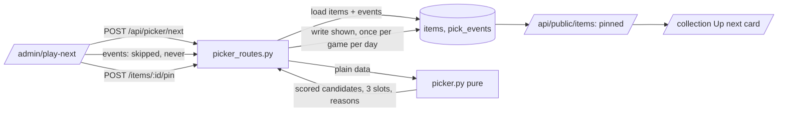

# Tracker E8a — Play Next — Design

Date: 2026-09-23. Parent spec:
`docs/planning/2026-09-22-tracker-enhancement-design.md` §6 (Play Next) and
decision D2 (public Up next). This document is the spec E8a is built from;
where it deviates from the parent the deviation is stated with its reason, and
this document wins. It also carries a `schema_check` fix found while deploying
E7b.

## Problem

The collection holds 49 backlog games and no way to choose among them. Play
Next answers "what should I play tonight?" from the owner's own shelf: three
named picks, each with reasons drawn from games the owner rated, favourited or
finished, deterministic apart from a small jitter so Reroll reorders. No model
call.

Separately, `schema_check` requires the database revision to *equal* the
code's head. Applying a migration before its deploy (the order E7b used) leaves
the live API unable to boot on a cold start until the new code lands.

## Scope

**In**

- `schema_check` tolerates a database ahead of the code (§1).
- Migration `0004`: the `pick_events` table (§2).
- `backend/picker.py`: pure scoring (§3), with the approved mood buckets (§4).
- Picker and pin routes (§5).
- `/admin/play-next`, edit-page Restore and Pin, the public Up next card (§6).
- Smoke and docs (§8).

**Out**

- Discover (E8b), Radar (E8c), the physical catalogue (E7c).
- Co-op and other game modes as a filter. Modes feed affinity only; moods match
  genres, themes and keywords (parent §6.1).
- Tuning `PICKER_WEIGHTS` beyond the parent's defaults: they live in one dict so
  they can be tuned after real use.

## Proposed solution

### 1. `schema_check`

| Database revision | Result |
|---|---|
| the code's head | boot |
| a revision absent from the code's migrations directory | boot, with a warning log: "database at X, code expects Y; assuming a newer additive migration" |
| a known revision other than head | refuse (behind) |
| none | refuse (empty) |

A database *ahead* of the code carries a revision id the older code has never
seen, so "unknown" is the only signal available; it is treated as ahead. That
is safe only because migrations here are additive, which becomes a written
rule: a migration adds tables and columns and never renames or drops one in the
same release, so the previous code keeps working against the newer database.
The rule goes into `CLAUDE.md` and `backend/migrations/README.md` (created if
absent).

Because this fix ships in the same PR as `0004`, the live code at E8a's own
migration time is still strict; E8a's deploy has the same short window E7b had.
Every later migration has none. (Owner's choice over shipping the fix first.)

### 2. Migration `0004` — `pick_events`

| Column | Type | Notes |
|---|---|---|
| `id` | uuid, primary key | |
| `item_id` | uuid, FK `items.id`, `ON DELETE CASCADE` | |
| `action` | enum `pick_action` (`shown`, `skipped`, `never`, `pinned`) | |
| `created_at` | timestamptz, default now() | |

Index on `(item_id, action, created_at)`. `items.pinned_at` already exists
(`0003`). Downgrade drops the table, then the type.

### 3. Scoring — `backend/picker.py`

Pure: takes items and events as plain data and returns scored candidates;
tested with fixtures and no database (the `matching.py` pattern). Jitter comes
from an injected `random.Random`, seeded in tests.

**Request:** `time` (`any` | `quick` | `evening` | `long`), `moods`
(subset of the six), `platforms` (platform ids; empty means all), `exclude`
(item ids).

**Candidates:** games with `owned_format IS DISTINCT FROM 'none'` and status
`backlog` or `active`, minus the pinned game, anything with a `never` event,
anything `skipped` in the last 7 days, and `exclude`. Moods are hard filters —
a game passes when any of its genres, themes or keywords is in any selected
bucket. Platforms filter likewise; an item with no platform matches every
platform. No candidates → `candidate_count: 0`.

**Reference items and weights:** every favourite, rated, finished or abandoned
game. Base weight: favourite 1.0, finished 0.3, abandoned −0.5 (a finished
favourite uses 1.0). Plus, when rated: `(rating − mean) / (10 − mean)` above the
collection's mean rating, `(rating − mean) / mean` below it, 0 at the mean
(no ratings → no adjustment). A finished item's weight never falls below 0.1.

**Attribute table:** each attribute value — genres, themes, keywords, game
modes, player perspectives, and the developer (`creator`) — maps to the mean
weight of the reference items carrying it.

**Terms (each 0–100), `PICKER_WEIGHTS`:**

| Term | Weight | Definition |
|---|---|---|
| affinity | 35 | `clamp(50 + 50 × mean_w)`, `mean_w` the mean table value over the candidate's attributes (unknown attributes count 0); 50 with no attributes |
| similarity | 20 | `100 × max(w, 0)` for the best-weighted reference item linked either way through `similar_games` (IGDB ids compared as strings); 0 when none |
| quality | 15 | `community_score`; 50 when missing |
| length fit | 15 | 100 for `any` or an unknown estimate; otherwise 100 inside `[lo, hi]`, linear to 0 at `lo/2` below and `2 × hi` above (quick `[0, 6]`, evening `[6, 15]`, long `[15, ∞)`); estimate is `time_to_beat.normally` |
| waiting | 10 | days since `acquired_at` (`started_at` for active items), 100 at 365+. **Deviation:** while the collection's acquired dates span less than 90 days they carry no information (the import filled them all), so waiting uses days since `release_date` instead, 100 at 3650+ |
| jitter | 5 | uniform 0–100 per request |

`total = Σ(weight × term) / Σ(weight)`, then −15 for each **distinct UTC day**
the game had a `shown` event in the last 14 days, capped at −45.
**Deviation:** the parent counted every showing; counting days stops an evening
of rerolls from burying fifteen games for two weeks.

### 4. Mood buckets — `MOOD_BUCKETS`

Exact strings, from the collection's own snapshots (a one-off read of 74 games'
`source_metadata`, 2026-09-23). Genres and themes as IGDB capitalises them;
keywords lower-case. Approved by the owner.

| Mood | Strings |
|---|---|
| Cozy | Simulator; Kids, Sandbox; cute, animal protagonist |
| Story | Visual Novel, Point-and-click; Drama, Mystery, Romance; story rich, story driven, choices matter, multiple endings, emotional, love story |
| Action | Shooter, Fighting, Hack and slash/Beat 'em up, Racing; fast paced, metroidvania, hand-to-hand combat |
| Creepy | Horror, Thriller, Survival; psychological horror, survival horror, cosmic horror, zombies, supernatural, dark fantasy, gore |
| Brainy | Puzzle, Strategy, Turn-based strategy (TBS), Real Time Strategy (RTS), Tactical, Card & Board Game; deck-building, roguelike deckbuilder, detective, investigation, murder mystery, block puzzle |
| Chaotic | Arcade; Party, Comedy; roguelite, roguelike, dark humor, funny |

Deliberately excluded as too broad to filter: the Action *theme* (55 of 74),
Adventure (56) and Role-playing (RPG) (26).

### 5. API

All admin (`require_admin`) except the public field. Picker routes live in a
new `backend/picker_routes.py` router; pin routes join `items.py` (declared
before `/{item_id}` where they share a prefix).

- `POST /api/picker/next` → `{picks: [PickOut ×≤3], candidate_count,
  profile_size}`. `PickOut`: `slot` (`best_fit` | `short_and_sweet` |
  `overdue_classic` | `waited_longest` | `pick_it_back_up`), `slot_label`,
  `item` (id, title, year, cover_url, type, platform, genres,
  time_to_beat_hours), `reasons` (2–3 strings), `score`. Writes a `shown`
  event for each pick unless that game already has one today (UTC).
  `profile_size` counts rated or favourited games.
- `POST /api/picker/events` `{item_id, action}` with `action` in `skipped` |
  `never` → 204.
- `DELETE /api/picker/events/{item_id}/never` → 204; deletes that item's
  `never` events.
- `POST /api/items/{id}/pin` → `ItemOut`. One transaction: clear `pinned_at`
  on any other item, set it here, status → `active`, `started_at` → today if
  empty, record `pinned`.
- `DELETE /api/items/{id}/pin` → `ItemOut`; clears `pinned_at`.
- `ItemOut` gains `play_next_excluded: bool` (a `never` event exists).
- `PublicItemOut` gains `pinned: bool`; `pinned_at` stays private.

**Slots** (no game repeats):

1. **Best fit** — highest total.
2. **Short and sweet** — highest total with `normally` ≤ 6 h (≤ the quick
   window when time is quick); omitted when none qualifies.
3. **Overdue classic** — oldest `release_date` among candidates with affinity
   at or above the candidate median. Becomes **Waited longest** (highest
   waiting term, same affinity gate) once acquired dates span 90+ days. Either
   way, if an `active` game was started more than 30 days ago (`started_at`)
   and has had no `shown` or `pinned` event in the last 30 days, this slot
   becomes **Pick it back up** for that game (the oldest such, if several).
   There is no status history, so `started_at` and events are the whole
   signal.

**Reasons**, templates, 2–3 per card, most specific first:

- overlap: "Shares Roguelike and Action with Hades II ♥" (the two highest-value
  shared attributes and the reference item carrying most of them; ♥ when it is
  a favourite; "which you rated 9" when rated and not a favourite)
- similarity: "IGDB lists it beside Celeste, which you rated 9"
- length: "About 8 h — fits an evening" / "About 4 h — a short one"
- age: "Out since 2017" (Overdue classic) / "On the shelf since March 2026"
  (Waited longest, from `acquired_at`, never `created_at`)
- back up: "Started in June 2026 and not touched since"

### 6. UI

- **`/admin/play-next`** (already in `WIDE_ROUTES`): an **Up next** block for the
  pinned game with Unpin; Time chips (Any · Quick <6 h · Evening 6–15 h · Long
  15 h+); mood chips (multi-select); platform chips (from the collection's
  platforms); three cards with slot label, cover, title, year, time to beat,
  genre chips, reasons, and **Play this** / **Not tonight** / **Never
  suggest**; **Reroll**. Not tonight records `skipped` and adds the id to the
  reroll's `exclude`. `candidate_count: 0` with moods selected shows "Nothing
  on the shelf matches those moods" and a **Try without moods** button. Below
  five rated or favourited games, the ratings nudge links to the shelf.
- Links to Play Next from `/admin` and from the admin collection page.
- **Edit page:** "Excluded from Play Next" with **Restore** when
  `play_next_excluded`; a **Pin** / **Unpin** control.
- **`/collection`:** a single **Up next** card beside the favourites row when a
  public item is pinned; nothing when the pinned item is private.

### 7. Errors

- A pick request with no candidates is 200 with `picks: []` and
  `candidate_count: 0`, never an error.
- Events and pins for an unknown item are 404; an unknown action is 422.
- Pinning an item on the want list (`owned_format = none`) is 422 — Play Next
  is the owned backlog.

### 8. Smoke and docs

`scripts/smoke.sh`: `POST /api/picker/next` unauthenticated → 401; public items
carry `"pinned"`. `CLAUDE.md`: the additive-migration rule and the relaxed
`schema_check`; `picker.py` as the pure scoring module and where the weights
and mood buckets live; the TODO marks E8a done.

## Key decisions

| Decision | Chosen | Tradeoff |
|---|---|---|
| `schema_check` on an unknown revision | Treat as ahead, warn | An unrelated database would also boot; mitigated by the loud log and the rest of the checks. Requires additive migrations. |
| Fix rollout | Same PR as E8a | E8a's own deploy keeps a short window; later ones have none. |
| Scoring location | Pure `picker.py` | Scores ~70 rows per request in Python; trivial at this size, fully testable. |
| Mood vocabulary | The collection's own strings | Buckets only match what is owned; Cozy is thin (≈10 games). |
| Third slot | Overdue classic until acquired dates span 90 days | Uses real data now; switches itself later. |
| Staleness | Distinct days, not showings | Weaker push toward variety than the parent. |

## Prior art and docs consulted

| Source | Finding | Verdict |
|---|---|---|
| Parent spec §6 and `2026-09-22-tracker-design-research.md` (Playnite PlayNext, Backlog Shuffle, StoryGraph Up Next, Steam Play Next) | Weighted-term scoring over the owned backlog, two inputs (time, mood), three named picks with reasons, staleness decay | Align, with the three stated deviations |
| The collection's snapshots (74 games, read 2026-09-23) | IGDB genres and themes are capitalised and compound ("Hack and slash/Beat 'em up"); keywords are lower-case and sparse; the Action theme covers 55 of 74 games | Buckets built from these exact strings; broad strings excluded |
| IGDB fixtures recorded for E7b | `similar_games` are integer ids; `external_id` is a string; `time_to_beat.normally` in hours | Compare ids as strings; length fit reads hours |
| Repo: `matching.py`, `formats.py`, `schema_check.py` | Pure modules tested without a database; exact-revision check | Align; relax the check as §1 |

## Open questions

None blocking. Weights and bucket strings are expected to be tuned after real
use; both live in one place each.

## Smoke test strategy

`scripts/smoke.sh` exists; E8a extends it (§8). Passing means: backend and
frontend suites green, build clean, ruff and prettier/eslint clean, no raw hex
outside the token blocks; after the owner applies `0004` and merges, smoke green
against production with no new errors in the Render logs. Functional check in
production: the owner opens `/admin/play-next`, gets three picks with reasons,
rerolls, pins one, and sees it as Up next on `/collection`.

## Deploy order (owner)

1. Apply `0004` to Neon (`alembic upgrade head`), then merge promptly (the live
   code is still strict this one time).
2. Render deploys; smoke and logs.
3. Open `/admin/play-next`.
