# Catalogue store keys — Design

A fix to E7c, found on the first production store refresh (2026-09-26).
Follows `2026-09-25-registry-title-keys-plan.md`, whose key rules this
extends from the registry to every source.

## Problem

After the first **Refresh stores** (1,958 listings), Needs match held 395
keys and **337 of them had no IGDB candidate at all**: the search itself
returned nothing. Four causes, each confirmed on production data and
reproduced on the recorded fixtures:

1. **Store keys keep platform and packaging words.** IGDB finds nothing for
   them (live: `7th sector` finds 7th Sector; `7th sector nsw` finds
   nothing). On the page-1 fixtures, 285 of 1,131 Switch game rows carry such
   a key; Strictly Limited alone has 194.

   | Store title | Key today |
   |---|---|
   | `7th Sector (NSW)` | `7th sector nsw` |
   | `7th Sector Special Limited Edition (NSW)` | `7th sector special nsw` |
   | `7'scarlet - Nintendo Switch™` | `7 scarlet nintendo switch` (live shape) |
   | `Tin & Kuna - Various Platforms (PS4, NSW, XBOX)` | `tin kuna various platforms` |
   | `Just Shapes & Beats for Nintendo Switch™` | `just shapes beats for nintendo switch` |
   | `Jack Jeanne - Silver Edition - Nintendo Switch™` | `jack jeanne silver edition` |
   | `Lies of P: Complete Edition Marionette Bundle` | `lies of p complete edition marionette bundle` |

2. **Accented letters are dropped.** `matching.normalize_title` keeps only
   `[a-z0-9]`: "Pokémon" keys as `pok mon`, "Café Enchanté" as `caf enchant`.
   68 of the 337 keys have an accented title. IGDB's search ignores accents
   (live: `pokemon legends z a` finds "Pokémon Legends: Z-A"), so a folded
   query is safe.
3. **Two stores assign the wrong platform.**
   - Premium Edition reads `product_type` before the title, and files PS4/PS5
     products under "Nintendo Switch Games": 9 PlayStation products become
     Switch listings, a Switch game typed "Sony PlayStation Games" is lost,
     66 PlayStation rows get a generic label, and 2 NES carts become Switch.
   - iam8bit names the platform in options called "Edition" or "Style",
     which its config does not read, so the tags step decides: an Xbox
     variant becomes Switch and several Switch variants get no platform.
   Fangamer and Aksys are correct: "Bugsnax for PlayStation 5 and
   PlayStation 4" really has a Switch variant (verified live).
4. **The fixtures hold page 1 only**, so live shapes such as `(NSW)` were
   never tested, and no test asks whether a key could find anything.

## Scope

**In:**
- One title-cleaning vocabulary in `physical_sources/parse.py`, used by
  every source's key: platform phrases, packaging edition phrases, and a
  single-game bundle suffix.
- Accent folding in `matching.normalize_title` (shared with the photo
  importer, by the owner's choice).
- The two platform fixes in `STORES`.
- `--all-pages` in `scripts/record_physical_fixtures.py`, one recording
  run, and the new fixtures committed.
- A key-quality test over every recorded listing and registry row.

**Out:**
- Multi-game bundles ("Akupara Games Triple Birthday Bundle"): they stay in
  Needs match for Ignore.
- Candidate order in Needs match (IGDB's order today, not score order).
- Tie-breaking IGDB entries that share a name (Red Dead Redemption ×2).
- The format classifier (for example iam8bit's Cozy Grove read as a disc).
- A hand-set platform surviving a store that states another (its own task).

## Proposed solution

```mermaid
flowchart LR
  T[title] --> C[collapse whitespace]
  C --> S["store patterns<br/>(STORES title_strip)"]
  S --> W["Switch 2 Edition to end"]
  W --> P["platform phrases out"]
  P --> E["packaging edition phrases out"]
  E --> B["single-game bundle suffix out"]
  B --> R["trailing separators out;<br/>never empty"]
  R --> N["normalize_title<br/>casefold, accents folded"]
  N --> K[key]
```

### Title vocabulary (`parse.py`)

- **Platform words:** Nintendo Switch 2, Switch 2, NS2, Nintendo Switch,
  Switch, NSW, PlayStation 4/5, PS4, PS5, PlayStation, Xbox (One, Series X|S),
  PC, Steam, "Various Platforms", and the retro codes stores bundle with a
  Switch copy (SMD, SG, MD, Mega Drive, Genesis, NES, SNES, GB, GBC, GBA,
  N64), so `Darius Extra Cozmic Bundle (NSW/SMD)` loses its bracket.
  Removed when they are:
  - a bracket group that holds only platform words, region codes (EUR,
    USA, UK, JP, ASIA) and separators: `(NSW)`, `[PlayStation 5]`,
    `(Switch 2, PS5, Xbox)`, `[EUR]`;
  - a "Various Platforms" phrase with its bracket list;
  - a `for <platform list>` or `- <platform list>` tail:
    `for Nintendo Switch™ and PlayStation 4`, `- Nintendo Switch™`;
  - a bare trailing platform word or phrase: `Zombie Night Terror -
    Nintendo Switch`, `SWITCH [EUR]`.
  A platform word inside a game's own name is kept: "Switch" in "Switch
  Force" is not a bracket, a tail or trailing.
- **Packaging edition phrases** (decision: key to the base game):
  - any `X Edition` after a separator (` - `, `:`, `(`, `[`), up to the next
    separator or the end: `- Silver Edition`, `(Elite Edition)`;
  - without a separator, only a known packaging word before "Edition":
    Standard, Limited, Special, Deluxe, Collector's, Premium, Elite,
    Physical, Complete, Definitive, Silver, Gold, Bronze, SteelBook,
    Signature, Exclusive, Retail, Launch, First, Anniversary, and the
    multi-word forms Special Limited, Limited Collector's, First Press.
    "OFF Bad Human Edition" keeps "Bad Human": not a known word, no
    separator, so it is not guessed at.
  - `First Press SE`, `Limited to 1,000`, `USK Version`, `(PRE-ORDER)`.
- **Single-game bundle suffix:** a trailing `<words> Bundle`, and a
  trailing `(with …)` / `+ <extras>` group naming merch (Soundtrack CD,
  Character Cards, Plush, Album). A title that names several games stays
  as it is.
- **Order:** the Switch 2 Edition cut first (unchanged from #27: removing
  "- Nintendo Switch 2" as a platform tail first would strand "Edition"),
  then platform phrases, then editions, then bundles, so `Tavern Talk
  Complete Edition - Limited Edition (Nintendo Switch)` keys as
  `tavern talk`.
- Every pattern is linear on third-party text; each gets a timing case in
  `test_a_long_run_is_linear`. `strip_title` never returns an empty string.

### Accent folding (`matching.py`)

`normalize_title` decomposes with NFKD and drops combining marks before
the `[^a-z0-9]` pass: `Pokémon` → `pokemon`, `Café Enchanté` →
`cafe enchante`. NFKD also folds compatibility forms (full-width letters,
ligatures). Characters with no decomposition (for example `ø`, `ß`) still
fall to the existing pass; that is noted, not fixed.

### Platform fixes (`stores.py`)

- `premium_edition`: platform steps become `("title", "product_type",
  "tags")`. On the fixtures this changes 81 rows, every one a correction.
- `iam8bit`: add `option:Edition` and `option:Style` after
  `option:Platform`. 12 rows change, all corrections. `option:Title` is
  **not** added: Shopify's default single option is named Title
  ("Default Title"), and reading it switches off the tags step for 14
  correct rows.

### Fixtures and the key-quality test

- `record_physical_fixtures.py --all-pages` walks each handle until a short
  page, writing `<handle>.pN.json` beside today's `.p1.json`, under the
  same robots, throttle and User-Agent rules. One owner-approved run.
- **Size gate:** page 1 is 11 MB today. If all pages take the fixture
  directory past 40 MB, pages 2 and on are written without `body_html`
  (the key, platform and game filter never read it), and the recorder's
  README says so. The run reports the size either way.
- **The test that would have caught this:** over every recorded listing,
  registry row and tracker row that is a game on Switch or Switch 2, no key
  contains a platform word or a packaging word, `edition` or `bundle`. A
  title that legitimately keeps one (a real game named "… Edition" with no
  separator and no known word) is listed in the test by name with a reason.
- The adapter coverage test and every existing parser test keep passing on
  the larger set.

### Rollout

No migration. After deploy: **Refresh stores**, **Refresh registry**, then
**Resolve** until 0. Changed keys unlink and re-resolve (#27 task 7); the
stale pending decisions drop out of Needs match (#27 task 5); PlayStation
rows leave the catalogue platforms and stop queuing.

## Key decisions

| Decision | Chosen | Tradeoff |
|---|---|---|
| Edition names in keys | Base game (owner) | IGDB's separate Complete/Definitive entries are never the target; one key per game across stores, which is what "does a physical copy exist" needs |
| Accent fix | In `normalize_title`, everywhere (owner) | The photo importer's matching changes too (for the better: spines and IGDB now agree on "Pokemon"); two normalizers drifting is avoided |
| Test corpus | Re-record all pages (owner) | A larger fixture set in git, bounded by the size gate |
| Bundles | A single-game bundle is the game (owner) | A bundle's merch is not recorded in the key; multi-game bundles still need a human |
| Platform words | Dropped everywhere, registry included (owner) | "Minecraft for Nintendo Switch 2" keys as `minecraft` on Switch 2 and may meet IGDB's Minecraft (the Switch 2 filter decides) |
| Edition phrase without a separator | Only known packaging words | Some store-specific names ("Gaia Edition" with no separator) stay; the key-quality test lists them so the vocabulary can grow on evidence |
| Premium Edition platform order | Title first | A product whose title names two platforms still falls to product_type; none do in the fixtures |

## Prior art & docs consulted

| Source | What it settled | Verdict |
|---|---|---|
| [Python `unicodedata`](https://docs.python.org/3.12/library/unicodedata.html) | NFD/NFKD split a base letter from its combining mark; `combining()` identifies the mark | Align |
| [Accent-stripping recipe (j4mie gist)](https://gist.github.com/j4mie/557354), [sqlpey](https://sqlpey.com/python/python-remove-accents/) | NFKD then drop combining marks is the standard library recipe | Align (discovery only; the docs above confirm the primitives) |
| [IGDB API docs](https://api-docs.igdb.com/) | No statement on diacritics | Verified live instead: folded queries find accented games |
| Live IGDB, 5 searches (2026-09-26) | Noise words make a search return nothing; folding is safe | Evidence for causes 1 and 2 |
| Recorded fixtures + 2 live product requests (platform trace) | Premium Edition and iam8bit causes; Fangamer and Aksys correct | Evidence for cause 3 |
| `2026-09-25-registry-title-keys-plan.md`, `physical_sources/README.md` | Decision A (base game), unlink on re-key, linear patterns, never-empty keys | Extend, don't deviate |

## Open questions

1. The fixture size after `--all-pages` is unknown until the run; the size
   gate decides what is written.
2. How many of the 395 clear after rollout is unknown until production
   refreshes. The target is below.

## Smoke test strategy

- **No new smoke util:** `scripts/smoke.sh` already covers the physical
  routes (401 unauthenticated, no catalogue data public); it must stay
  38/38.
- **Tests (the definition of done before merge):** the key-quality test on
  all recorded pages, the timing cases, the platform assertions for the 9
  Premium Edition and 12 iam8bit rows, `normalize_title` accent cases, and
  the full backend suite.
- **After deploy, read through the owner's signed-in session (GET only):**
  `/api/physical/status` and `/api/physical/needs-match`. Passing means
  Unresolved is 0, Needs match is well below 395, keys with no candidate
  are below 100, and no pending key contains a platform word. Render's logs
  show no error or traceback for the refresh and resolve requests.
