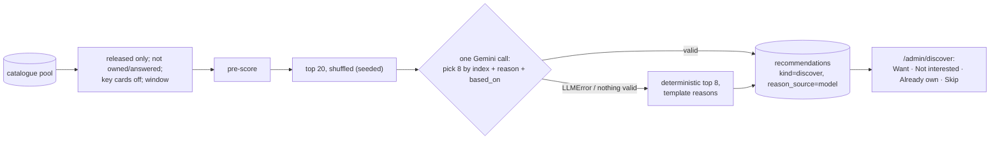

# Tracker E8b — Discover — Design

Parent spec: `docs/planning/2026-09-22-tracker-enhancement-design.md` §7
(with §6.3, §9, §10, §12). This spec wins where they differ, and says where.
Settled elsewhere: the E7c spec's "E8b and E8c decisions" (Gemini free tier,
one call per generate, the fallback covers a 429; popularity `balanced`,
window `any`, platforms = the collection's; Want public; films out; judged
by feel) and E8c Radar (the shared `recommendations` table, its answer rules
and locks).

## Problem

Radar answers "what physical release is coming that I'd want?". Discover
answers the other half: "what already exists physically, on my platforms,
that I'd love and don't own?". The catalogue knows ~1,300 physical editions
and ~2,000 store listings; nobody can read that by hand. Discover ranks them
against the owner's taste, lets one model call pick a varied eight with
reasons that name the owner's own games, and records the owner's answer so a
game is never suggested twice once decided.

## Scope

**In:**
- `backend/discover.py`: pure pool filter, pre-score, candidate shuffle,
  prompt, schema, pick validation and the deterministic fallback.
- Discover in `backend/recommendations_routes.py`: generate and list for
  `kind: "discover"`; a new **Already own** route; **Want** replacing
  Radar's Watch.
- `/admin/discover`, and a card component shared with `/admin/radar`
  (extracted from `AdminRadar.jsx` into `components/`).
- A dismissible **Rate a few** panel on `/admin/discover` for unrated
  finished games, using the existing `QuickRate`.
- Radar's wording: Watch → **Want**, "Watching" → "Wanted, still to come".

**Out:** films and other media (E7c decision); a batch history and a Needs
match panel on the Discover page (owner decision: Needs match stays on
`/admin/catalogue`, linked); any scheduled generation (parent §12); a
second model call per generate; any migration.

## Proposed solution



### 1. Pool (`radar_load.load_pool`, reused)

Every linked catalogue game on the requested platforms, collapsed per
`(igdb_id, platform_id)` — the same loader Radar uses (owner decision:
**exists physically**, buyable now or not). Discover keeps a candidate when:

- it is **released**: its collapsed `release_date` is null or on or before
  today (parent §7.1: everything dated in the future belongs to Radar);
- `window = recent` → released within the last three years; `any` (the
  default) → no bound;
- its format is not a Game-Key Card or code in a box, unless
  `include_key_cards` (D7); an unknown format is kept and marked;
- it is not excluded: `radar_load.excluded_games` (an item with that IGDB
  id, owned or wanted, on any platform; a recommendation of either kind
  wanted, dismissed or owned).

**Platforms:** default the collection's distinct game platforms among the
catalogue's (Nintendo Switch 130, Switch 2 508, N64 4); `{130, 508}` when
the collection has none. Radar keeps its own two. The request may name any
subset of the three.

### 2. Pre-score (`discover.py`, pure)

The profile is Play Next's (`picker.reference_weights`,
`attribute_table`), each candidate a `PickerItem` from its
`catalogue_games.snapshot` (as Radar builds one).

```
score = 0.45 × affinity + 0.35 × similarity + 0.20 × quality
        + popularity_sign × 15 × popularity
        + 10 if buyable now (an in-stock or open pre-order listing)
        − 10 if the format is unknown
popularity = min(1, ln(1 + community_votes) / ln(1 + 2000))
popularity_sign: safe +1, balanced 0, deep −1
```

`affinity`, `similarity` and `quality` are picker's 0–100 scales;
`community_votes` is IGDB's `total_rating_count` from the snapshot.

### 3. The model call

- **Candidates:** the top 20 by pre-score, shuffled with a seed derived
  from the batch id (position bias: a model moves late entries up less
  often; shuffling spreads that across candidates; seeded so a test can
  reproduce it).
- **Profile in the prompt:** up to ten reference games, numbered from 1,
  each with its title, favourite ♥, rating and status; the top five genres
  and themes by weight.
- **Prompt:** pick eight, favour variety across genres, name the owner's
  games behind each pick in `based_on` and in the reason, never mention a
  title that is not in the candidate list, reasons one sentence, no
  marketing language.
- **Schema** (`complete_json`):
  `{picks: [{index: integer 0–19, reason: string, based_on: [integer 1–10]}], maxItems 8}`.
- **Validation:** a pick is dropped when its index is out of range or
  repeated, its reason is empty, or a `based_on` number is not in the
  profile list (the remaining `based_on` numbers are kept); `based_on` maps
  to the reference items' ids.
- **Fallback:** on `LLMError` (quota, timeout, missing key) or when no pick
  survives validation, the deterministic top eight with Radar-style
  template reasons (`reason_source = template`), and the response says why
  in words. The feature never blocks on the model.
- **Budget:** one `complete_json` per generate. Gemini's free tier is per
  project and resets at midnight Pacific; the button says "Generate — uses
  one of today's Gemini requests" and makes no count promise (the docs no
  longer publish one).

### 4. Routes (`recommendations_routes.py`)

| Route | Change |
|---|---|
| `POST /generate` | Accepts `{kind: "discover", popularity?: "safe"\|"balanced"\|"deep" = "balanced", window?: "recent"\|"any" = "any", platforms?: [130, 508, 4], include_key_cards?: false}`. Same lock, row locks and upsert rules as Radar; replaces only Discover's pending rows on the platforms generated. Returns `{batch_id, count, ranked_by: "model"\|"template", model_note}`. |
| `GET ?kind=discover` | `{generated_at, ranked_by, personalised, picks: [...]}`, each pick as Radar's rows plus `based_on_titles` and `genres`. |
| `POST /{id}/want` | Replaces `/watch` (owner decision: one word). Same effect: a public item, no owned copy, backlog, the registry's format only. |
| `POST /{id}/own` | New. A private item (`owned_format = physical`, `is_public = false`, backlog, the registry's format only); the row becomes `owned`. 409 if the game is already an item. |
| `POST /{id}/dismiss`, `/skip` | Unchanged, both kinds. |

`ranked_by` and `model_note` persist in the rows' `source_metadata`, so the
list can say how the current picks were made.

### 5. `/admin/discover`

- **Controls:** popularity (Safe / Balanced / Deep), window (Recent / Any),
  platform chips, the Game-Key Card toggle, Generate with its budget label,
  and "Needs match →" linking `/admin/catalogue`.
- **Picks:** the shared `RecommendationCard` (extracted from Radar's
  `RadarCard`): cover, title, year · platform · format, the reason, "Based
  on: Inscryption, Hades II", genre chips, the store line, and Want / Not
  interested / Already own / Skip, each named for its game.
- **How it was ranked:** "Ranked by Gemini" or the fallback note in words.
- **Rate a few:** up to six of the owner's finished, unrated games with
  `QuickRate` (PATCH `/api/items/{id}` `{rating}`), dismissible; the
  dismissal is remembered with `writeShelfPref('discover.rate-a-few', …)`.
  Hidden when there are none.

### 6. Radar and the public side

- Radar's button and section read **Want** and **Wanted, still to come**;
  its client calls `/want`.
- Public: unchanged. A want reaches `/collection` only through `wanted`.
  `test_public.py`'s recommendation names gain `ranked_by`, `model_note`
  and `based_on_titles`.

## Key decisions

| Decision | Chosen | Tradeoff |
|---|---|---|
| Pool | Exists physically (owner) | Some picks are second-hand hunts; buyable ones get +10 and a store line |
| Want vs Watch | "Want" on both pages (owner) | Radar's wording changes; one action, one word |
| Batch history, Needs match panel | Dropped (owner) | Older pending picks are replaced by each generate; Needs match is one click away |
| Picks | 8 of 20 (owner) | Short lists; generate again for more (one request each) |
| Profile quality | Rate-a-few panel (owner) | A little UI on Discover; sharper profile for Discover and Play Next |
| Model output | Indices into a server-built list | The model cannot introduce a title; it can only choose and explain |
| Fallback | Deterministic top 8 with template reasons | A 429 still yields picks, flagged as unranked |
| Popularity | IGDB vote count, signed by mode | Deep favours obscure games; balanced ignores popularity |
| LLM seam | Existing `generateContent` + `responseSchema` in `llm.py` | Google's docs now lead with the Interactions API; the importer works in production on the current fields, so no migration here (flagged) |

## Prior art & docs consulted

| Source | Settled | Verdict |
|---|---|---|
| Parent spec §7, §6.3, §9, §10, §12 | Pipeline, request, pre-score shape, model contract, actions, public rule | Align, except the owner's changes above |
| E7c spec, E8b decisions | Defaults, Gemini free tier, films out, judged by feel | Align |
| E8c Radar (`radar_load.py`, `radar.py`, `recommendations_routes.py`) | Pool loader, exclusions, answer rules, row locks, registry-only format | Reuse |
| `backend/llm.py`, `backend/importer.py` | `build_provider`, `complete_json(prompt, schema)`, `LLMError`, per-entry validation | Reuse the pattern |
| [Gemini structured output](https://ai.google.dev/gemini-api/docs/structured-output) (updated 2026-09-23) | Schema subset: `minimum`/`maximum`, `minItems`/`maxItems`, `required`, `enum`; "very large or deeply nested schemas may be rejected" | Keep the schema small and flat; docs now show the Interactions API's `response_format` |
| [Gemini rate limits](https://ai.google.dev/gemini-api/docs/rate-limits) (updated 2026-09-02) | Per project; RPD resets at midnight Pacific; free-tier numbers only in AI Studio | No count promised in the UI |
| [LLM listwise reranking under positional bias](https://arxiv.org/html/2604.03642), [position-invariant listwise reranking](https://arxiv.org/html/2604.27599v1) | Late candidates are moved up less; shuffling or order-invariance mitigates; keep output constrained to the candidate set | Shuffle, and answer by index (discovery; not load-bearing) |

## Open questions

1. How good the picks feel is judged after a few batches (E7c decision);
   the weights are constants in `discover.py`.
2. Whether the free tier's per-model quota lets `llm.py`'s fall-through
   chain spend up to three requests on one generate is unverified; the
   label promises "one of today's requests", which holds when the first
   model answers.

## Smoke test strategy

- **Existing util:** `scripts/smoke.sh` gains 401 checks for
  `POST /api/recommendations/{id}/want` and `/own`, and the `/admin/discover`
  deep link; the public leak grep gains the new names.
- **Before merge:** `discover.py` pure tests (released filter, each
  popularity mode, key cards, window, seeded shuffle, prompt holds only
  indices and the owner's titles, validation drops bad indices, repeats and
  foreign `based_on`, fallback); route tests with a fake provider (model
  success, invalid output, `LLMError` fallback, own, want, the Radar rename);
  `test_public.py` with a seeded Discover row; frontend suites.
- **After deploy (no migration):** the owner presses Generate on
  `/admin/discover`; through the signed-in session (GET only) the list
  shows eight picks, `ranked_by: model` or a named fallback, every pick
  with a reason and a `based_on` naming owned games, none owned; Want one →
  it is public on `/collection`; Render's logs show no error or traceback.
