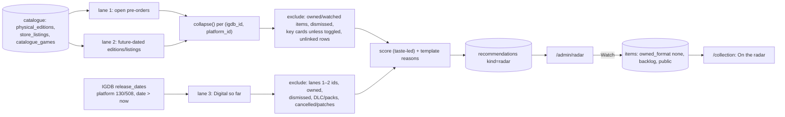

# Tracker E8c — Radar — Design

Parent spec: `docs/planning/2026-09-22-tracker-enhancement-design.md` §8
(with §7.1–§7.2, §9, §10, §12). This spec wins where they differ, and says
where. Decisions already settled elsewhere: E7c spec "E8b and E8c decisions
settled here" (Want public, horizon `any`), parent D5 (default platforms are
the collection's) and D7 (Game-Key Cards behind a toggle, off).

## Problem

The physical catalogue (E7c, live since 2026-09-25, keys fixed in #27 and
#28) knows what is coming out physically on the owner's platforms: open
pre-orders at twelve boutique stores and dated upcoming editions from the
r/NSCollectors registry. Nothing reads it yet. Pre-order windows at these
stores close in weeks and do not reopen, so a game the owner would want is
missed unless someone checks twelve sites by hand. Radar turns the
catalogue into a short, taste-ranked list of what to watch, and lets the
owner mark games to watch, which then show publicly on `/collection`.

## Scope

**In:**

- Migration `0006`: the shared `recommendations` table (parent §7.2, all
  columns, used by Radar now and Discover in E8b).
- `backend/radar.py`: pure pool, score and reason code.
- `IgdbSource.upcoming()`: lane 3's IGDB query, with a recorded fixture.
- `backend/recommendations_routes.py`: generate, list, watch, dismiss, skip,
  and the Watching list. Admin only.
- `/admin/radar`: Watching, Suggested, Dated later, Digital so far.
- The public "On the radar" strip on `/collection`, after Up next.

**Out:**

- Discover (E8b), its model call and its page.
- Refreshing the catalogue from Radar (owner decision: Radar regenerates
  only; the store walk stays on `/admin/catalogue`).
- Scheduled or automatic generation (parent §12: nothing runs on a timer).
- Price history, notifications, anything about films or other media.
- Any public exposure of suggestions, prices or pre-order windows.

## Proposed solution



### 1. The `recommendations` table (`0006`, additive)

Exactly parent §7.2: `id` uuid pk; `kind` enum `discover|radar`; `type`
(item type, `game` here); `title`; `year`; `release_date`;
`external_source`, `external_id`; `cover_url`; `reason` text;
`reason_source` enum `model|template`; `based_on` jsonb (the reference item
ids behind the reason); `score` smallint; `batch_id` uuid; `generated_at`;
`status` enum `pending|wanted|dismissed|owned|skipped`; `platform_id`,
`platform`; `physical_format`, `format_source`, `format_note`;
`listing_ids` jsonb; `source_metadata` jsonb. Unique on
`(kind, external_source, external_id, platform_id)`. New enum types are
created and dropped explicitly; `physical_format` and `format_source` reuse
the existing types. Nothing on `items` or the catalogue changes.

Radar keeps in `source_metadata`: the IGDB snapshot fields the page shows
(genres, hypes), `lane` (`preorder|dated|digital`), `release_precision`,
and the store lines (`store`, `price`, `currency`, `availability`,
`preorder_closes_at`, `url`) for the admin page only.

### 2. The pool (`radar.py`, pure)

The route loads rows; `radar.py` receives plain views and decides. A
candidate is `(igdb_id, platform_id)` (E7c §1), built with `collapse()`.

- **Platforms:** the collection's catalogue platforms by default (items the
  owner has on Nintendo Switch 130 or Switch 2 508; N64 has no upcoming
  physical releases), overridable per request.
- **Lane 1, pre-orders:** linked `store_listings` with
  `availability = preorder`, not archived, `is_game`.
- **Lane 2, dated:** linked live `physical_editions` (`is_physical IS
  DISTINCT FROM false`) and linked listings whose `release_date` is after
  today. Day and month precision are **Suggested**; year and quarter are
  **Dated later** (parent §8.1). Horizon: none (E7c: `any`).
- **Lane 3, Digital so far:** `IgdbSource.upcoming(platforms)` reads
  `/v4/release_dates` where `platform` is one of the platforms and `date >
  now`, expanding `game` (name, cover, hypes, game_type, genres, themes,
  keywords, similar_games). It keeps release dates with `status` not in
  {5 Cancelled, 35 Digital Compatibility Release, 36 Next-Gen Optimization
  Patch Release} and games whose `game_type` is Main Game, Remake, Remaster,
  Expanded Game or Port (0, 8, 9, 10, 11), with `hypes >= 5`. It pages
  `limit 500` until a short page, capped at 4 pages. `first_release_date`
  is not used: it is the earliest date on any platform (live: Persona 4
  Revival's Switch 2 date is later than its first date). Games already in
  lanes 1–2 are removed by `igdb_id`. Rows are stored with
  `physical_format` NULL and `format_note` "no physical edition announced".
- **Exclusions (all lanes):** a game the owner already has as an item, on
  any platform (owned or watched); a `recommendations` row with status
  `dismissed`, `wanted` or `owned` for that game in either kind (parent
  §7.2); rows with no `igdb_id` (Needs match, parent §7.1); for lanes 1–2, a
  candidate whose collapsed format is `game_key_card` or `code_in_box`
  unless `include_key_cards` is set (D7). `skipped` never excludes.

### 3. Score and reasons (`radar.py`, pure)

The profile is Play Next's: `picker.reference_weights(items)` and
`picker.attribute_table(...)` over the owner's items. Each candidate
becomes a `PickerItem` from its `catalogue_games.snapshot` (lanes 1–2) or
the upcoming row (lane 3), exactly as `picker_routes.to_picker_item` reads
`source_metadata`.

Owner decision: **taste-led**.

```
score = 0.55 × affinity + 0.35 × similarity + 10 × hype
        (+ 15 when a pre-order closes within 30 days)
hype  = min(1, ln(1 + hypes) / ln(1 + 150))
```

`affinity` and `similarity` are `picker`'s 0–100 scales, so taste carries
90 of 100 points and hype 10. `score` is stored rounded to a smallint.
Kept per generation: the top 30 Suggested, the top 20 Dated later, the top
10 Digital so far.

**Empty profile** (nothing favourited, rated or finished): affinity and
similarity are neutral for everyone, so the order falls to hype and date,
and the page says "ranked by anticipation: rate a few games to personalise".

**Reasons** are templates (`reason_source = template`), at most three per
card, most specific first:

- similarity: "IGDB lists it beside Dredge" (the reference item's title);
- affinity: "Shares Roguelike and Pixel Art with Hades ♥" (Play Next's
  overlap wording);
- window: "Pre-orders close Nov 8 at Limited Run · $59.99";
- format: "Full game on cartridge", or the collapse note ("Full game on
  cartridge in EUR — Super Rare");
- date: "Nintendo Switch 2 · Mar 2027";
- hype, lane 3 only: "412 people waiting on IGDB".

### 4. Routes (`recommendations_routes.py`, admin only)

All under `/api/recommendations`, all behind `require_admin`, none public.

| Route | Does |
|---|---|
| `POST /generate` `{kind: "radar", platforms?, include_key_cards?: false}` | One batch: build the pool, score, upsert. Replaces the kind's `pending` rows; keeps `wanted`, `dismissed`, `owned`, and refreshes `skipped` rows back to `pending` only if still in the pool. Returns counts per section and whether lane 3 ran. |
| `GET ?kind=radar` | The kind's `pending` and `skipped` rows grouped by section, plus `generated_at` and the catalogue's last store and registry run times. |
| `GET /watching` | Items with `owned_format = none` and a future `release_date`, or an open pre-order at a linked listing (`store_listings.igdb_id = items.external_id::int` and platform), soonest first, with the listing's window and price. |
| `POST /{id}/watch` | Creates the item through the same create path as `POST /api/items` (`apply_copy_fields`): type game, title, IGDB id, platform, cover, `release_date`, `owned_format = none`, status `backlog`, `is_public = true`, `source_metadata` from the snapshot; a known physical format is written through `formats.apply_registry_format`. Marks the row `wanted`. 409 if the item already exists. |
| `POST /{id}/dismiss` | Status `dismissed`: out of Radar and Discover for good. |
| `POST /{id}/skip` | Status `skipped`: hidden until the next generation. |

`generate` holds the catalogue's write lock (`exclusive`), so it never
runs during a store refresh. A lane-3 failure (IGDB down, not configured,
rate-limited) is recorded in the response and lanes 1–2 are still written.

### 5. `/admin/radar`

Linked from `/admin`, a wide route (`WIDE_ROUTES`), styled with tokens, and
using the shelf components (`PosterCard`, `PosterGrid`). Card actions are
siblings of the card link, and nothing is hover-only (CLAUDE.md).

- **Header:** Generate, the Game-Key Card toggle, "Generated 2 h ago", and
  "Catalogue refreshed 3 d ago →" linking `/admin/catalogue`.
- **Watching:** from `GET /watching`.
- **Suggested:** pending rows grouped by month, soonest-closing pre-orders
  pinned to the top of each month. Each card shows cover, title, date,
  platform, format chip, store line, reasons, and Watch / Not interested /
  Skip.
- **Dated later:** year- and quarter-precision rows, the same cards.
- **Digital so far:** lane 3, collapsed by default.

### 6. Public "On the radar" strip

`/collection` gains a strip after **Up next**: items with `wanted = true`
and `release_date` after today, soonest first, each `PosterCard` with its
Upcoming ribbon and format mark. It reads `/api/public/items`, which
already carries `wanted`, `release_date` and `physical_format`, so the
public API gains **no** field. It shows nothing when empty.
`test_public.py` gains a recommendations name set (`recommendation`,
`batch_id`, `based_on`, `reason_source`, `listing_ids`, `preorder`,
`price`) checked over every public model and seeded response, before any
route exists.

## Key decisions

| Decision | Chosen | Tradeoff |
|---|---|---|
| Lane 3, Digital so far | Included (owner) | A new IGDB query and fixture; shows games that may never ship physically, collapsed under their own heading |
| Strip placement | After Up next (owner) | Both forward-looking rows read as one band before the look back |
| Refresh | Regenerate only (owner, deviates from parent §8.2) | Fresh pre-orders need a store refresh on `/admin/catalogue` first; the page shows the catalogue's age |
| Table | Shared, full parent §7.2 shape now (owner) | Discover-only columns sit unused until E8b; one migration, one exclusion rule |
| Scoring | Taste-led, 90 taste / 10 hype (owner) | Hugely anticipated games that fit loosely rank lower than niche ones that fit well |
| Lane 3 source | `release_dates`, not `games.first_release_date` | Two expanded fields per row; correct per-platform dates |
| Owned exclusion | Any item with that IGDB id, any platform | A game owned on Switch never reappears as its Switch 2 release (the owner can still add it by hand) |
| Watch creates a public item | Yes (E7c: Want is public) | Watching is visible on `/collection` at once |

## Prior art & docs consulted

| Source | Settled | Verdict |
|---|---|---|
| Parent spec §7.1–§7.2, §8, §9, §10, §12 | Lanes, table, actions, public rule, no model call, no timers | Align, except refresh (owner) and scoring balance (owner) |
| E7c spec, "E8b and E8c decisions settled here" | Horizon `any`, Want public, `collapse()` as the candidate | Align |
| `backend/picker.py`, `picker_routes.py` | `reference_weights`, `attribute_table`, `affinity`, `similarity`, the snapshot keys `to_picker_item` reads, reason wording | Reuse, unchanged |
| `backend/physical_sources/collapse.py` | `collapse()` → `Candidate` (format, note, store lines, buyable, release date and precision) | Reuse |
| `backend/public.py`, `tests/test_public.py` | Allowlist; `PublicItemOut` already has `wanted`, `release_date`, `physical_format` | No new public field |
| IGDB API docs (`api-docs.igdb.com`) | The docs page refused the fetch tool (403) and its tables did not render readably in the browser | Verified live instead (below) |
| Live IGDB, 2026-09-27: `/v4/date_formats`, `/v4/game_types`, `/v4/release_date_statuses` | date_format 0 day, 1 month, 2 year, 3–6 quarter, 7 TBD; game types 0 Main, 1 DLC, 3 Bundle, 8 Remake, 9 Remaster, 10 Expanded, 11 Port, 13 Pack; statuses 5 Cancelled, 35 Digital Compatibility Release, 36 Next-Gen Optimization Patch Release | Authoritative enum values |
| Live IGDB `release_dates`, platforms 130/508, `date > now` | ≥500 upcoming release dates (a `limit 500` page was full); 121 of the first 500 belong to games with hypes ≥ 5; `first_release_date` differs from a platform's date | Lane 3 queries `release_dates` and pages |

## Open questions

1. How many Suggested rows a real generation yields is unknown until the
   catalogue is read in production; the caps (30 / 20 / 10) are a first
   guess, tuned from the first run.
2. Whether 90/10 taste/hype feels right is judged by use, as Discover will
   be (E7c: judged by feel). The weights live in one constant.

## Smoke test strategy

- **Existing util:** `scripts/smoke.sh` gains: `GET` and `POST` on
  `/api/recommendations`, `/api/recommendations/generate` and
  `/api/recommendations/watching` answer 401 unauthenticated; the public
  items response carries none of the recommendation names; the
  `/admin/radar` deep link answers 200.
- **Before merge:** the backend suite with `radar.py`'s pure tests on
  recorded fixtures (a catalogue slice and the lane-3 `release_dates`
  fixture), route tests on a real Postgres, `test_public.py` extended, the
  frontend suite with the strip and the admin page.
- **After deploy:** apply `0006` to Neon before merging (migrate, then
  merge). Then, through the owner's signed-in session: `POST /generate`
  once, and `GET ?kind=radar` shows non-empty Suggested with a reason on
  every card, lane 3 present or its failure named, and no owned game in any
  section. Watch one game: it appears in Watching and on `/collection`'s
  strip; Render's logs show no error or traceback.
