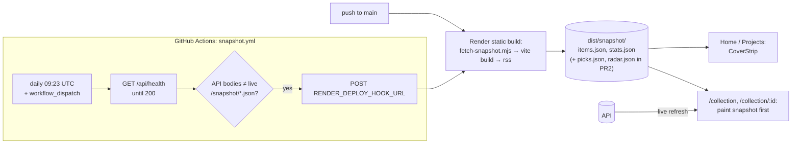

# Tracker Showcase — Design

Input: `docs/planning/2026-09-28-tracker-showcase-review.md` (findings in
priority order, and the rules for what may be public). Parent spec:
`docs/planning/2026-09-22-tracker-enhancement-design.md` §3, §8.3, §9, §12.
Current state: `CLAUDE.md` → Current state / TODO, and
`docs/planning/2026-09-23-tracker-roadmap-handoff.md`. This spec wins where
they differ, and says where. No schema change.

## Problem

The tracker is now most of the site's engineering, and the site still
presents it as one card behind Projects. A visitor landing on Home sees two
link cards and has no idea `/collection` exists; the nav's Blog item points
at an empty page; the first thing a first-time visitor to `/collection` sees
is the free tier's thirty-second cold start. The page itself has rough
edges — an unlabelled "Nintendo Switch 2 · 10 on cartridge, of 10" line,
bar charts with no axis, a single-option "Games" filter, and an item page
that tells the visitor it is showing "Your rating".

The tracker's most interesting work — Play Next's scoring and Radar's
catalogue — is entirely private, so the public never sees it. The review's
rule for changing that: **show outputs and reasoning, never inputs,
operations or state.** Picks and upcoming releases are outputs; they can be
public, read-only, built from stored results, restricted to public facts,
and in first person.

## Scope

**In** — two PRs. PR1 (A + B + C) merges without PR2 (D).

- **A. Site shell** (frontend only)
  1. "Collection" in the nav (Home · About · Projects · Collection · Blog)
     and a third link card on Home, with a four-cover strip.
  2. The Blog nav item renders only when a published post exists. Home's
     "Latest" block already renders only then; a test pins it.
  3. The Projects tracker card gains the cover strip and support for a
     "How it works →" link, rendered once its target exists (E).
- **B. `/collection` polish**
  4. The cartridge line becomes a labelled "On cartridge" block in the stats
     row.
  5. Ratings histogram and finishes strip get end labels and a per-bar
     `title`.
  6. `FilterChips` hides a group with one member (the "Games 68" chip), on
     both shelves.
  7. Item page: "My rating"; platform, format and completeness move out of
     the genre chips into a "My copy" line; all public copy first person.
- **C. Cold start — build-time snapshot**
  8. The static build fetches `/api/public/items` and `/api/public/stats`
     into `frontend/public/snapshot/`; a daily GitHub Actions workflow
     triggers a rebuild when production data changed. `/collection` renders
     the snapshot immediately, then refreshes from the API; item pages paint
     card fields from it first. `smoke.sh` is corrected about which pages
     call the API.
- **D. Public read-only outputs** (PR2 — a deliberate spec change, see
  [Spec changes](#spec-changes))
  9. `GET /api/public/picks` → "Recent picks" under Up next.
  10. `GET /api/public/radar` → "Coming to cartridge" beside On the radar.
- **E. Content** (after the code lands, written with the owner)
  12. "How the tracker works" as the first blog post. Publishing it turns
      the Blog nav on (item 2) and sets the Projects card's link (item 3).

**Out:**

- Discover in public, in any form. Its batch is a shopping list.
- Any public Generate, Refresh, or other action that writes or spends quota.
- Public: `/admin/catalogue` and anything from the catalogue tables; the
  importer; edit pages; bulk tools; `notes`, `cart_id`, `acquired_at`,
  `region`, `format_source`, `owned_format`, `pinned_at`; model notes and the
  Gemini budget line; the signed-in email; every non-public row.
- Store names, prices, currencies, availability, store URLs and pre-order
  windows — even for public radar rows.
- A scheduled ping to keep the API awake, and a paid Render plan. The
  snapshot makes both unnecessary for the showcase.
- Year in review (E9), Admin landing polish, the "This Website" card's CI
  link, and HTTP caching headers on the API.
- Committing snapshot data to git (see K1).

## Proposed solution

### A. Site shell

**Nav.** `RootLayout` replaces its four hand-written `NavLink`s with a
`NAV` array rendered in order: Home (`end`), About, Projects, Collection,
Blog. Blog is filtered out when `posts.length === 0`. `posts` comes from
`content/posts.js`, where production builds compile drafts to `null`, so a
draft-only repo has no Blog item in production and does have one in dev
(where drafts render with their badge). Collection's `NavLink` is
prefix-active, so it stays highlighted on `/collection/:id`.

`vitest.config.js` has no markdown plugin, so anything importing `posts.js`
in a test must `vi.mock('../content/posts.js')`. `RootLayout.test.jsx` does,
with an empty and a one-post variant.

**Home.** A third `link-card` after the existing two:
"What I'm playing →" / "The collection: what I own, finish and want next."
Inside it, a `CoverStrip`. The "Latest" block is unchanged (it already reads
`const [latest] = posts` and renders nothing without one); a new
`Home.test.jsx` pins both the card and the Latest gating.

**`CoverStrip`** (`components/CoverStrip.jsx`). Reads the items snapshot via
`readSnapshot('items')`, takes `topFavourites(items, 4)`, renders the covers
as a row. The covers are decorative (`alt=""`): they sit inside a link whose
text already names the destination, and nested links are invalid. With no
snapshot or no favourites it renders nothing, and the card reads as text.
`topFavourites` moves from `FavoritesRow`'s inline sort into `lib/shelf.js`
(favourites, rating descending, unrated last, then title) so the two cannot
drift.

**Projects.** Card entries in `content/projects.js` gain two optional
fields: `strip: 'favourites'` renders a `CoverStrip` under the heading;
`more: { to, label }` renders a secondary link after the description. The
tracker card gets `strip` in A; `more` is set in E, when the post exists —
so the site never links to a page that does not.

### B. `/collection` polish

**On cartridge.** `OnCartridge` moves into `.shelf-stats` as a fourth block,
with the same heading pattern as Ratings and Finishes: heading
"On cartridge", then per platform "Nintendo Switch 2 — 61 of 68", then the
remaining parts muted ("3 Game-Key Cards · 4 not recorded"). It is not
hidden "until a second platform has formats": `KEY_CARD_PLATFORMS` holds
only Switch 2, so that condition would hide it permanently. It still renders
only when a platform has a recorded format, as now.

**Histogram and finishes.**
- Ratings: an `aria-hidden` axis row under the bars with "1" at the start
  and "10" at the end.
- Finishes: an `aria-hidden` month initial under each bar (J F M A …),
  from the same twelve UTC months the strip already computes.
- Every bar gets `title` equal to its existing `aria-label`. The visible
  labels are the non-hover affordance; `title` is additive, so nothing is
  hover-only. The axis text uses `--text-muted`, already measured in both
  themes.

**Single-member groups.** `FilterChips` skips a group when at most one of
its chips would render (count > 0 or pressed) and none is pressed. A pressed
chip always keeps its group, so a filter can always be cleared. This is in
the shared component, so the admin shelf's "Games 74" goes too — one design
system, one rule.

**Item page.**
- The rating tile reads **"My rating"** — signed in or not. See K8.
- A **"My copy"** line under the title block replaces the owned-platform,
  format and completeness chips: "My copy: Nintendo Switch 2 · Full game on
  cartridge · Complete in box". Missing parts are left out; a Switch 2 copy
  with no format reads "format not recorded", as the chip does now. A wanted
  item reads "Wanted for Nintendo Switch 2", or "On my want list" without a
  platform. The chip row keeps genres, then themes and other platforms
  (muted).
- A sweep of public routes found no other second-person copy; the one hit in
  `FavoritesRow` ("Pick your favourites") renders only with `placeholders`,
  which the public page never passes. A test pins that.

### C. Build-time snapshot

**Files.** `frontend/public/snapshot/items.json` and `stats.json` are the
exact response bodies of `/api/public/items` and `/api/public/stats`. No
field is added or removed, so every consumer parses them with the code that
already parses the API. The directory is gitignored. Render serves an
existing file ahead of the SPA rewrite ("Render does not apply redirect or
rewrite rules to a path if a resource exists at that path"). The files live
under `/snapshot/`, not `/collection/`, so no directory in `dist/` shares a
path with an SPA route: how a static host treats a request for a bare
directory (redirect to a trailing slash, 404, or rewrite) is undocumented for
Render, and `/collection` is the page this phase exists to show. (Changed
during execution, 2026-09-28; the first draft used `/collection/*.json`.)

**`scripts/fetch-snapshot.mjs`** runs first in `npm run build`
(`node scripts/fetch-snapshot.mjs && vite build && node scripts/generate-rss.mjs`):

- Does nothing unless `VITE_API_URL` is set. It is set only on Render's
  static site, so CI and local builds stay offline and deterministic.
- Polls `GET /api/health` until 200, up to 120 s, to wake the API.
- Fetches both endpoints; validates shape (items is an array, stats an
  object with `total`); writes both files or neither.
- Logs what it did and **always exits 0**. A sleeping or broken API ships a
  build without a snapshot, which behaves exactly like today's site.
- `npm run snapshot` runs it against production for local development.

**`.github/workflows/snapshot.yml`** (its own zone — it is CI config):

- `on: schedule: '23 9 * * *'` and `workflow_dispatch`. Off the hour,
  because GitHub delays scheduled runs at the top of the hour.
- `permissions: contents: read`. It never pushes.
- Wakes the API with the same health poll, fetches the API bodies and the
  live `https://joey-haas.dev/snapshot/*.json`, compares with `jq -S`, and
  `POST`s the `RENDER_DEPLOY_HOOK_URL` repository secret only when they
  differ or the live file is missing. The job summary says which.
- The site and API URLs are public and written in the workflow; only the
  hook URL is a secret.

**Freshness.** Any deploy refreshes the snapshot; otherwise it trails
production by at most a day, and the page corrects itself once the live
fetch lands. The backend never redeploys for a snapshot: its `rootDir` is
`backend`, and Render only autodeploys a service for changes under its root
directory — and the hook is the static site's, not the API's.

**`lib/snapshot.js`** exports `readSnapshot(name)`: fetches
`/snapshot/${name}.json` from the site's own origin (not `API_URL`),
returns the parsed body, or `null` on a non-OK response, invalid JSON or a
thrown error. It never throws. No module-level cache: the files are static,
and the browser's HTTP cache is the right layer.

**`/collection` loading.** The snapshot and the API are requested together.

| Snapshot | API | Shown |
|---|---|---|
| arrives first | later OK | snapshot, then live data replaces it |
| arrives first | fails | snapshot stays; no error |
| missing | OK | live data (today's path) |
| missing | slow | "Waking the server…" after 2 s (today's path) |
| missing | fails | today's error |
| any | arrives first | live data; a late snapshot is ignored |

A snapshot without `stats.json` renders the items without stats blocks,
as a failed stats call does now.

**Item page.** In parallel with the detail call, it reads the items
snapshot and, if the id is there, paints the card-level fields at once
(title, cover, year, creator, status, rating, genres, the My copy line).
Detail-only sections (description, tiles, similar) appear when the API
answers. The API is authoritative: a 404 still renders Not Found even if the
snapshot had the id (it was unpublished since). Any other failure after a
snapshot paint keeps the painted fields and shows "More detail could not be
loaded. Try again shortly." in place of the detail sections. "Waking the
server" shows only when nothing was painted.

**Constraint wording.** "Public pages other than `/collection*` make no API
calls" stays true: Home and Projects read a static file from the site's own
origin. `CLAUDE.md` and `smoke.sh` gain that distinction, and `smoke.sh`'s
line "the only part of the public site that calls the API at all" is
corrected — `RootLayout`'s `/api/auth/me` runs on every page.

### D. Public read-only outputs (PR2)

#### `GET /api/public/picks`

Rows: the items with a `shown` pick event on the most recent UTC day that
has one among the games still a public suggestion, **if that day is one of
the 7 UTC days ending yesterday** (otherwise `[]`). A public suggestion is
public, owned (`owned_format` not `none`), status backlog or active, not
pinned (it is Up next already), has no `never` event, and has no `skipped`
event at or after its `shown` event. **Only events before today's UTC
midnight count** — `shown`, `skipped` and `never` alike — so the list
changes at most once a day. Title order; at most 3 ([Spec
changes](#spec-changes) 6).

Reasons are recomputed — `pick_events` stores no slot, score or reason, and
`/next` adds jitter — by a new pure `picker.public_reasons(item, profile)`:

- The profile is built from **public rows only**, so a reason can never
  name a private game. The admin picker keeps its full profile.
- Only the overlap, similarity and length reasons. The slot-specific ones
  are dropped: "On the shelf since {Month YYYY}" is derived from
  `acquired_at`, which is private, and "Started in … and not touched since"
  reports activity timing. "Out since {year}" goes with them, because
  without a slot it has no meaning.
- At most 3, as now; an item with none shows its title alone.

Response model `PublicPickOut`, exactly:

| Field | Type | From |
|---|---|---|
| `id` | UUID | `items.id` (links to `/collection/:id`) |
| `type` | ItemType | `items.type` |
| `title` | str | `items.title` |
| `cover_url` | str \| None | `items.cover_url` |
| `platform` | str \| None | `items.platform` |
| `reasons` | list[str] | `public_reasons` |

Never: `slot`, `slot_label`, `score`, any date, `candidate_count`,
`profile_size`, event ids or actions.

Rendered on `/collection` as **"Recent picks"** directly under Up next:
compact cards, reasons as a short list under each title, no buttons. Hidden
when empty.

#### `GET /api/public/radar`

Rows from `recommendations` where `kind = radar`, `status = pending`,
`physical_format = game_card`, `release_date > today (UTC)`,
`source_metadata.release_precision` in `NEAR_PRECISIONS` (`day`, `month`),
and `source_metadata.release_source = registry` — the date came from a
registry edition, never from a store listing or IGDB's cross-platform first
date ([Spec changes](#spec-changes) 7). Top 6 by `score` (ties broken by
title, platform and external id), returned soonest first. Pending only: a
wanted game is already an item and shows in On the radar; dismissed,
skipped-then-replaced and owned rows never appear. Lane 3 (digital) is
excluded by the format filter.

Response model `PublicRadarOut`, exactly:

| Field | Type | From |
|---|---|---|
| `title` | str | `recommendations.title` |
| `platform` | str \| None | `recommendations.platform` |
| `physical_format` | PhysicalFormat | always `game_card` today |
| `release_date` | date | `recommendations.release_date` |
| `release_precision` | str | `day` or `month`, so the page can show "Mar 2027" |
| `igdb_url` | str \| None | `source_metadata.snapshot.url`, only if it starts with `https://www.igdb.com/` |
| `cover_url` | str \| None | `recommendations.cover_url` |

Never: `id`, `score`, `reason`, `reason_source`, `based_on`, `batch_id`,
`generated_at`, `status`, `kind`, `external_id`, `platform_id`,
`format_source`, `format_note`, `listing_ids`, and from `source_metadata`
everything but the URL — `lane`, `section`, `hypes`, `store_lines` (store,
price, currency, availability, `preorder_closes_at`, store URL).

Rendered as **"Coming to cartridge"** beside On the radar (stacked on
narrow screens): poster cards with platform and "Mar 2027", each linking to
IGDB when `igdb_url` is set (external, `rel="noopener"`), unlinked
otherwise. Hidden when empty.

**The IGDB URL.** Nothing stores one today. `FIELDS` in `sources/igdb.py`
gains `url` (and `GAME_FIELDS` in `scripts/record_igdb_fixtures.py` with
it); the snapshot builder stores it as `url`; the fixtures are re-recorded,
never edited. Catalogue snapshots refresh when older than
`SNAPSHOT_MAX_AGE_DAYS` (30), up to `STALE_REFRESH_LIMIT` per Resolve, so
existing rows gain the URL over the following weeks; until then they render
unlinked. Item snapshots gain it too, harmlessly: `source_metadata` is never
public and `PUBLIC_METADATA_FIELDS` is an allowlist.

#### First person, everywhere

`picker._named` becomes `"{title}, which I rated {rating}"`. Radar reuses
it, so new Radar generations read the same; rows already stored keep their
old wording until regenerated (they are admin-only). The admin picker and
Radar tests that pin the wording change with it.

#### Snapshot, extended

`fetch-snapshot.mjs` and `snapshot.yml` add `picks.json` and `radar.json`,
and `/collection` paints both strips from them first, under the same table
as above.

## Spec changes

Made deliberately, and recorded here so the next reader does not take them
for drift:

1. **Recommendations are partly public.** Parent spec §8.3 and §9, and the
   E8c design, say nothing from `recommendations` is public. PR2 exposes
   exactly the seven `PublicRadarOut` fields above for pending, cartridge,
   near-dated Radar rows. Discover rows stay private.
2. **`pick_events` is read publicly.** Parent §9 lists `pick_events` under
   "Never". PR2 reads it to choose which public items to show; no event
   field reaches the response.
3. **`reasons` is a public field name.** `test_public.py`'s
   `RECOMMENDATION_NAMES` check covers every public model and includes
   `reason`. It gains a named exception for `PublicPickOut.reasons` — and
   only that — with a comment pointing here.
4. **Public pages may read static JSON.** "Public pages make no API calls"
   is unchanged; Home and Projects now read `/snapshot/items.json`, a
   static file from the site's own origin.
5. **First-person reasons in admin.** The parent's example reason ("which
   you finished") is second person; reasons are now first person
   everywhere.
6. **The picks day is chosen from public suggestions, once a day.** Only
   `shown` events of games that are still public suggestions (public,
   owned, backlog or active, unpinned, not refused) choose the day, and only
   events before today's UTC midnight count, so the list changes at most
   once a day. Order within the day is by title. Reason: private rows and
   intra-day timing would otherwise leak — anyone polling the route could
   watch the owner use Play Next, skip a game or refuse one. The admin
   restore route deletes a `never` event outright, which is visible at once;
   that is accepted.
7. **Public radar dates come only from the registry.** Never from a store
   listing (its date is often parsed from the store's page) or from IGDB's
   cross-platform first date. `collapse` records the date's provenance and
   Radar Generate stores it as `source_metadata.release_source`. It fails
   closed: rows stored before it need one Radar Generate after deploy to
   appear.

`CLAUDE.md`'s Radar paragraph ("Nothing from `recommendations` is public")
and the "Public pages other than `/collection`" line are rewritten in PR2
and PR1 respectively.

## Key decisions

| # | Decision | Tradeoff |
|---|---|---|
| K1 | **Snapshot is fetched by the Render build, rebuilt by a daily deploy hook — not committed to `main`.** | `main` requires a PR, strict `backend` + `frontend` checks and `enforce_admins`. A `GITHUB_TOKEN` push is rejected; a `GITHUB_TOKEN` PR starts no CI, so its required checks never report. Committing would need weakened protection, a PAT/App bypass, or a PR for the owner to merge daily — and would keep unpublished items in git history. Cost: two fetchers (the workflow compares, the build writes), and the hook URL is one more secret. |
| K2 | **Cadence: daily at 09:23 UTC, plus every deploy and `workflow_dispatch`.** | At most a day stale, and the page self-corrects on the live fetch. Hourly would spend build minutes for data that changes a few times a week. |
| K3 | **Snapshot files are verbatim API bodies**, gitignored, and the build step is gated on `VITE_API_URL`. | No second schema to keep in step; CI stays offline. A local build has no snapshot unless `npm run snapshot` is run. |
| K4 | **The build step never fails the build.** | A sleeping API cannot block a deploy; the cost is a deploy that ships without a snapshot, which is today's behaviour. |
| K5 | **Public picks: most recent shown day within 7 days, public profile, no slot reasons, "Recent picks".** | Recomputed reasons may differ from what the admin saw (jitter, smaller profile). "Tonight's" would be false for days-old picks. |
| K6 | **Public radar: pending, `game_card`, near-dated, top 6 by score, seven fields.** | A cartridge-only list matches the heading; key cards and code-in-box releases stay admin-only. |
| K7 | **IGDB `url` requested and stored; unlinked until backfilled.** | A search URL would be imprecise; building a URL from an id is not a documented IGDB contract. Backfill is gradual (30-day snapshot age). |
| K8 | **"My rating" always, not only when signed out.** | The rating is the owner's in both cases, so one string is correct for every reader and needs no branch. Deviates from the request's "when not signed in". |
| K9 | **First person everywhere** (`_named`). | One wording; admin reads "which I rated 10", which is the owner describing his own shelf. Old stored Radar reasons keep "you" until regenerated. |
| K10 | **"On cartridge" joins the stats row rather than hiding.** | Hiding "until a second platform" would be permanent, since only Switch 2 has key cards. |
| K11 | **Single-member chip groups hide in the shared `FilterChips`.** | Both shelves change; a pressed chip always keeps its group. |
| K12 | **"How it works" is the first blog post.** | Shiki code blocks and RSS come free; publishing it switches the Blog nav on. |
| K13 | **Cover strips are decorative.** | They live inside a link or beside a titled card; `alt=""` avoids repeating titles to a screen reader and nested links. |

## Prior art & docs consulted

| Source | What it settled | Verdict |
|---|---|---|
| Review, `2026-09-28-tracker-showcase-review.md` | Findings 1–7, public principles, keep-private list | Align; its option 4(b) is implemented as a build fetch rather than a commit (K1) |
| Parent spec §3, §8.3, §9, §12 | Allowlist pattern, "hide what is empty", never-public list | Align, except [Spec changes](#spec-changes) 1–2 and 5 |
| E8a / E8c designs | Picker reason templates, Radar lanes, sections, precision | Align |
| `gh api …/branches/main/protection` (2026-09-28) | PR required, strict checks, `enforce_admins: true` | Drives K1 |
| [GitHub: events that trigger workflows](https://docs.github.com/en/actions/reference/workflows-and-actions/events-that-trigger-workflows) | `schedule` runs on the default branch, delayed at the top of the hour; public-repo schedules disable after 60 days without activity; `GITHUB_TOKEN` events start no workflow runs except dispatch | Align; the 60-day rule goes in the README |
| [Render: monorepo support](https://render.com/docs/monorepo-support) | A service with a root directory autodeploys only for changes under it | The API is untouched by snapshots |
| [Render: deploy hooks](https://render.com/docs/deploy-hooks) | Secret per-service URL, GET or POST | Align; the page does not say static sites explicitly — confirm in the dashboard (open question 1) |
| [Render: redirects and rewrites](https://render.com/docs/redirects-rewrites) | Rules are not applied where a file exists | `/snapshot/*.json` is served, not rewritten |
| `backend/public.py`, `tests/test_public.py` | Hand-named fields, field-set pins, name and sentinel leak tests | Align; one named exception (Spec change 3) |
| `backend/physical_sources/resolve.py` | Catalogue snapshots refetch after 30 days, 2 × BATCH per Resolve | Drives K7's backfill note |

## Open questions

1. **Static-site deploy hook.** Render's docs do not say outright that
   static sites have one. The owner checks the static site's Settings tab
   before Zone 2; if it is absent, the workflow calls the Render API's
   deploy endpoint with an API key secret instead — same shape, different
   secret.
2. **Build minutes.** A daily rebuild is at most ~30 builds a month on top
   of normal deploys; the owner confirms that sits inside the workspace's
   build allowance on the Render billing page.

## Smoke test strategy

`scripts/smoke.sh` exists and runs against production after each deploy
(`./scripts/smoke.sh https://joey-haas.dev https://api.joey-haas.dev`).

**PR1 adds:**
- `/snapshot/items.json` and `/snapshot/stats.json`: when 200, served as
  JSON, and the items body passes the existing private-field regex. When
  absent, a warning line (the build shipped without one), not a failure.
- The corrected comment about which pages call the API.

**PR2 adds:**
- `/api/public/picks` and `/api/public/radar` return 200 and a JSON array.
- Neither body contains a forbidden key (`score`, `slot`, `store`, `price`,
  `currency`, `availability`, `preorder`, `batch_id`, `based_on`, `lane`,
  `hypes`, `listing_ids`, `format_source`, `status`) — a regex like the
  existing items check.
- `picks.json` and `radar.json` under the same present-or-warn rule.

**Passing looks like:** every existing check green, the new checks green or
warning only for an absent snapshot, and — after `workflow_dispatch` on
`snapshot.yml` — the job summary reporting either "unchanged" or "deploy
triggered", followed by a static-site deploy in Render whose build log shows
the snapshot written.
