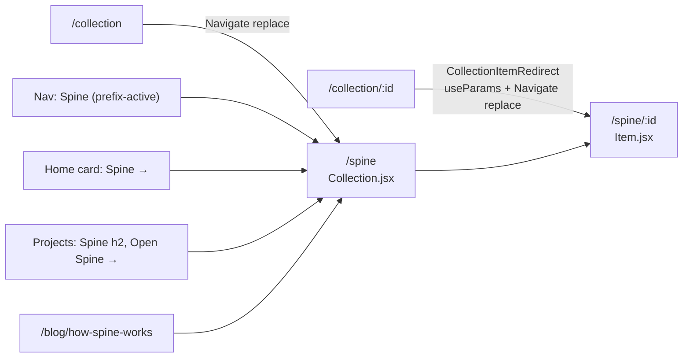
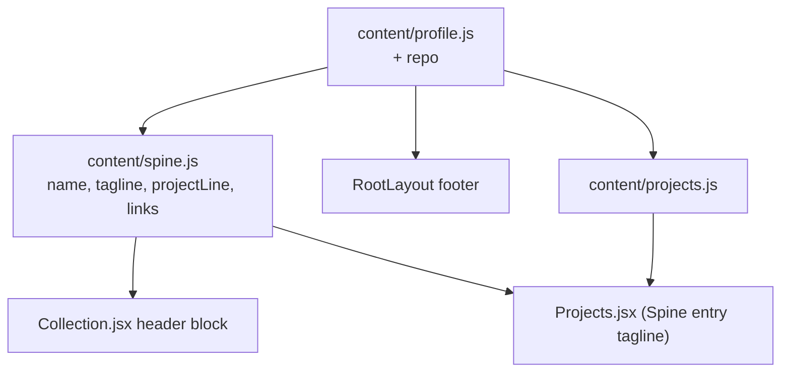

# Spine: naming, positioning and site polish — design

Date: 2026-10-02 · Branch: `spine` · Brief: `docs/planning/2026-10-02-spine-brief.md`

## Problem

The tracker is most of the engineering on this site and has a top-nav slot,
but it goes by three names (nav "Collection", Projects "Media Collection",
Home "What I'm playing"), nothing on its page says it is something Joey built,
and its Projects card is one dense paragraph. Separately, every route renders
the same `<title>Joey Haas</title>`, `index.html` has no description or
link-preview tags, and the footer carries no copyright or source link — the
first things a hiring manager notices.

This phase names the tracker **Spine**, says what it is everywhere it appears,
publishes the deferred "How Spine works" post, and fixes titles, meta and
footer. It closes the showcase review's findings 1 (flagship hidden), 2 (Blog
in the nav over an empty page) and 7 (Projects card), and Part 2 item 1 (the
how-it-works page).

## Scope

**In**

- A. One name: nav label, `/spine` and `/spine/:id` routes with client-side
  redirects from `/collection*`, a header block on `/spine`, Home and Projects
  copy, the shelf's `h1`s, every internal link, comments naming the old route.
- B. Projects card with `tagline`, `highlights` and `links`.
- C. The post reviewed against the code and published (`draft: false`).
- D. Per-page titles on every route, static meta and an `og:image` card in
  `index.html`, a footer copyright line.
- E. Light theme and 375px checks, browser verification of the redirects and
  titles, the Recent picks empty-cover investigation, smoke after deploy.
- Docs: `CLAUDE.md` and README follow the rename.

**Out**

- Any backend or schema change; API paths (`/api/public/*`) and `/admin/*`
  routes do not move. Admin labels stay as they are.
- File and module renames (`Collection.jsx`, `public.py`, ...): presentation
  rename only, with a one-line comment where a name no longer matches.
- Server-side redirects in `render.yaml` (Key decision 1).
- Per-route meta or prerendering; a `/projects/spine` page; a back link on the
  item page; moving Home's existing link-card copy into `content/`.
- GitHub issues (declined at the gate).

## Proposed solution

### Routing

- `App.jsx`: `spine` → `Collection`, `spine/:id` → `Item`;
  `collection` → `<Navigate to="/spine" replace />`; `collection/:id` →
  `CollectionItemRedirect`, a few-line component in `App.jsx` that reads
  `useParams()` and renders `<Navigate to={`/spine/${id}`} replace />`.
- `WIDE_ROUTES`: `/spine` replaces `/collection`. The redirect routes render
  nothing but a redirect, so they need no wide layout.
- Internal links move: `Collection.jsx` (five), `Item.jsx` (one), `Home.jsx`,
  `content/projects.js`, the nav.

### Copy

- **New `content/spine.js`** exports the name, the canonical tagline (the
  `/spine` lede), the project line, the Projects tagline variant and the link
  targets (`/spine`, `/blog/how-spine-works`, the repo).
- **`profile.repo`** = `https://github.com/joeyh92989/joey-haas.dev`, the one
  copy of the repo URL; the footer, `spine.js` and `projects.js` read it.
- **Home** keeps its link-card copy inline, per the brief's constraint
  exception; only the third card's title, sub-line and target and the second
  card's sub-line change.

### `/spine` header block

Replaces the current `h1` and sub-line in the loaded state of `Collection.jsx`:

- `h1` **Spine**; the loading and error states' `h1`s also read **Spine**.
- lede: the canonical tagline.
- a muted project line, *I built this: React and FastAPI on free tiers,
  Postgres on Neon, and a camera pointed at the shelf.*, followed by
  **How it works →** (router `Link`) and **Source →** (`<a>` to
  `profile.repo`).

Everything below it is unchanged. The block shows in the loaded state only;
loading and error keep their current single `h1` plus status line, so a cold
start does not stack a project pitch over a skeleton.

### Projects card

`Projects.jsx` renders, per entry and in this order: `h2` (linked by `to` or
`url`, as today), `tagline` if present, cover strip if `strip`, the
description, `highlights` as `<ul className="project-highlights">` if
present, `links` as `
` if present, tech chips.
A link with `to` renders a router `Link`; one with `href` renders an `<a>`.
Labels are stored without the arrow and the arrow is appended at render, as
`more` does today. `more` is removed from both the data and the component.
Entries without the new fields render exactly as today.

Copy is the brief's item 8 verbatim, with the Play Next highlight as reworded
in the brief (approved in brainstorming). "This Website" gains only `links`:
**Source →** (`profile.repo`) and **CI pipeline →**
(`${profile.repo}/actions`).

### Titles

`lib/usePageTitle.js` exports `usePageTitle(title)`: sets `document.title` in
an effect keyed on `title`, no cleanup. Every page in `App.jsx` calls it:

| Route | Title |
|---|---|
| `/` | Joey Haas — Senior software engineer, Denver |
| `/about` | About · Joey Haas |
| `/projects` | Projects · Joey Haas |
| `/blog` | Blog · Joey Haas |
| `/spine` | Spine · Joey Haas |
| `/spine/:id` | Spine · Joey Haas, then `{item title} · Spine` once known |
| `/blog/:slug` | `{post title} · Joey Haas`; an unknown slug renders `NotFound` |
| 404 | Not found · Joey Haas |
| `/admin` | Admin · Joey Haas |
| other admin pages | `{page h1} · Admin` (Collection, Import from photos, Play Next, Catalogue, Radar, Discover); `/admin/collection/:id` → `{item title} · Admin`, `Item · Admin` until loaded |

Every title is passed as one template string. The redirect routes set none:
they replace themselves before paint matters.

### Meta

Static, in `frontend/index.html`: `description` (brief's item 13 wording),
`og:title` (*Joey Haas*), `og:description` (same as `description`),
`og:type=website`, `og:url=https://joey-haas.dev/`,
`og:image=https://joey-haas.dev/og-card.png` with `og:image:width` 1200,
`og:image:height` 630 and `og:image:alt`, and
`twitter:card=summary_large_image`.

The card is `frontend/public/og-card.png`, 1200×630: "Joey Haas", the profile
tagline and "Spine — a tracker for my physical game collection" on the dark
`--bg`, in the site's fonts. It was rendered once from a scratchpad HTML file by
headless Chrome (`--headless=new --window-size=1200,630
--force-device-scale-factor=1 --screenshot`), loading the `@fontsource` woff2
files from `node_modules`, and committed as a PNG; the HTML is not committed.
`sharp` was the plan, but librsvg cannot load woff2, so it would have rendered
fallback fonts. This section records how it was made so it can be redone.

### Footer

The footer becomes two groups in a wrapping flex row: left,
`© {new Date().getFullYear()} Joey Haas · Source` (Source → `profile.repo`);
right, the existing email · GitHub · LinkedIn · Sign in/Admin, unchanged. At
375px the groups stack. Styling uses existing tokens only.

### The post

Reviewed against the code it names (`matching.py` thresholds,
`PICKER_WEIGHTS`, `DISCOVER_WEIGHTS`, the collapse rule, `load_public_picks`,
`schema_check`, the CI and snapshot workflows). Every proposed correction is
presented at the zone checkpoint as old line → new line with the source line
that proves it; none is applied silently. Then `draft: false` in the same PR.
Its `/spine` links stand, since the rename lands.

### Recent picks empty covers (E)

Investigated under the structured-debugging rules, on the live site after
deploy and locally against the snapshot: first whether "Coming to cartridge"
renders its covers (same CSS), then `cover_url` on the picked items in
`/api/public/picks`. If the data is null, the fix is data (re-link the item in
`/admin/collection/:id`), not code. If it is clipping, the fix is CSS in
`index.css`. Root cause is shared before any fix.

### Docs

`CLAUDE.md`: the architecture note's "Public pages other than
`/collection*`", the `WIDE_ROUTES` convention, the Media tracker section's
`/collection` mentions, and a Spine TODO entry. README: the routes table and
"Collection snapshot" section say `/spine`. Heading anchors that other docs
link to are kept.

## Key decisions

1. **Rename the route now, with client-side redirects.** The post, the
   Projects links and anything shared from now on name `/spine`; renaming
   later only grows the redirect surface. Alternatives: label-only rename
   (no route churn, but the URL contradicts every label); Render 301s in
   `render.yaml` (real redirects curl can see, but a deploy-path change with
   its own zone, and Render's docs do not state how a redirect rule orders
   against the existing `/*` rewrite). Cost of the choice: smoke cannot see
   the redirects, so they are verified in the browser.
2. **`<Navigate replace>` inside a wrapper, not `useNavigate`.** react-router
   8.3.1's docs recommend `useNavigate` over `Navigate`, but `Navigate` is
   not deprecated and is the declarative form a route table reads best in.
   `to` does not interpolate params and relative paths cannot carry the id,
   so `/collection/:id` needs the `useParams` wrapper either way. `replace`
   is required: StrictMode fires the effect twice in dev. The old route
   renders one empty frame before redirecting; acceptable for a legacy URL.
3. **Projects renders the new fields inline, without a new component.**
   Two conditional blocks follow the pattern `more` already uses; a
   `ProjectCard` component would be a refactor of a 40-line page for no
   second consumer.
4. **`content/spine.js` for Spine copy, `profile.repo` for the repo URL.**
   One home for the name and taglines, so a wording change touches one file.
   `profile.js` is "personal facts", so Spine copy does not go there, but the
   repo URL is used by the footer too and fits. Home's existing inline copy
   is the one exception, and stays so.
5. **`usePageTitle` effect hook over React 19's `<title>`.** One writer, no
   hoisting rules. React's `<title>` needs a single string child (an
   interpolated `{a} · {b}` silently renders empty) and two at once is
   documented as undefined. The hook's weakness — a page that forgets it
   keeps a stale title — is covered by a route-table test.
6. **`twitter:card=summary_large_image`, not the brief's `summary`.** The
   brief chose `summary` when no image was planned; with a 1200×630 card,
   `summary` would crop it to a small square. Deviation from the brief,
   flagged for approval.
7. **Generate the card, commit only the PNG.** Open Graph lists `og:image` as
   required and LinkedIn treats it as required; previews without it are a
   gray bubble. A committed generator would be a new tool with a README
   for a file that changes once a year.
8. **The `/spine` header shows only once the shelf has loaded.** Matches how
   the shelf already treats loading and error, and keeps the cold-start
   message the first thing a waiting visitor reads.

## Prior art & docs consulted

| Source | Used for | Verdict |
|---|---|---|
| react-router 8.3.1 installed source and `components.d.ts`; [Navigate docs](https://reactrouter.com/api/components/Navigate) | `Navigate` props, no param interpolation, NavLink prefix matching | Align; deviate from the "prefer `useNavigate`" advice (KD2) |
| [remix-run/react-router#9116](https://github.com/remix-run/react-router/issues/9116), [PR #10435](https://github.com/remix-run/react-router/pull/10435) | StrictMode double navigation | Fixed in this version; `replace` used anyway |
| [react.dev `<title>`](https://react.dev/reference/react-dom/components/title), [React 19 release post](https://react.dev/blog/2024/12/05/react-19) | Native metadata alternative | Rejected (KD5) |
| [ogp.me](https://ogp.me/) | Required OG properties | Align: `og:image` included |
| [LinkedIn sharing help](https://www.linkedin.com/help/linkedin/answer/a521928) | Required tags, image ≥1200×627 | Align |
| [Apple TN3156](https://developer.apple.com/documentation/technotes/tn3156-create-rich-previews-for-messages) | iMessage previews read static HTML only, follow server redirects | Align: meta is static |
| [Slack robots](https://api.slack.com/robots) | Slack reads OG and Twitter tags | Align |
| X developer docs | `twitter:card` fallback rules | **Not verified** — docs unreachable; relying on secondary sources that `twitter:*` falls back to `og:*` except `twitter:card` |
| [Render redirects and rewrites](https://render.com/docs/redirects-rewrites), [Blueprint spec](https://render.com/docs/blueprint-spec) | Server-side redirect option | Out of scope; rule ordering against `/*` not documented |
| Repo: `CLAUDE.md` conventions, showcase spec/review, `scripts/smoke.sh` | Tokens, `WIDE_ROUTES`, `role="img"`, `useMediaQuery`, smoke's SPA-200 note | Align |

## Open questions

- None. KD6 (`summary_large_image`) deviates from the brief and was approved
  with the spec on 2026-10-02.

## Smoke test strategy

- **Smoke util exists:** `./scripts/smoke.sh https://joey-haas.dev
  https://api.joey-haas.dev`. It gains no checks — any path returns 200 under
  the SPA rewrite — only a comment naming `/spine` beside the existing `/blog`
  note. Passing: every existing check PASS after deploy.
- **Automated (Vitest, `npm test`):** `usePageTitle` once; a route-table test
  rendering each `App.jsx` route under a `MemoryRouter` with `apiFetch`
  mocked and asserting `document.title`; redirect tests that `/collection`
  lands on `/spine` and `/collection/42` on `/spine/42`; nav label and
  prefix-active on `/spine/42`; the `/spine` header block (h1, lede, both
  links); Projects highlights, links (internal vs external) and an entry
  without the new fields unchanged; Home card copy and target; footer line
  with the current year. Existing assertions on "Collection" and
  `/collection` updated. Passing: suite green; backend suite untouched and
  green.
- **Browser (preview `frontend`, then production after deploy):** the
  redirects land and replace history; nav active on `/spine` and an item;
  titles per the table; light theme and 375px on `/`, `/projects`, `/spine`
  and one item page with no overflow; Recent picks covers; the `og:` tags in
  the served HTML (`curl -s https://joey-haas.dev | grep og:`) and the card
  at `/og-card.png`. Passing: all of the above, and no console errors.
