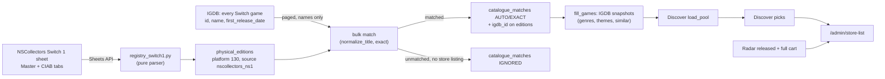

# Switch 1 physical catalogue and the store list — design

Date: 2026-10-04 · Branch: `switch1-catalogue`

## Problem

On 2026-10-04 the owner went to a store with a list built from Discover and
Radar and bought Death's Door, a 2021 Switch game with a physical release.
Spine had no record of it anywhere: not owned, never suggested, not in the
physical catalogue. The game fits the owner's taste (Hades 10, Breath of the
Wild 10), so this is a coverage gap, not a scoring miss.

Switch 1 games already reach Discover — Omori, Citizen Sleeper and Sea of
Stars were pending picks that day — but only when some catalogue source lists
them. Today that means a boutique store currently selling the game (the twelve
in `stores.py`). Nothing lists the thousands of released Switch 1 physical
games: the registry and `switch2-tracker` are Switch 2 only, the IGDB platform
ingest is N64 only, and Switch 1 is deliberately never ingested from IGDB
(`platform_policy.py:9-10`, `test_switch_1_is_never_ingested`) because IGDB
cannot tell a physical Switch game from a digital-only one.

Second, the store trip itself was assembled by hand from a read-only database
query. The owner wants that view in the app, usable on a phone in a store.

## Scope

**In**

- A. A Switch 1 registry source: the r/NSCollectors "Switch Physical
  Releases" sheet (Master tab, all regions, plus the code-in-a-box tab), read
  through the Sheets API like the Switch 2 registry, written as
  `physical_editions` on platform 130.
- B. Bulk title matching against IGDB's Switch game list, so about 4,200
  titles resolve without one search each; unmatched titles are recorded as
  ignored and never enter Needs match.
- C. A region-free format rule for platform 130: a cartridge in any region
  makes a Switch 1 game a cartridge.
- D. `/admin/catalogue`: a Refresh Switch 1 button, run status and an
  unmatched count.
- E. `/admin/store-list`: a phone-friendly admin page listing what to look
  for in a store, with Got it marking a game owned.

**Out**

- Download-required Switch 1 cartridges (e.g. Borderlands Legendary
  Collection): no data source flags them; every Switch 1 cartridge counts as
  the full game. Owner's choice.
- IGDB ingestion of Switch 1, scraping DoesItPlay, PriceCharting, GameTDB
  (terms or robots exclude them; see Prior art).
- Special Reserve Games as a store: behind a bot challenge, excluded under
  the repo's no-bypass rule, as Atari is.
- Radar changes: Switch 1 is back catalogue; Radar is about upcoming releases.
- Anything public. No new public field, route or snapshot file.
- Schema changes. No migration is needed (see Key decision 6).

## Proposed solution

### A. Switch 1 registry source

- New pure module `physical_sources/registry_switch1.py`, beside
  `registry.py` and reusing its helpers (`rows_from_values`,
  `locate_header`, `_cart_id`, `source_ref`, `merge`), not copying them.
  Sheet id `1FNyvbbU64Pb9lheg28gC_5fMalIYJ0aD763T7M1QqF0`; tabs found by gid
  as `registry.py` does: Physical Release Master `2004832329`, CIAB
  `1406641930`. Source key `nscollectors_ns1` (fits `String(20)`).
- Master header (row 4): `Master TItle | Game Title | Region | Release Date |
  Cart ID | Publisher | LP # | Edition Info | Other Info | Verified By |
  Check`. Required: Game Title, Region. The header's own typo ("TItle") is
  matched case-insensitively, not copied.
- Each Master row becomes an `EditionRow`: platform 130, the row's region,
  `is_physical=True`, `physical_format=game_card` with
  `format_source=registry` when a Cart ID (`LA-H-…`) is present, otherwise
  format unknown; release date from the sheet; `cart_id` kept on the edition
  (never copied to items, per the existing rule).
- CIAB rows with `CIAB only? = Yes` become `code_in_box` editions at tier
  `registry`. Rows with `No` add nothing (the cartridge edition is already
  in Master).
- Fixtures first: record the Master and CIAB responses with
  `scripts/record_physical_fixtures.py` before any parser test; the parser
  runs only on recorded data. The Master read was not inspected live during
  brainstorming (a bulk read was blocked), so the first recorded fixture
  confirms the columns and whether `Other Info` carries anything useful.

### B. Bulk title matching

- New `physical_sources/switch1_titles.py` (pure: matching) and a
  `catalogue.py`-side loader (I/O): page IGDB `games` with
  `where platforms = (130); fields id,name,first_release_date,alternative_names.name;
  sort id asc; limit 500` and match each distinct Switch 1 edition title by
  `normalize_title` against names and alternative names.
- One exact match → `catalogue_matches` AUTO/EXACT and `igdb_id` propagated,
  as the N64 path pre-decides today (`platform_policy.py:123-148`).
- Two or more exact matches → disambiguate by release year from the sheet;
  still ambiguous → ignored.
- No match → `catalogue_matches` IGNORED with `igdb_id` null, **unless** a
  store listing shares the key, in which case the key is left to Resolve so
  a store's game is never hidden by the registry.
- Matched games get IGDB snapshots through the existing `fill_games`, so
  Discover's taste scoring works on them.
- `propagate` already protects `igdb_platform` rows; it gains the same
  protection for `nscollectors_ns1` only if Resolve would otherwise re-link
  them (decided in the plan against the code).

### C. Region-free format for platform 130

`collapse.py` keeps its home-region rule for Switch 2, where a Japanese
cartridge and a US Game-Key Card are genuinely different products. For
platform 130 there is no Game-Key Card and the console is region-free, so:
any `game_card` claim in any region makes the game a cartridge; otherwise
`code_in_box` if only CIAB claims exist; otherwise unknown. Expressed as a
per-platform region policy in `collapse.py` (`REGION_FREE_PLATFORMS =
{SWITCH}` in `limits.py`), with tests for both platforms.

### D. Admin catalogue

- Route `POST /api/physical/refresh-switch1` (admin): fetch sheet → upsert
  editions (retire rows no longer listed, as the registry does) → bulk match →
  fill snapshots; one `catalogue_runs` row; shares the catalogue write lock.
- `/admin/catalogue`: a Refresh Switch 1 button beside Refresh N64, its last
  run in the status list (`SOURCE_NAMES`: "Switch 1 registry"), and a line
  "N Switch 1 titles unmatched" (count of IGNORED keys on 130). No list of
  them: hidden quietly, per the owner's choice.
- `test_switch_1_is_never_ingested` stays true: IGDB is still never a
  physical source for Switch 1; the registry is.

### E. Store list

- Route `/admin/store-list`, frontend only, reading what admin endpoints
  already return: pending Discover picks (`/api/recommendations?kind=discover`)
  and pending Radar rows (`/api/recommendations`), the latter filtered to
  released (date on or before today) full cartridges.
- Sections, in order: **Top picks** (Discover, by score) · **Out now on
  Switch 2** · **Out now on Switch** · **Ask about pre-orders** (Radar full
  carts within 90 days) · **Skip in store** (Radar rows with no physical
  edition or a Game-Key Card). Each row: title, platform, format, one reason.
- A standing note at the top: "On Switch 2 boxes, put back Game-Key Cards."
- **Got it** on a row calls the existing `POST /api/recommendations/{id}/own`
  (Already own), which creates the private owned item and drops the game from
  Discover and Radar. Optimistic removal with the existing error handling.
- Phone first: a single column, large tap targets, no hover, works at 375px;
  shelf tokens only. Admin title "Store list · Admin"; linked from `/admin`.

## Key decisions

1. **The community sheet is the source of "physical", not IGDB.** IGDB has
   no documented physical-release field (only the deprecated `media` enum and
   an undocumented `game_release_format`), which is why Switch 1 was never
   ingested. The NSCollectors sheet lists about 4,200 titles with cart IDs
   and a code-in-a-box tab, is maintained (updated 2026-10-03), and is read
   with the code path the Switch 2 registry already uses.
   Alternative: ingest all IGDB Switch games and filter by the sheet — stores
   thousands of digital-only games for nothing.
2. **Bulk local matching, not per-title search.** Paging IGDB's Switch list
   (tens of requests) and matching names locally replaces ~4,200 searches at
   IGDB's 4 req/s and keeps the Needs match queue usable. Cost: titles whose
   sheet name differs from IGDB's and has no alternative name stay hidden.
3. **Unmatched titles are IGNORED, unless a store lists them.** The owner
   chose quiet hiding; the store-listing exception keeps a buyable game from
   being hidden by the registry's naming.
4. **Region-free cartridges on Switch 1 only.** The home-region rule exists
   because Switch 2 regions differ in format; Switch 1 has no such split and
   the owner buys imports.
5. **Every Switch 1 cartridge is the full game.** Download-required carts are
   rare big ports and no source flags them; the owner chose to ignore them.
6. **No migration.** `platform_id` is generic, `source` is free text,
   `game_card`/`code_in_box` and `registry` already exist, and IGNORED is an
   existing `MatchDecision`.
7. **Store list is frontend over existing endpoints.** Got it reuses Already
   own, so the page adds no write path and no backend route.

## Prior art & docs consulted

| Source | Used for | Verdict |
|---|---|---|
| r/NSCollectors Switch Physical Releases sheet (Sheets API `spreadsheets.get`, tab headers) | Tabs, gids, Master/CIAB headers, ~4,200 titles, updated 2026-10-03 | Align — the chosen source |
| `physical_sources/README.md`, `registry.py`, `platform_policy.py`, `collapse.py`, `resolve.py`, `radar_load.py`, `discover.py` | Existing patterns: fixtures first, pure parsers, gid lookup, pre-decided EXACT matches, collapse tiers | Align; collapse gains a per-platform region policy |
| [IGDB API docs](https://api-docs.igdb.com/) (`release_dates`, `external_games`, `game_release_formats`) | Whether IGDB marks physical releases | No usable field; deviate from IGDB as a physical source |
| DoesItPlay.org | Only explicit download-required field | Excluded: HTML only, no licence found |
| [PriceCharting API docs](https://www.pricecharting.com/api-documentation) | Physical catalogue | Excluded: paid, internal use only |
| GameTDB robots.txt | Cart lists | Excluded: data downloads disallowed |
| Special Reserve Games `products.json` | Death's Door's publisher | Excluded: bot challenge (HTTP 429, Vercel checkpoint) |
| Blu-ray Forum download-required thread (last edit 2021-03-08) | Download-required carts | Out of scope (owner chose to ignore) |

## Open questions

- The Master tab's `Other Info` / `Edition Info` contents and the sheet's
  intro text were not read live; the first recorded fixture settles whether
  either says anything about downloads or exclusions. If it does, the plan
  revisits decision 5 before parsing it.
- Neon free-plan storage: snapshots for a few thousand more catalogue games
  (a few KB each) should fit; the plan measures current usage before the
  first refresh.

## Smoke test strategy

- **Existing smoke util:** `./scripts/smoke.sh`. Add unauthenticated checks:
  `POST /api/physical/refresh-switch1` → 401, and `/admin/store-list` deep
  link → 200. The public-exposure checks already cover catalogue leaks.
- **Automated:** parser tests on recorded fixtures (Master, CIAB, header
  typo, missing cart ID, CIAB-only), bulk-match tests (one, two-by-year,
  none, alternative name, store-listing exception), collapse tests (Switch 1
  region-free, Switch 2 unchanged), route tests (admin-only, lock, run row),
  `test_public*` unchanged and green, store-list page tests (sections,
  filters, Got it, Game-Key Card note).
- **After deploy (owner runs the refresh):** press Refresh Switch 1 once;
  passing is a completed run, an unmatched count, Death's Door present as a
  Switch 1 cartridge in the catalogue, and a Discover generate whose pool
  includes Switch 1 games no store lists. Then `/admin/store-list` on a
  phone.
