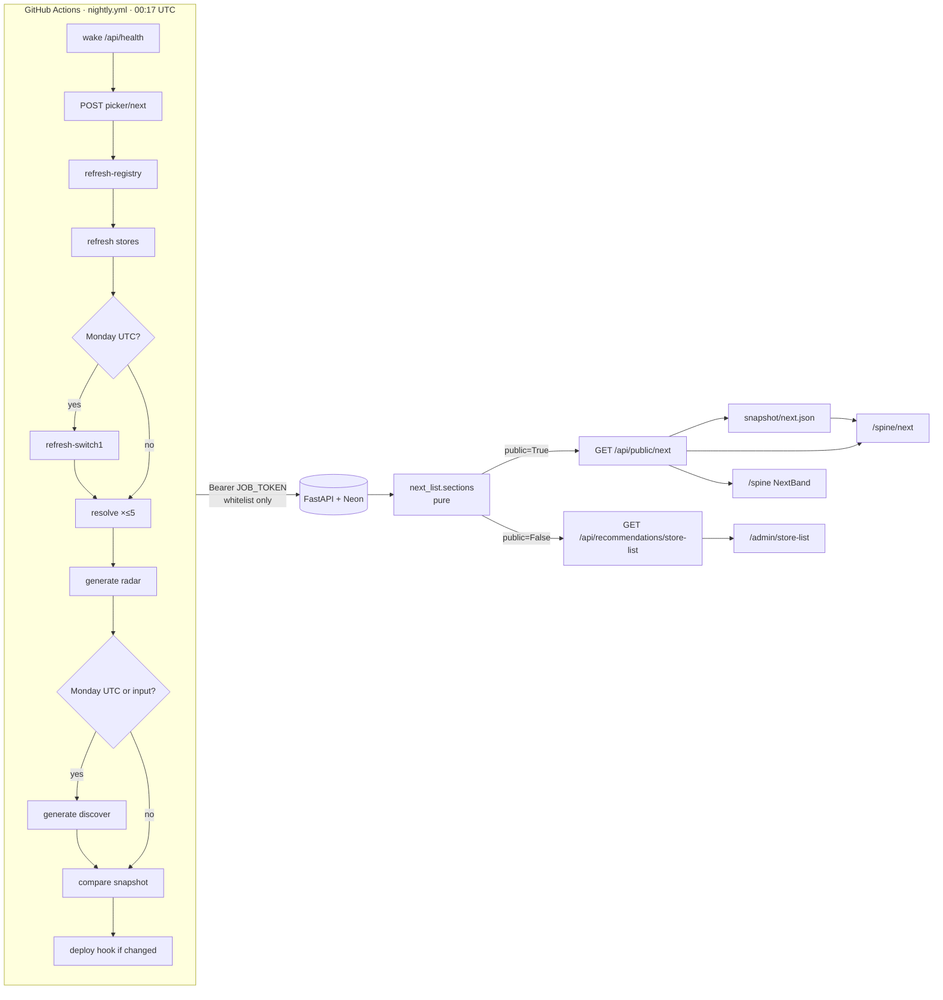

# Spine Next — Design

Input: `docs/planning/2026-10-05-spine-next-brief.md` (scope, items 1–23),
`docs/planning/2026-10-05-spine-next-review.md` (findings, and the
per-feature table of what is public) and
`docs/planning/2026-10-05-site-design-second-look.md` (findings 1, 2, 5 and 6
are in scope here). Parent rules: `docs/planning/2026-09-28-tracker-showcase-design.md`
§D (public outputs). Current state: `CLAUDE.md` → Current state / TODO. This
spec wins where they differ, and says where (see Spec changes). **No schema
change.**

## Problem

Every live part of Spine waits for a button. Recent picks needs Play Next
opened, Coming to cartridge needs a Generate, and the catalogue behind Radar
and Discover needs four refreshes and a Resolve. The snapshot workflow copies
what the database holds, and nothing writes to the database on a schedule, so
on 2026-10-05 `/api/public/radar` returned `[]` while Radar held nine dated
cartridges. The stored reasons have drifted too: some Radar rows still read
"which **you** rated 10", from before the first-person change.

The admin store list is rich: top picks, cartridges out now, pre-orders
within 90 days, digital-only rows to skip. The public side shows a shelf with
three picks on top. And `/spine` mixes two things: what is owned (the shelf)
and what is next (play, buy, coming). Adding the shopping list there would
push the shelf below thirty games that are not on it.

The chrome around the tracker was built for a résumé. At 390px the masthead
and three lines of nav take about 240px before the Spine `h1`.

## Scope

**In** — the brief's items 1–23, as amended below:

- **A. Nightly job (PR A).** `JOB_TOKEN`, the `require_admin` whitelist, the
  `nightly.yml` workflow replacing `snapshot.yml`, and the "Last nightly" line
  on `/admin`.
- **B. Public endpoint (PR B).** `GET /api/public/next`, the pure
  `next_list.py`, the admin `GET /api/recommendations/store-list`, public
  reasons rebuilt at read time, and the public date rule.
- **C. Pages (PR B).** `/spine/next` (What's next), `SpineHeader`,
  `SpineTabs`, `NextBand`, the trimmed `/spine`, `/admin/store-list` on the
  server's sections through a shared `NextRow`, the compact masthead, the
  one-row phone nav, and the chip-row fade.
- **D. Copy and docs (PR B).** `content/spine.js`, README, the how-it-works
  post, `CLAUDE.md`, `scripts/smoke.sh`.
- **E. Checks (no PR).** Post-deploy verification, plus one data step: the
  owned Nintendo 64 cartridges entered in the collection before PR B goes
  live (see Deploy order).

**Out:**

- Any migration. No `PickAction` for a nightly pick (the one-day lag is
  accepted); no trigger column on `catalogue_runs` (see K6).
- Retiring `/api/public/picks` and `/api/public/radar`. That is a follow-up,
  once the snapshot and the post no longer read them (item 10).
- The status-colour retune and the item-page backdrop (second look, findings
  3 and 4). Those are a small follow-up PR.
- `refresh-platform` (Refresh N64) in the nightly job. It stays a manual
  button.
- A bulk importer for owned cartridges. Owned N64 carts go in through the
  existing Add form or the photo importer.
- Stock, store names, prices and pre-order windows on any public surface.

## Proposed solution



### A. The nightly job (PR A)

**1. `JOB_TOKEN`.** `config.py` gains `job_token = _optional(source,
"JOB_TOKEN")`; `render.yaml` declares it with `sync: false`; `env.example`
lists it, commented. Unset means every bearer request is a 401 and the site
behaves exactly as today.

**2. The whitelist.** In `items.py`:

```python
JOB_ROUTES: frozenset[tuple[str, str]] = frozenset({
    ("POST", "/api/picker/next"),
    ("POST", "/api/physical/refresh-registry"),
    ("POST", "/api/physical/refresh"),
    ("POST", "/api/physical/refresh-switch1"),
    ("POST", "/api/physical/resolve"),
    ("POST", "/api/recommendations/generate"),
    ("GET", "/api/physical/status"),
})
```

`require_admin(request)`:

1. A session user → pass. This is checked first, so nothing changes for a
   session.
2. Otherwise, a bearer token passes only when all of these hold:
   - `request.app.state.job_token` is set (read with `getattr`, default
     `None`);
   - the header is `Authorization: Bearer <token>`;
   - `(request.method, request.scope["route"].path)` is in `JOB_ROUTES`;
   - `secrets.compare_digest` matches.

   When all hold, it logs `job token accepted: POST /api/picker/next` at INFO.
   It never logs the token.
3. Anything else → `401 Not authenticated`. The message is the same for every
   case, so a caller cannot learn which routes are listed.

`main.py` sets `app.state.job_token = config.job_token` once, right after
creating `app` (K1). `request.scope["route"].path` is the matched route
template with the router prefix included. FastAPI resolves dependencies after
routing, so a trailing slash or a `root_path` cannot widen the match.

Tests (`tests/test_job_token.py`) build a small app from the real routers.
They check:

- the token on every listed route passes the dependency;
- the same token on `PATCH /api/items/{id}` and `POST /api/items` gets a 401;
- a wrong token, a non-Bearer scheme, and no token configured each get a 401;
- a session still passes with or without a header;
- `JOB_ROUTES` equals the seven pairs above. A change to the whitelist has to
  change the test.

**3. `.github/workflows/nightly.yml`** replaces `snapshot.yml`. It is one
workflow. It runs on `cron: '17 0 * * *'` and on `workflow_dispatch` with a
boolean input `discover`, read as `inputs.discover`: the `inputs` context
keeps booleans as booleans, while `github.event.inputs` turns them into
strings. It runs under `concurrency: { group: nightly, cancel-in-progress: false }`
and `permissions: contents: read`. The job has `timeout-minutes: 150`.
`JOB_TOKEN` is a repository secret.

| Step | Call | curl `-m` | On failure |
|---|---|---|---|
| Wake | `GET /api/health`, the existing loop, unchanged | 10 × 24 | error (job fails) |
| Check token | `JOB_TOKEN` secret present | — | error annotation; write steps skipped, compare still runs, job fails at the end |
| Picks | `POST /api/picker/next` with `{}` | 120 | warning |
| Registry | `POST /api/physical/refresh-registry` | 900 | warning |
| Stores | `POST /api/physical/refresh` (all) | 3600 | warning |
| Switch 1 | `POST /api/physical/refresh-switch1`, weekly only | 1800 | warning |
| Resolve | `POST /api/physical/resolve`, repeated while `unresolved_remaining` is above 0 and falling, at most 5 rounds | 600 each | warning |
| Radar | `POST /api/recommendations/generate` `{"kind":"radar"}` | 900 | warning |
| Discover | the same with `{"kind":"discover"}`, weekly or when `inputs.discover` is set | 300 | warning |
| Compare | `snapshot.yml`'s step, with `next` added to the optional outputs | as today | as today |
| Deploy | `snapshot.yml`'s deploy-hook step | as today | as today |
| Summary | each step's status, written to `$GITHUB_STEP_SUMMARY` | — | fails the job only on a missing token |

- **Weekly** means `date -u +%u` = `1`: Monday in UTC, which is Sunday
  evening in Denver (18:17 MDT, 17:17 MST).
- **One helper does every write call.** `call NAME TIMEOUT PATH [BODY]` runs
  `curl -sS -m TIMEOUT -o "$NAME.json" -w '%{http_code}'` with the bearer
  header and `Content-Type: application/json`. Anything but a 200 becomes a
  `::warning::NAME: HTTP <code>` and is added to a `failed` list. A 409 reads
  `NAME: the catalogue was busy (409), skipped` instead: the owner pressed
  something at the same moment. A curl error counts as status `000`. The
  helper never exits non-zero, so the following steps run on yesterday's
  data. Picks, refreshes and generates sit in one shell step so the helper
  and the `failed` list are shared. That step writes the list to
  `$GITHUB_OUTPUT`, and the summary step reports it.
- **The pick lag gets a comment in the workflow.** The picks step records
  three games as shown today (UTC). `/api/public/picks` and `tonight`
  publish them after the next UTC midnight, so each run publishes
  yesterday's picks and records today's.
- **The `next` snapshot changes every night** because `generated_at`
  changes. The static site therefore redeploys nightly, which is intended:
  the picks change daily anyway. The compare step's comment says so.
- Each step's timeout fits inside Render's 100-minute request limit (see
  `CLAUDE.md`'s importer note). The store walk is the long one.

The README's workflow section explains:

- GitHub disables a scheduled workflow in a public repo after 60 days without
  repository activity;
- how to re-enable it (Actions → Nightly → Enable workflow);
- that the `/admin` line below is what warns about it.

**4. "Last nightly" on `/admin`.** One line on the admin landing:

> Last nightly: catalogue Sun 4 Oct 18:31 · ok · Radar Sun 4 Oct 18:44 ·
> Discover Sun 4 Oct 18:45

- **Where the times come from.** The catalogue time is the newest
  `finished_at` across `GET /api/physical/status`'s runs; "ok" means every
  run in that latest group has `ok: true`, otherwise "failed: <sources>".
  Radar's and Discover's `generated_at` come from the store-list route
  (item 7). Until PR B ships that route, PR A reads them from
  `GET /api/recommendations?kind=radar` and `?kind=discover`, and PR B
  switches to the single call.
- **Stale warning.** When the newest run is more than 36 hours old, the line
  reads **Nightly may have stopped** and links to the README section.
- **Who ran it.** The line reports the latest run, whoever triggered it
  (K6).
- **No new table.** A pure formatter, `lib/nightly.js`, turns the two
  responses into the line, and it is unit tested.

### B. The public endpoint (PR B)

**5. `GET /api/public/next`**, registered on the public router (`public.py`)
like picks and radar, with its models and loader in `public_outputs.py`.

```text
PublicNextOut
  generated_at: { picks: date|null, catalogue: datetime|null,
                  radar: datetime|null, discover: datetime|null }
  tonight:      { up_next: PublicTonightCard|null,
                  picks: [PublicTonightCard] }        # == load_public_picks
  wanted:       [PublicNextRow]                       # item_id set
  buy_now, preorders, later, not_on_cartridge: [PublicNextRow]

PublicTonightCard { item_id, type, title, cover_url, platform, reasons }
PublicNextRow     { title, platform, physical_format, release_date|null,
                    release_precision|null, cover_url, igdb_url,
                    reasons (≤2), top_pick, new, item_id|null }
```

- **`generated_at`:**
  - `picks` is the UTC day `load_public_picks` chose, or null.
  - `catalogue` is the stalest store's last good run, computed the same way
    the admin Radar list does it (`min` over each store's latest
    `ok = true` `finished_at`).
  - `radar` and `discover` are the newest `generated_at` of each kind's
    pending rows.
- **`tonight`:**
  - `up_next` is the pinned item, if it is public; its `reasons` is `[]`.
  - `picks` is exactly `load_public_picks`, re-shaped so `id` becomes
    `item_id` (K3).
- **`wanted`** holds public items with `wanted = true`:
  - `item_id` is set, so the page links to `/spine/:id`;
  - `release_date` is the item's own date (IGDB, already public on
    `/spine`), set only when it is after today;
  - `reasons` is `[]`.
- **The leak test** (`test_public_outputs.py`) walks the whole body
  recursively and asserts none of these keys appear at any depth: `id`,
  `score`, `rank`, `hypes`, `lane`, `store_lines`, `format_note`,
  `model_note`, `ranked_by`, `based_on`, `based_on_titles`, `listing_ids`,
  `preorder_closes_at`, `price`, `store`, `url` (but `igdb_url` and
  `cover_url` are allowed), `status`, `batch_id`. A second test asserts that
  no answered row (dismissed, skipped, wanted or owned) appears.

**6. `backend/next_list.py`, pure.** No FastAPI or SQLAlchemy in its import
graph. It joins the existing import-graph test with `radar.py`,
`discover.py` and `picker.py`, and it imports only those three and the
standard library.

- **Input.** `NextCandidate` is a frozen dataclass with `kind`, `igdb_id`,
  `platform_id`, `platform`, `title`, `physical_format`, `lane`,
  `release_date`, `release_precision`, `release_source`, `score`,
  `cover_url`, `igdb_url`, `genres`, `based_on`, and `payload` (an opaque
  per-caller dict carried through untouched).
- **The core function.** `sections(candidates, today, *, public: bool)`
  returns `{"buy_now", "preorders", "later", "not_on_cartridge"}`, each a
  list of `NextEntry(candidate, top_pick, new, date_shown)`. The rules are
  `AdminStoreList.jsx`'s, moved:
  1. A Discover pick goes to `buy_now` with `top_pick = True`, highest score
     first. A Discover row that is not released (its period has not ended)
     is dropped.
  2. A Radar row that is digital-lane, or whose format is `game_key_card`
     or `code_in_box`, goes to `not_on_cartridge`, highest score first,
     capped at 12.
  3. A Radar full cartridge whose period has ended goes to `buy_now`.
     Dedupe is on `(igdb_id, platform_id)`, Discover first.
  4. A Radar full cartridge whose period has not ended and whose date is
     within 90 days (`PREORDER_DAYS`) goes to `preorders`, soonest first.
  5. A Radar full cartridge further out, or dated only to a quarter or
     year, goes to `later`, soonest first, capped at 12.
  6. A Radar full cartridge with no date goes last in `later`.
- **Which date a rule may use** (K5). With `public=True`, rules 3–6 use only
  a public date: `release_source` in `PUBLIC_DATE_SOURCES = ("registry",)`,
  plus `"igdb_platform"` if item 9's extension lands. A cartridge with only a
  store's date counts as undated, so it goes last in `later` with
  `date_shown = None`. With `public=False`, any date is used, which is what
  the admin page shows today.
- **The `new` badge.** `new = full cartridge and 0 ≤ (today − release_date)
  ≤ 30 days`, computed from any known date in both modes. A boolean leaks
  nothing.
- **Helpers.** `period_end(date, precision)` is moved from the JSX.
  `genre_line(genres)` returns "Shares Mystery and Story rich with games on
  my shelf", or None when there are no genres.
- **Tests.** The `radarSection` / `buildList` / `periodEnd` cases from
  `AdminStoreList.test.jsx` move into `tests/test_next_list.py`, plus the new
  rules: the caps, `later`, the public date rule, dedupe on `(igdb_id,
  platform_id)` (two different games with the same title both appear), and
  an unreleased Discover row being dropped.

**7. `GET /api/recommendations/store-list`** (admin, `recommendations_routes.py`).

- It calls the same loader and `sections(..., public=False)`.
- It returns the same section keys. Each row is the admin row the page
  already reads (`id`, `score`, `store_lines`, `format_note`, reasons as
  stored, any-source `release_date` and precision), plus `top_pick` and
  `new`.
- It also returns `generated_at` and `catalogue`, as `/api/public/next`
  does, plus `registry_at`.
- The loader is `next_load.py`: database → `NextCandidate`s, pending rows of
  both kinds, beside `radar_load.py`. Both routes share it, so the two pages
  cannot disagree about a section except by the one public date rule.

**8. Public reasons are rebuilt at read time** (K2). The rule is that a
public reason names only public games.

- **Public profile.** It is built once per request:
  `to_picker_item` over public game items, exactly as `load_public_picks`
  already does.
- **Radar rows.** Make a `PickerItem` from `source_metadata.snapshot` (the
  helper `radar.py` already uses to score), then run
  `radar._taste_reasons(item, similar_to, references, weights, table)`
  against the public profile only. The stored `reason` text is never read
  for the public page. That text holds the store pre-order window and
  price, and the stale "you" wording.
- **Discover rows.** Keep the stored reason only when both hold:
  - every id in the row's `based_on` column is a public item;
  - the text does not name any private game title. The check is a
    case-insensitive whole-word match, `\b<title>\b`, over private game
    items' titles. It catches a model that named a game without citing it.

  If either fails, use the rebuilt template reasons, exactly as for Radar.
- **Fallback.** When no reason survives, use `genre_line(genres)`: Discover
  has `source_metadata.genres`; for Radar, read the snapshot's genres. If
  there are no genres, return `[]`.
- **Limit.** Each row keeps at most two reasons (`MAX_REASONS`).
- **Tests:**
  - a Discover pick whose `based_on` includes a private item loses the model
    text;
  - model text that names a private title it did not cite is replaced;
  - a Radar row's public reasons never contain "Pre-orders close" or a
    currency sign, even when the stored text does;
  - a row with no surviving reason gets the genre line;
  - every public reason is first person: no `\byou\b` or `\byour\b`, in the
    spirit of `test_picker.py`'s
    `test_public_reasons_are_first_person_and_capped`, run over the whole
    `/api/public/next` body;
  - the stale "which you rated" stored text never reaches the body.
- **The admin page is unchanged.** It keeps the stored reasons, store window
  included.

**9. A public date is a registry or IGDB per-platform date.**

| Section | Date published |
|---|---|
| `buy_now`, Radar rows | a registry date, else null |
| `buy_now`, Discover rows | null (their date source is not stored) |
| `preorders`, `later` | a registry date; a store-only date makes the row undated and moves it to `later` |
| `not_on_cartridge` | null; the line says why they are skipped, not when |
| `wanted` | the item's own date, when upcoming |

The Buy now **Newest** sort orders by `release_date` with undated rows last,
ties broken by best match (see Spec changes, S2). After the first nightly
run, E21 counts the pending cartridges whose `release_source` is `store` or
`igdb_first`. If that is most of them, `collapse._release` gains a fourth
source, `igdb_platform`, from `sources.igdb.parse_upcoming`'s per-platform
`release_dates`, and it is added to `PUBLIC_DATE_SOURCES`. That is a
follow-up, not part of PR B. `igdb_first` never becomes public: it is the
earliest date on any platform.

**10.** `/api/public/picks` and `/api/public/radar` stay. The snapshot keeps
fetching them until the follow-up that retires them. The plan says so.

### C. Pages (PR B)

**11. `/spine/next` — `pages/Next.jsx`**, title *What's next · Spine*,
routed as a child of `/spine` in `App.jsx`. `WIDE_ROUTES`' `/spine` entry
already covers it (confirmed: `isWideRoute` matches `/spine/` prefixes).
From the top:

1. **`SpineHeader`** (item 17), then the page's `h1` **What's next** at the
   section size.
2. **The lede**, from `content/spine.js`, then a muted freshness line: *Picks
   from Sun 4 Oct · catalogue refreshed Sun 4 Oct · Discover batch Sun 4
   Oct*. A missing part is left out.
3. **Tonight.** The Up next card, then the three picks with their reasons.
   When nothing is pinned, "Nothing pinned tonight"; when there are no
   picks, an empty state.
4. **Wanted.**
5. **Buy now**, in groups headed Nintendo Switch 2, Nintendo Switch, then
   Nintendo 64; a group with no rows is not rendered.
   - A `SortControl` offers Best match or Newest; the pref is stored under
     `shelf.next.sort`.
   - The badges, **New** and **Top pick**, are text badges, so they need no
     `role="img"`.
6. **Pre-orders**, soonest first. A row reads "Out Oct 15, 2026" through
   `releaseWords`, or "Out Oct 2026" for month precision.
7. **Later.**
8. **Not on cartridge**, a `<details>` whose `summary` gives the count. The
   body opens with *Digital only or a Game-Key Card, so not for the shelf.*
9. IGDB attribution in the page foot, as on `/spine`.

Every section keeps its heading and shows its empty-state line from
`content/spine.js` rather than disappearing.

**12. Snapshot first.** `next` joins `SNAPSHOTS` in `fetch-snapshot.mjs` as
an optional output, valid when it is an object holding `tonight` and
`buy_now`. `/spine` does snapshot-then-API inline today: an
effect over `readSnapshot` then `apiFetch`, where live data wins and a
painted snapshot outranks an error. The strips' copy of that effect goes when
the strips go. A small hook, `lib/useSnapshotThenLive.js`
(`useSnapshotThenLive(name)` → `{ data, live, error }`), carries the same
rules for `Next.jsx` and `NextBand`. `Collection.jsx`'s own shelf loader
stays as it is. "Waking the server" shows only when there is no snapshot.

**13. `SpineTabs`** (`components/SpineTabs.jsx`) is a `<nav
aria-label="Spine sections">` holding two `NavLink`s: **Shelf** (`/spine`,
`end`) and **What's next** (`/spine/next`).
- The active state is underlined and in `--accent`, with no hover-only
  state, and both links are keyboard reachable.
- The site nav keeps one Spine item. `NavLink` without `end` is already
  prefix-active, so it highlights on `/spine/next` and on item pages. A test
  pins this.

**14. `/spine` trims to the shelf.**
- `UpNext`, `RecentPicks`, `OnTheRadar` and `ComingToCartridge` leave the
  page. They and their tests are deleted where nothing else imports them.
- **`NextBand`** sits under the hero numbers. It is one link:
  *What's next → Tonight: Hades II · 11 to buy · 9 pre-orders*.
  - The counts are `buy_now.length` and `preorders.length`. "Tonight" names
    `up_next`, or else the first pick.
  - It reads the `next` snapshot, then the API, and is hidden when there is
    no data.
- `HeroNumbers` and `FavoritesRow` keep their exports for the admin shelf.

**15. `/admin/store-list`** reads `GET /api/recommendations/store-list`.
- **Shared `NextRow`** (`components/NextRow.jsx`): cover thumb, title,
  platform · format · date line, up to two reasons, and badges. The title
  links to `/spine/:id` when the row has an `item_id`; otherwise the link
  goes to `igdb_url`.
- **Admin controls.** The admin page passes `actions` and `storeLines`
  slots, rendered as **siblings** of the row's link, never nested inside it:
  Got it, Want, Not interested, and the store lines.
- **Removed.** `radarSection`, `buildList`, `periodEnd`, the `SECTIONS`
  constants, and their tests (now in `test_next_list.py`).
- **Layout.** The page keeps its phone-first single column and gains Later.
  The section headings change to the public names (Buy now, Pre-orders,
  Later, Not on cartridge), and the Top picks group becomes the Top pick
  badge inside Buy now. That is a visible change to the admin page; see
  Spec changes, S3.

**16. Compact masthead.**
- **One component.** The header and nav row move from `RootLayout` into
  `components/SiteHeader.jsx`: `SiteHeader({ compact, isHome, theme,
  onToggleTheme, hasPosts })`.
- **Which pages are compact.** `RootLayout` computes `compact` from
  `COMPACT_ROUTES = ['/spine', '/admin']`, using the same prefix helper as
  `WIDE_ROUTES` (K4).
- **Compact form.** A 24px avatar, the name as a wordmark (Newsreader, the
  body size, set solid), no tagline line, and the nav on the same row as
  the wordmark on desktop.
- **Narrow screens** (`max-width: 34rem`, on every page): the nav is one row
  with `overflow-x: auto`, `white-space: nowrap`, no scrollbar chrome, and
  the right-edge fade from item 18. The theme toggle is the row's last item
  and stays outside `<nav>`, as now. The nav never wraps.
- **Target.** At 390px on `/spine` the Spine `h1` sits in the top third of
  an 844px-tall screen.
- **Tests.** `RootLayout.test.jsx` adds: compact on `/spine`, `/spine/next`,
  `/spine/:id`, `/admin` and `/admin/store-list`; full on `/`, `/about`,
  `/projects` and `/blog/x`; no tagline when compact. The pixel target is
  checked in E22, since jsdom has no layout.

**17. `SpineHeader`** (`components/SpineHeader.jsx`): `SpineHeader({ asLink })`.
- **Contents.** The Spine name in Newsreader at the display size, the
  tagline, `SpineTabs`, and a hairline rule (`--border`).
- **The name.** On `/spine` it is the page's `h1`. On `/spine/next`
  (`asLink`) it is a `Link` to `/spine` in the same style inside a `p`, and
  the page's `h1` is "What's next", below the block. Each page has exactly
  one `h1`, and a test checks both pages.
- **The project line** and its two links move to the foot of `/spine` beside
  the attribution, as a colophon. The strings stay in `content/spine.js`.

**18. Chip rows fade at the edge.** Under 34rem, `.filter-chips`, the sort
row, and the phone nav from item 16 get:

```css
mask-image: linear-gradient(to right, #000 calc(100% - 2rem), transparent);
```

A mask needs no colour, so it is correct in both themes with no new token.
The fade is cosmetic: the scroll and the focus order are unchanged, and a
focused chip under the fade is still reachable. It applies to both shelves.

### D. Copy and docs (PR B)

**19. Copy and docs.**
- **`content/spine.js`** holds every new string: the lede, the tab labels,
  the section headings, the empty states, the freshness-line template, the
  band template, the Not on cartridge line and the badge labels.
- **README:** the routes table gains `/spine/next` and
  `/api/public/next`; the Collection snapshot section adds `next`; the
  workflow section describes `nightly.yml` (it writes, and is not only a
  copier), the job token whitelist, and the 60-day note.
- **The how-it-works post:** "What the public sees" drops "Discover stays
  private", describes the page, and gives a short example
  `/api/public/next` response; "the two live strips" becomes the page.
- **`CLAUDE.md`:** a TODO entry for this phase, and Media tracker notes on
  the token whitelist (`JOB_ROUTES`, and why its test is the point), the
  nightly order, the public date and reason rules, and `next_list.py` as
  the one sectioning authority.

**20. `scripts/smoke.sh`** adds four checks:
- `/spine/next` answers 200 (the static site serves `index.html`);
- `/api/public/next` is JSON whose top-level keys include `tonight`,
  `buy_now`, `preorders`, `later` and `not_on_cartridge`;
- `POST /api/picker/next` with no token is a 401;
- the same call with `Authorization: Bearer wrong` is a 401.

### E. Checks (after deploy, no PR)

- **21. Fill and count.** Set `JOB_TOKEN` on Render and as the repository
  secret, then run Nightly by hand with `discover` set. Then:
  - confirm `/api/public/next` fills and no "which you rated" text remains;
  - count the pending cartridges by `release_source`, using the admin
    store-list response (it carries `source_metadata`) or a read-only SQL
    query on Neon;
  - decide item 9's `igdb_platform` extension against that count.
- **22. Visual pass.** Light theme and 390px on `/`, `/spine`,
  `/spine/next`, one item page and `/admin/store-list`. Check:
  - the compact masthead and the one-row nav;
  - the tab row, the band, the badges and the sort control wrap cleanly;
  - the fade shows, and `<details>` is reachable by keyboard;
  - the `h1` sits in the top third.
- **23.** `./scripts/smoke.sh https://joey-haas.dev https://api.joey-haas.dev`.

### Deploy order

1. **PR A.** Set `JOB_TOKEN` on Render (it redeploys) and add the
   `JOB_TOKEN` repository secret. Merge PR A, which deletes `snapshot.yml`
   and adds `nightly.yml`. Run Nightly by hand once and read its summary.
   The `/admin` line should show the run.
2. **Before PR B: owned Nintendo 64 cartridges into the collection**,
   matched to IGDB through the metadata picker (Add, or the photo
   importer). Discover's `excluded_games` skips any collection item by IGDB
   id, so N64 games already owned stop being suggested once they are in.
   Only published carts can be named in public reasons. Then run Nightly
   with `discover` set, so the batch PR B publishes already excludes them.
3. **PR B.** Merge it, and the nightly picks it up. Run Nightly by hand
   once so `next.json` lands in the snapshot. Then E21–E23.

## Spec changes

Where this spec departs from the brief:

- **S1 — `tonight` uses `item_id`, not `id`** (brief item 5 says `picks` is
  "exactly `load_public_picks`" and `up_next` a `PublicItemCard`). The data
  is the same and the field is renamed, so the leak walk can ban `id` with
  no exemptions. `/api/public/picks` keeps `id` until it is retired.
- **S2 — Buy now publishes a registry date when it has one** (the brief's
  item 9 says `buy_now` publishes no date). The Newest sort needs an order,
  and a registry date is public by the brief's own rule. Discover rows and
  store-dated rows stay null and sort last under Newest.
- **S3 — the admin store list adopts the public section names** and gains
  Later. Its Top picks group becomes a badge inside Buy now. It is a
  visible change to a page you use in stores, and the price of "one
  server-side sectioning".
- **S4 — the pages may differ in exactly one way:** with `public=True`, a
  store-only date counts as undated (items 7 and 9 conflict in the brief;
  decided 2026-10-05, K5).
- **S5 — Buy now has a third group, Nintendo 64**, because Discover covers
  platform 4 (decided 2026-10-05).
- **S6 — Discover model text also needs a title scan** before it may be
  public, not only `based_on` ids (decided 2026-10-05).
- **S7 — `COMPACT_ROUTES` is its own list** beside `WIDE_ROUTES`, because
  `WIDE_ROUTES` holds neither `/admin` nor `/admin/store-list` (brief item
  16 says "the same route list").
- **S8 — "Sunday" is Sunday evening in Denver**, which is Monday in UTC
  (decided 2026-10-05).

## Key decisions

- **K1 — The token reaches `require_admin` through `request.app.state`.**
  `main.py` sets `app.state.job_token`, and `require_admin` reads it with
  `getattr(..., None)`. None of the five router factories changes, and test
  apps that never set it fail closed. *Tradeoff:* the dependency reads
  state it is not handed, which is less explicit than passing it in.
  *Rejected:* a callable dependency built in `main.py` and passed into every
  factory. It is explicit, but it changes five signatures and every test's
  `client_for`, for a value only `main.py` sets. The whitelist matches the
  route **template** (`scope["route"].path`), not `url.path`, so path
  quirks cannot widen it.
- **K2 — Public reasons are rebuilt at read time, for both kinds.** Radar's
  stored text holds the store window and price (`_window_reason`) and went
  stale once already, and `based_on` is per row, not per reason, so the
  stored text cannot be filtered safely. Rebuilding with
  `radar._taste_reasons` over a public-only profile is the same pattern as
  `picker.public_reasons`. Discover's model text is kept only when it
  passes the id check and the title scan (S6). *Tradeoff:* one profile
  build per public request (~70 items, pure Python), and the public reasons
  can differ from the admin page's. *Rejected:* storing per-reason ids at
  generate time. It needs every row regenerated, it fails closed until then,
  and stored text still goes stale.
- **K3 — `tonight` wraps `load_public_picks`** instead of the page also
  calling `/api/public/picks`. That means one request, one snapshot file,
  and the band's counts and the page from one source. With S1, the leak
  walk needs no exemptions.
- **K4 — One `SiteHeader` with a `compact` prop**, chosen by
  `COMPACT_ROUTES` and the prefix helper `WIDE_ROUTES` already uses. One
  component keeps the nav, the toggle and the accessibility notes in one
  place. A separate list is needed because "is this the tool" and "is this a
  grid" are different questions (`/admin/store-list` is compact but narrow).
- **K5 — `next_list.sections(..., public)` is the one sectioning
  authority.** The admin route passes `public=False` and the public route
  `public=True`. The only behavioural difference is which dates count, and
  it is tested in one place. *Tradeoff:* a store-dated pre-order sits in
  Pre-orders on the admin page and in Later on the public one. The
  alternative, both pages sectioning on any date, lets a store's date
  decide a public placement.
- **K6 — "Last nightly" reports the latest catalogue run, whoever triggered
  it.** Telling the job's runs from button presses would need a trigger
  column, which is a migration. The 36-hour stale warning covers both a
  failed job and GitHub's 60-day switch-off. *Tradeoff:* a manual press can
  hide a dead job for up to 36 hours.
- **K7 — The nightly job never fails on a refresh or generate step.**
  Yesterday's data is a better page than none, and the summary and the
  `/admin` line make failures visible. It fails on a missing token secret,
  which is configuration and not data, and the snapshot steps still run
  first.
- **K8 — The nightly snapshot redeploy is accepted.** `next` carries
  timestamps, so it differs every night. Picks change daily anyway, so the
  redeploy is the point.
- **K9 — `next_load.py` is a separate module** (database → candidates),
  mirroring `radar_load.py`. It keeps `public_outputs.py` and
  `recommendations_routes.py` (643 lines) from growing a second copy of the
  same query.

## Prior art & docs consulted

| Source | What it settled | Verdict |
|---|---|---|
| GitHub Docs, *Events that trigger workflows* → `schedule`, `workflow_dispatch` | cron is UTC; delays at the top of the hour; runs only on the default branch; **public repos disable scheduled workflows after 60 days without activity**; `inputs` keeps booleans as booleans, `github.event.inputs` turns them into strings | Align: an off-hour cron, `inputs.discover`, the 36h warning and a README note |
| FastAPI docs, *Advanced Dependencies* | Parameterised dependencies are callable instances (`__call__`) | Considered for K1 and rejected; `app.state` leaves the router signatures alone |
| `backend/items.py` `require_admin`, `main.py` | A router-level dependency on five routers; CORS allows only `Content-Type`, so a browser cannot send `Authorization` cross-origin | Align: extend in place; the CORS rule is extra protection, noted |
| `public_outputs.py`, `picker.public_reasons` | The rebuild-at-read pattern and allowlist models | Align (K2, K3) |
| `radar.py` `_window_reason`, `_taste_reasons`; `recommendations_routes.py` row persistence | Stored reasons hold store data; `based_on` is a column, one per row | Deviate from the brief's "filter stored reasons" (K2) |
| `physical_sources/collapse.py` `_release` | `release_source` ∈ registry, store, igdb_first | Align: public = registry (+ igdb_platform later) |
| `radar_load.py` | `DISCOVER_PLATFORMS = (130, 508, 4)`; `excluded_games` skips every collection IGDB id | S5; the N64 data step |
| `AdminStoreList.jsx` | `radarSection`, `buildList`, `periodEnd`, `PREORDER_DAYS = 90` | Moved to `next_list.py` |
| `snapshot.yml`, `fetch-snapshot.mjs` | The compare/normalise/deploy-hook steps and the optional-output rules | Kept verbatim; `next` added as optional |
| Showcase spec §D | Outputs, never inputs; first person; nothing written on a visitor's action | Extended, not changed |

## Open questions

1. **S2.** Is a registry date on Buy now rows acceptable? It is the only way
   Newest can sort. If not, Newest becomes "New badge first, then best
   match" and Buy now publishes no dates.
2. **S3.** Is the admin store list's renaming acceptable (Top picks becomes
   a badge, plus a Later section)? The alternative keeps the admin page's
   section names as display labels over the same server keys.
3. **Stale threshold.** Is 36 hours right for "Nightly may have stopped"?
   It tolerates one missed night plus GitHub's schedule delays.

## Smoke test strategy

- **The util exists:** `scripts/smoke.sh`, run as `./scripts/smoke.sh
  https://joey-haas.dev https://api.joey-haas.dev` after each deploy. Item 20
  adds four checks. Passing means every check prints ok and the script
  exits 0.
- **PR A post-deploy:** smoke (including both 401 checks); a manual Nightly
  run whose summary lists no failed step; `/admin` showing "Last nightly"
  with today's times.
- **PR B post-deploy:**
  - smoke;
  - `/api/public/next` has non-empty `buy_now` or `preorders`;
  - `snapshot/next.json` is served;
  - E21's count;
  - E22's visual pass, with screenshots;
  - Render's logs are clean for the run window: no 5xx, and
    `job token accepted` appears only for whitelisted paths.
- **The automated suites gate both PRs:** `./.venv/bin/pytest` (including
  `test_job_token.py`, `test_next_list.py`, and the extended
  `test_public_outputs.py` with the leak walk) and `npm test` (`RootLayout`,
  `Next`, `NextRow`, `SpineHeader`, `SpineTabs`, `NextBand`,
  `AdminStoreList`, `lib/nightly`). Both also need `npm run build`, ruff,
  Prettier and ESLint clean.
